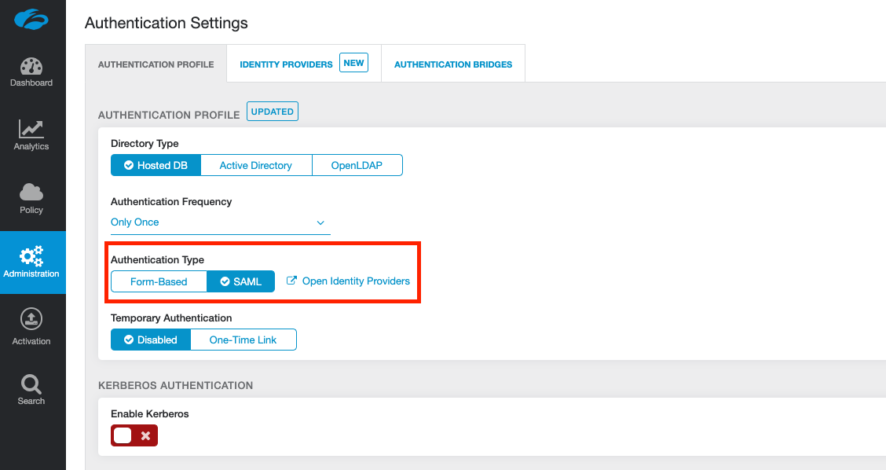
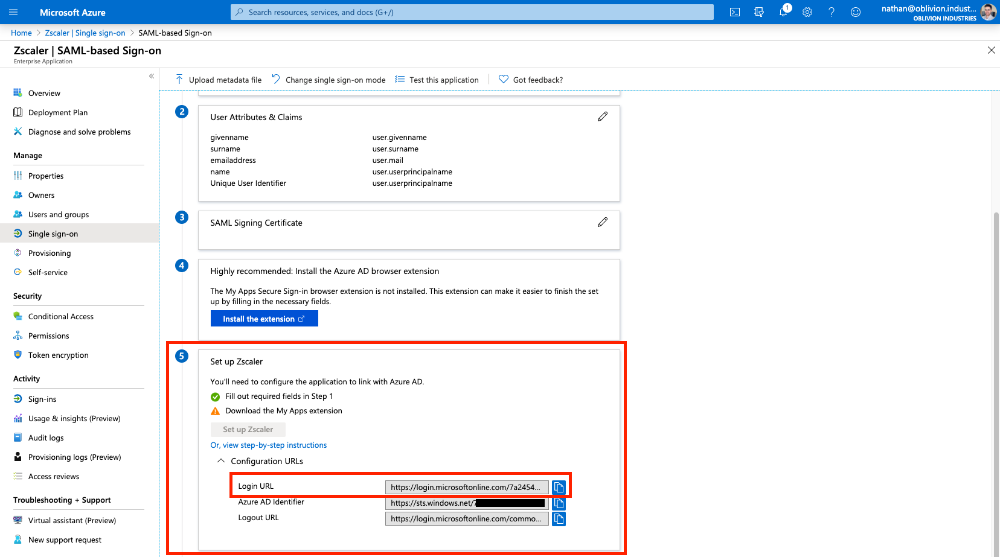
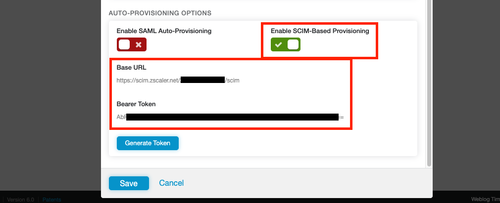
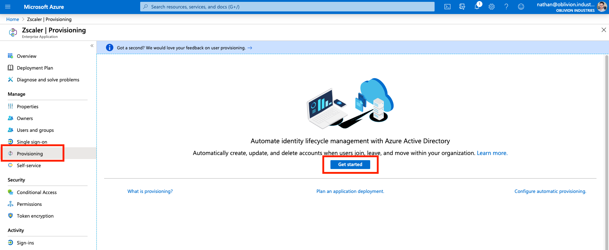
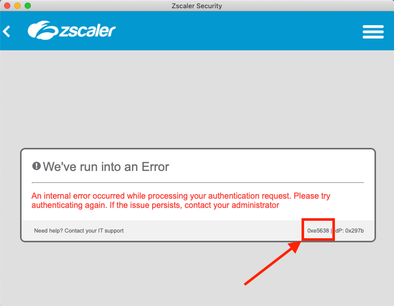

This guide will cover configuring Azure AD as the Identity Provider (IdP) for ZIA. Our users defined in Azure AD will be able to authenticate with Z-App/ZIA using Microsoft Single Sign-on (SSO), and we'll also be able to start creating policies in ZIA centered around the same users, groups, and departments we've defined.

By integrating with an IdP like Azure AD, we no longer need to manually manage users and their credentials ourselves in the ZIA portal. We are effectively outsourcing user management and authentication to a 3rd party: Azure AD.

From a user perspective, when they enter their username into Z-App, they'll be redirected to sign in using their company credentials via Microsoft:


# Add a New Identity Provider in ZIA

Log into your ZIA admin portal and go to **Administration > Authentication Settings.**


Change the **Authentication Type** to **SAML** (from Form-Based) and then click the link **Open Identity Providers** (or click the Identity Providers tab at the top).



Under the **Identity Providers** tab, click **Add Identity Provider**.


In the window that appears, don't fill anything in yet. Click to download the **SP Metadata** towards the bottom of the window. This will download a file called **zscaler-metadata.xml** that we'll use in the next section.


# Add ZIA as an Enterprise Application in Azure AD

From the [Azure Portal](https://portal.azure.com), open the side hamburger menu and click **Azure Active Directory**. You can also search for it using the search bar at the top.


Under **Manage** in the side menu, click **Enterprise applications**.


Next, under the **All Applications** menu, click **New Application**.


In the search box to add a new application, type "**Zscaler**".


Select the Zscaler application that corresponds to cloud your ZIA tenant was provisioned on. If you can't remember this, check the URL that you use to log into the admin portal with. For example:

* `admin.zscalertwo.net` == **Zscaler Two**
* `admin.zscaler.net` == **Zscaler**
* `admin.zscloud.net` == **Zscaler ZSCloud**

Select the correct application and click **Create** (or **Add** depending on whether you are using the old or new enterprise app gallery).


# Configure the ZIA Enterprise Application

You will now be on the administration page for the Zscaler / ZIA enterprise application you added above (if not, you can get to this page via: Azure Active Directory > Enterprise Applications > All Applications, then click on the ZIA app you added above).

## 1 - Configure SAML-based Single Sign-on

Under **Manage** in the side menu, click **Single sign-on**, and select **SAML** when prompted. This will place you on the SAML configuration page.


## 2 - Import the Zscaler SP Metadata File

Click **Upload metadata file** at the top, and select the **zscaler-metadata.xml** file you downloaded from the ZIA admin portal earlier. This will open a panel and pre-populate some of the required info.


The Sign on URL field will be empty and is required. This is the same as the pre-populated Reply URL field, so **copy and paste the URL from *Reply URL* to *Sign on URL***. This is of the format:

```
https://login.<cloudname>.net:443/sfc_sso
```

Leave the **Reply State** and **Logout Url** fields blank.


When you're done, click **Save** at the top, then X to close the panel.


## 3 - Create a SAML Signing Certificate

Next to the 3rd step, **SAML Signing Certificate** in the SAML configuration page, click the edit/pencil icon.


In the panel that appears, make sure the **Signing Algorithm** is **SHA-256** and **Signing Option** is set to **Sign SAML assertion**.

Click **New Certificate** then **Save**. Open the menu by clicking the three dots to the right of the certificate, and download the **Base64** certificate.


**IMPORTANT:** The certificate will download as a .cer file. You must change the file extension to **.pem** or it will not be able to be used later on. DO NOT just download the certificate in .pem format as this will cause user authentication to fail. **The certificate downloaded must be the Base64 certificate in .cer format, renamed to .pem.**

Close the panel by clicking X once you've downloaded the certificate.


## 4 - Note down the Login URL

Expand the **Configuration URLs** under the **5th step** in the SAML configuration page, and note down/copy the **Login URL**: we'll need this later. The Login URL should be of the format:

```
https://login.microsoftonline.com/<unique-token>/saml2
```




# Assign Users & Groups to the Enterprise Application

We now need to assign what users are authorized to use the ZIA Enterprise Application. Only the users or groups specified will be able to sign into ZIA via Microsoft SSO. If you skip this section, your user's won't be able to sign in, and you won't see user data populated in ZIA for you to configure policy around.

Select **Users and groups** from the side menu of the enterprise application, then click **Add user**.


Select the Users and Groups to be both synced with and provisoned access to ZIA. If you select a group, all members of that group will receive ZIA access.


When you are finished, click **Assign**.


# Finish Configuring the IdP in ZIA

Return to the ZIA admin portal and finish configuring the new IdP. Fill in the details as follows:

| Field                  | Description                                                  |
| ---------------------- | ------------------------------------------------------------ |
| Name                   | Enter a descriptive name for the IdP                         |
| Status                 | **Enabled**                                                  |
| SAML Portal URL        | Enter the **Login URL** you copied from the SAML configuration page (Step 5 - Set up Zscaler). This is in the format: `https://login.microsoftonline.com/<uniquetoken>/saml2` |
| Login Name Attribute   | Set this to `NameID`                                         |
| Org-Specific Entity ID | **Disabled**                                                 |
| Public SSL Certificate | Upload the **Base64 certificate** you downloaded above. It MUST be in .pem format. If it was downloaded as a .cer file, simply **change the extension to .pem** |
| Vendor                 | **Azure Active Directory**                                   |
| Authentication Domains | Leave this as Any or select a domain to associate this IdP with. Users signing in with this domain will be redirected to this IdP. |
| Sign SAML Request      | **Disabled** - Azure AD does not support signed SAML responses from the service provider. |


Don't touch any of the options under the **Auto-Provisioning** section just yet.

Click **Save** to save the IdP config and close the window.


# Configure SCIM User Provisioning

So far we've configured a way to authenticate our users, but we still need to configure a method to provision them in ZIA so we can create policies that utilize user identities; like URL filtering and DLP.

You can learn more about SCIM Provisioning [here](https://help.zscaler.com/zia/about-scim), but in short, it involves the IdP regularly syncing user information with Zscaler via an API. With Azure AD, this sync happens every 40 minutes. Using SCIM is best practice.


## 1 - Edit Identity Provider Settings

In the ZIA admin portal, click the edit/pencil icon next to the Azure AD IdP we just added (Administration > Authentication Settings > Identity Providers tab).

This time, under the **Auto-Provisioning Options** section, check the **Enable SCIM-Based Provisioning** checkbox (do NOT enable SAML Auto-Provisioning).



Note down both the **Base URL** and **Bearer Token** displayed. The Bearer Token is essentially an API key we will give to Azure AD. Clicking Generate Token will invalidate the previous token and display a new one.

Click **Save** when you are done and **ACTIVATE** your changes! **Make sure you do this, or your Bearer Token will not work in the steps below.**


## 2 - Configure SCIM Provisionig in Azure AD

Return to the ZIA Enterprise Application in Azure AD. This time select **Provisioning** from the side menu and select **Get Started** if prompted.



Change the **Provisioning Mode** to **Automatic**, and fill in the following fields:

* For **Tenant URL**, copy and paste the **Base URL** from above.
* For **Secret Token**, copy and paste the **Bearer Token** from above.

Click **Test Connection** to verify. If you recieve an error about "invalid credentials", make sure you saved and activated your change in the step above.


Click **Save** to continue.

Once your changes have been saved, change **Provisioning Status** to **On**.

Save your changes again and the Scope field should appear.

If you recieve an error, or the scope field is not appearing:

* Back out of the Provisioning menu and go into it again. This should fix the error and cause the scope menu to appear.
* Ensure you have assigned users and/or groups (containing users) to the enterprise application first.

For the **Scope**:

| Scope                                   | Description                                                  |
| --------------------------------------- | ------------------------------------------------------------ |
| **Sync only assigned users and groups** | Only users and groups explicitly assigned access to this enterprise application (under Users and groups in the side menu) will be provisioned via SCIM to ZIA. Note that if you don't select a group and your scope is set to this option, that group will not appear in ZIA when creating policies. |
| **Sync all users and groups**           | All users and groups defined in Azure AD are synced with ZIA; irrespective of what was defined under Users and Groups in the side menu. |

Set your scope accordingly and click **Save** again. Don't forget to do this or your user information will not sync with ZIA!


## 3 - Synchronize

Your users and groups will sync to ZIA on the next API cycle (every 40 minutes). As this is the first time, you can manually force a sync by clicking the option **Clear current state and restart synchronization** (and then **Save**).


## 4 - Verify

Once your users and groups have synchronised with ZIA, they'll be visible in the ZIA admin portal under **Administration > User Management**.


# Test the Azure AD configuration

We're going to test everything that we've done. Open Z-App (sign-out if you're already signed in with another user) and sign in with the credentials of one of your Azure AD users that you assigned to the ZIA Enterprise Application.


When you enter the username, Z-App should now redirect you to sign-in with Microsoft. Enter valid user credentials and test the sign-in.


If everything is working well, the user will be signed in and Z-App will minimize itself to your system tray or menu-bar. If you open it, you'll see your user is authenticated.


## Troubleshooting Sign-in

If the Microsoft SSO fails, check the config on the Azure AD side. This could be due to:

* The URLs in the SAML config are not correct.
* Your user has not been assigned to the enterprise application.


If sign in passes Microsoft SSO, but you get a Zscaler error (as per the image below), check the error code in the bottom right corner against the [list of error codes here](https://help.zscaler.com/zia/troubleshooting-saml). This indicates an issue with the config on the Zscaler side (typically something to do with the certificate you imported from Azure AD).




# Finish

If all went well, you should now have your ZIA tenant integrated with Azure AD with SAML-based SSO and SCIM user provisioning.