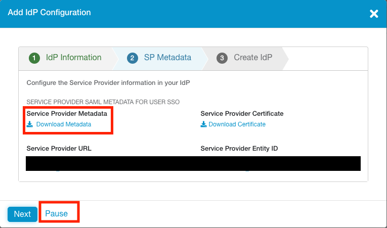
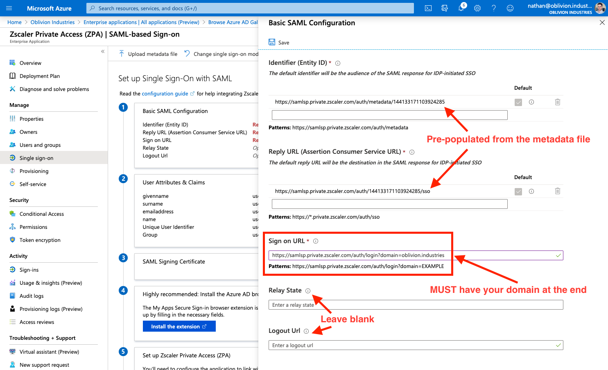

This guide will cover configuring Azure AD as the Identity Provider (IdP) for ZPA. Our users defined in Azure AD will be able to authenticate with Z-App/ZPA using Microsoft Single Sign-on (SSO), and we'll also be able to create access policies for our private applications based on user identity and attributes.

If you followed my previous post covering ZIA integration with Azure AD, then the first few steps will be (mostly) the same.


# Add a New Identity Provider in ZPA

Log into the [ZPA admin portal](https://admin.private.zscaler.com) and go to **Administration** > **IdP Configuration**.


Click **Add IdP Configuration** at the top-right of the screen.


Under the **IdP Information** section:

1. Enter a name for the IdP configuration.
   ZPA supports multipe IdPs, hence a name is required to differentiate them.
2. Ensure **User** is selected for **Single Sign-On**.
3. Select the domain(s) you wish to associate with the IdP configuration.
   Zscaler support must add any additional domains to your admin portal first before you can use them.


Click **Next** to continue.

The next tab shows info you'll for the configuration on the Azure AD side. **Download the Service Provider Metadata file** (this will download as a file called **sp_metadata.xml**) as we'll use this in the next section.



Click **Pause** (this will suspend the IdP config temporarily) and continue to the next section.


# Add ZPA as an Enterprise Application in Azure AD

From the [Azure Portal](https://portal.azure.com), open the side hamburger menu and click **Azure Active Directory**. You can also search for it using the search bar at the top.


Under **Manage** in the side menu, click **Enterprise applications**.


Next, under the **All Applications** menu, click **New Application**.


In the search box to add a new application, type "**Zscaler**".


Select the **Zscaler Private Access (ZPA)** application and click **Create** (or **Add** depending on whether you are using the old or new enterprise app gallery).


# Configure the ZPA Enterprise Application

You will now be on the administration page for the ZPA enterprise application you added above (if not, you can get to this page via: Azure Active Directory > Enterprise Applications > All Applications, then click on the ZPA app you added above).

## 1 - Configure SAML-based Single Sign-on

Under **Manage** in the side menu, click **Single sign-on**, and select **SAML** when prompted. This will place you on the SAML configuration page.


## 2 - Import the Zscaler SP Metadata File

Click **Upload metadata file** at the top, and select the **sp_metadata.xml** file you downloaded from the ZPA admin portal earlier. This will open a panel and pre-populate some of the required info.


The Sign on URL field will be empty and is required. Copy the example URL, replacing the `EXAMPLE` at the end with your domain that is being associated with this Azure AD config.

For example, for my domain of `oblivion.industries`, my Sign on URL would look like:

```
https://samlsp.private.zscaler.com/auth/login?domain=oblivion.industries
```



The Relay State and Logout Url fields should be left blank.

Click **Save** at the top when you are done, and X to close the panel.


## 3 - Create a SAML Signing Certificate

Next to the 3rd step, **SAML Signing Certificate** in the SAML configuration page, click the edit/pencil icon.


In the panel that appears, make sure the **Signing Algorithm** is **SHA-256** and **Signing Option** is set to **Sign SAML assertion**.

Click **New Certificate** then **Save**. Open the menu by clicking the three dots to the right of the certificate, and download the BOTH the **Base64** certificate and the **Federated Certificate XML**. You should only need the latter, but it can sometimes be helpful to have both.


Close the panel by clicking X once you've downloaded the certificate and metadata files.


# Assign Users & Groups to the Enterprise Application

We now need to assign what users are authorized to use the ZPA Enterprise Application. Only the users or groups specified will be able to sign into ZPA via Microsoft SSO. If you skip this section, your user's won't be able to sign in, and you won't see user data populated in ZIA for you to configure policy around.

Select **Users and groups** from the side menu of the enterprise application, then click **Add user**.


Select the Users and Groups to be both synced with and provisoned access to ZPA. If you select a group, all members of that group will receive ZPA access.


When you are finished, click **Assign**.


# Finish Configuring the IdP in ZPA

Return to the ZPA admin portal and click the **resume** button next to the paused IdP configuration (Administration > IdP Configuration).


For the **IdP Metadata File**, click to **upload the Federated Certificate XML** you download from Azure AD above. ***This will automatically populate all settings for you; including the certificate.*** 

If for some reason the certificate does not populate, you can upload the Base64 certificate you downloaded.


Scroll to the bottom of the window and change **SCIM Sync** to **Enabled**.

Note down the **SCIM Service Provider Endpoint** URL, and generate a new **Bearer Token**. Note down the Bearer Token as well. You will need both of these in the next step.


Click **Save** to finish the configuration on the ZPA side. Unlike ZIA, you do not need to activate your changes for them to take effect.


# Configure SCIM Provisioning in Azure AD

So far we've configured a way to authenticate our users, but we still need to configure a method to provision & de-provision them in the ZPA database.

You can learn more about SCIM Provisioning [here](https://help.zscaler.com/zpa/about-scim), but in short, it involves the IdP regularly syncing user information with Zscaler via an API. With Azure AD, this sync happens every 40 minutes. Using SCIM is best practice.


## 1 - Configure SCIM Provisionig in Azure AD

Return to the ZPA Enterprise Application in Azure AD. This time select **Provisioning** from the side menu and select **Get Started** if prompted.


Change the **Provisioning Mode** to **Automatic**, and fill in the following fields:

* For **Tenant URL**, copy and paste the **Base URL** from above.
* For **Secret Token**, copy and paste the **Bearer Token** from above.

Click **Test Connection** to verify. If you recieve an error about "invalid credentials", make sure you saved and activated your change in the step above.


Click **Save** to continue.

Once your changes have been saved, change **Provisioning Status** to **On**.

Save your changes again and the Scope field should appear.

If you recieve an error, or the scope field is not appearing:

* Back out of the Provisioning menu and go into it again. This should fix the error and cause the scope menu to appear.
* Ensure you have assigned users and/or groups (containing users) to the enterprise application first.

For the **Scope**:

| Scope                                   | Description                                                  |
| --------------------------------------- | ------------------------------------------------------------ |
| **Sync only assigned users and groups** | Only users and groups explicitly assigned access to this enterprise application (under Users and groups in the side menu) will be provisioned via SCIM to ZPA. |
| **Sync all users and groups**           | All users and groups defined in Azure AD are synced with ZPA; irrespective of what was defined under Users and Groups in the side menu. |

Set your scope accordingly and click **Save** again. Don't forget to do this or your user information will not sync with ZPA!


## 3 - Synchronize

Your users will sync to ZPA on the next API cycle (every 40 minutes). As this is the first time, you can manually force a sync by clicking the option **Clear current state and restart synchronization** (and then **Save**).


## 4 - Verify

Once your users and groups have synchronised with ZPA, they'll be visible in the ZPA admin portal under **Administration > SCIM Users** and **Administration > SCIM Groups**.


# Import SAML Attributes

In order to create policies in ZPA, we need to import the fields we can use (called SAML attributes) from the IdP. This also allows us to test whether user authentication is working correctly.

> **IMPORTANT:** I strongly recommend do the next step in an Incognito or Private tab. Failing that, completely sign out of both Azure AD and any Microsoft accounts you are currently signed in as in your current browser session.
>
> The next step will redirect you to Microsoft SSO to sign in with one of our test users, but if an active session to another Microsoft account is detected, it will use that instead. Importing the SAML attributes will then fail, as this account is likely not associated with our Azure AD tenant.

In the ZPA admin portal, go to **Administration** > **IdP Configuration** and expand the IdP configuration you want to import the attributes from. Under **Import SAML Attributes**, select the domain associated with the IdP you want to import the attributes from and click **Import**.


Sign in using the credentials of a user that is authorized to use ZPA (ie: a user associated with the ZPA enterprise application). This will test your SSO config so far:

* If you encounter a Microsoft error (and you're trying this in an incognito or private tab), this indicates an issue with the Microsoft side of the config. Check to see whether the user you are attempting to sign in as has been added to the enterprise application as an authorized user. Additionally, check that your SAML config is correct.
* If you encounter a Zscaler branded error, this indicates an issue with the config on the Zscaler side. Note down the error code in the bottom left and check it against a [list of error codes here](https://help.zscaler.com/zia/troubleshooting-saml). 

If you have a successful login, the SAML JSON response will be captured and used to discover available SAML attributes to import:


Anything in the left column, **Name**, you should overwrite with a descriptive name. **What you type here will appear when creating an access policy**, so `Full Name` is a lot easier to understand than `...claims_displayname_Azure AD` is.

NB: If you have multiple IdPs configured, the name given to the attribute must be unique amongst all of them or it will not import.

Some important mappings you might want to be aware of:

| SAML Attribute Name | What you should call it         |
| ------------------- | ------------------------------- |
| displayname         | Full Name                       |
| groups              | Group or memberOf               |
| givenname           | First Name                      |
| name                | Username (eg: user@example.com) |
| surname             | Surname                         |
| emailaddress        | Email Address                   |

You can also use the JSON displayed at the bottom of the page to work out what things should be called based on the captured data.

Note: Only SAML attributes that have not been imported are displayed in the table. If the table is blank or some fields are missing, check you haven't already imported the attribute you're after.

When you are done, click **Save** to finish the import.


You will now be able to create an Access Policy using any of the imported SAML attributes:


# Configure Service Entitlement

You now need to explicitly turn on ZPA in the Zscaler App, otherwise ZIA will be the only product to appear when a user signs in. This is called Selective Entitlement and is a way companies can specifically enable ZPA for some employees (eg: remote workers), but not all of them.

In the ZPA admin portal, click the link in the menu to go to the **Zscaler App Portal**.


Once in the Zscaler App Portal go to **Administration > Zscaler Service Entitlement**.


IMPORTANT: If you have a brand new ZPA portal, you will not see the option for **Zscaler Service Entitlement** in the Zscaler App Portal. You need to [raise a ticket with support](https://help.zscaler.com/submit-ticket) to have this enabled, and can use the following script:

> Hi team. IdP is now configured in ZPA. Please enable ZPA in the Zscaler App Portal at your earliest convenience. Thank you.


You can choose to enable ZPA in the Zscaler App globally for all users, or only allow access to specific groups. 

IMPORTANT: Group membership is synced from ZIA. If you've changed group membership or created a new group in Azure AD, you must wait for it to sync to ZIA with SCIM AND wait for it to sync from ZIA to the Zscaler App portal (you can also initate a manual pull from ZIA under Administration > Zscaler App Support > Advanced Configuration)

Select whether to enable ZPA for all users (check the **ZPA Enabled by Default** option), or select users by specifying a group.

Click **Save** when you are finished and return to the ZPA admin portal.


# Test the Azure AD configuration

We're going to test everything that we've done so far. Open Z-App (sign-out if you're already signed in with another user) and sign in with the credentials of one of your Azure AD users that you assigned to the ZPA Enterprise Application.

When you enter the username, Z-App should now redirect you to sign-in with Microsoft. Enter valid user credentials and test the sign-in.


If everything is working well, and you've enabled ZPA in the Zscaler App (Zscaler Service Entitlement), the user will be signed in to both ZIA and ZPA (provided Azure AD has been used for the IdP for both). Z-App will minimize itself to your system tray or menu-bar. If you open it, you'll see your user is authenticated.


## Testing SSO in a Browser

You can test the IdP configuration outside of the ZPA admin portal using the following URL. Replace `EXAMPLE.COM` with your company’s domain name as per Azure AD.

IMPORTANT: Test the URL in a Private/Incognito window.

```
https://samlsp.private.zscaler.com/auth/v2/login?ssotype=test&domain=EXAMPLE.COM
```


## Troubleshooting Sign-in

If the Microsoft SSO fails, check the config on the Azure AD side. This could be due to:

* The URLs in the SAML config are not correct.
* Your user has not been assigned to the enterprise application.


If sign in passes Microsoft SSO, but you get a Zscaler error (as per the image below), check the error code in the bottom right corner against the [list of error codes here](https://help.zscaler.com/zia/troubleshooting-saml). This indicates an issue with the config on the Zscaler side (typically something to do with the certificate you imported from Azure AD).


# Finish

If all went well, you should now have your ZPA tenant integrated with Azure AD with SAML-based SSO and SCIM user provisioning.