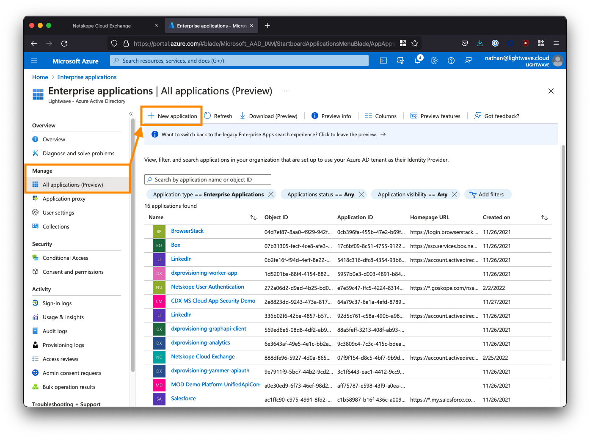
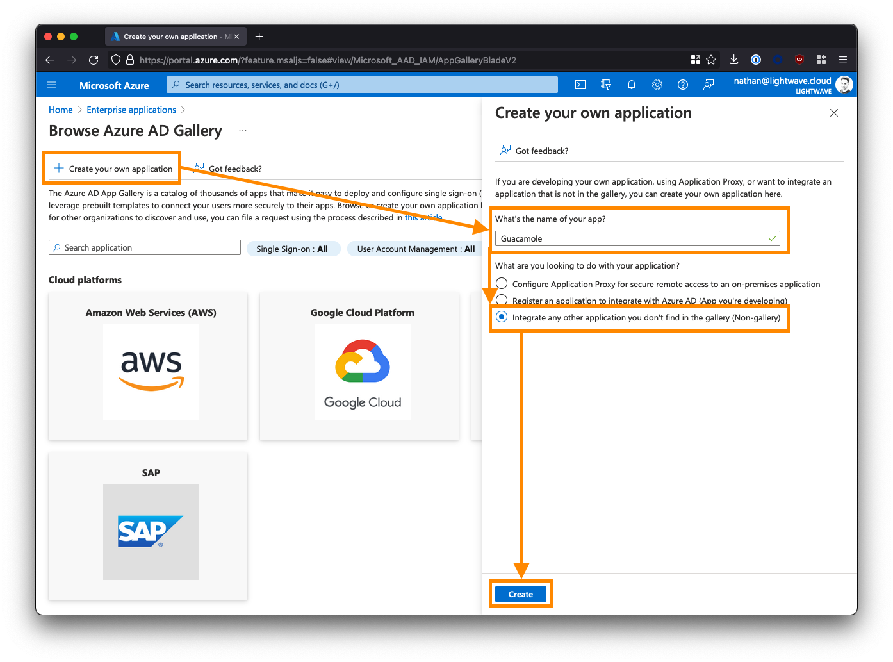
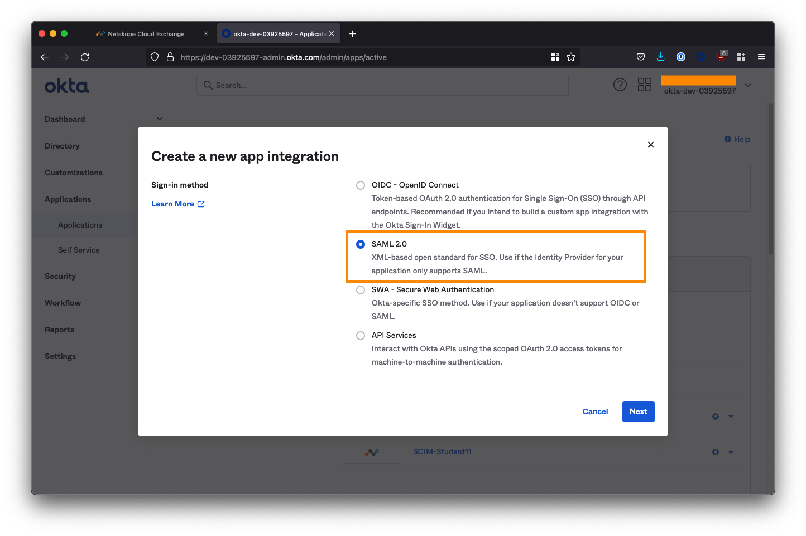
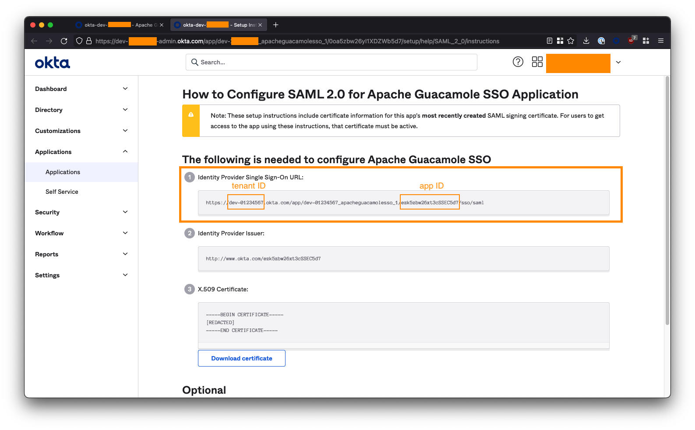
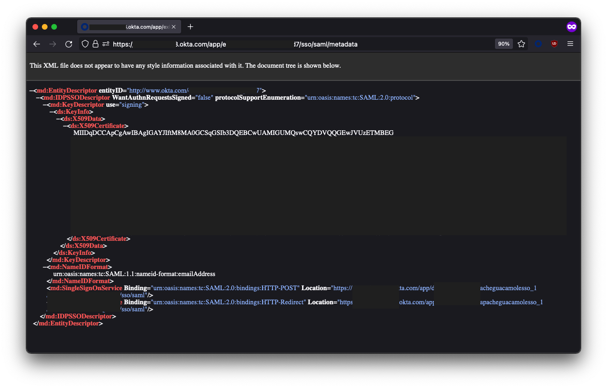
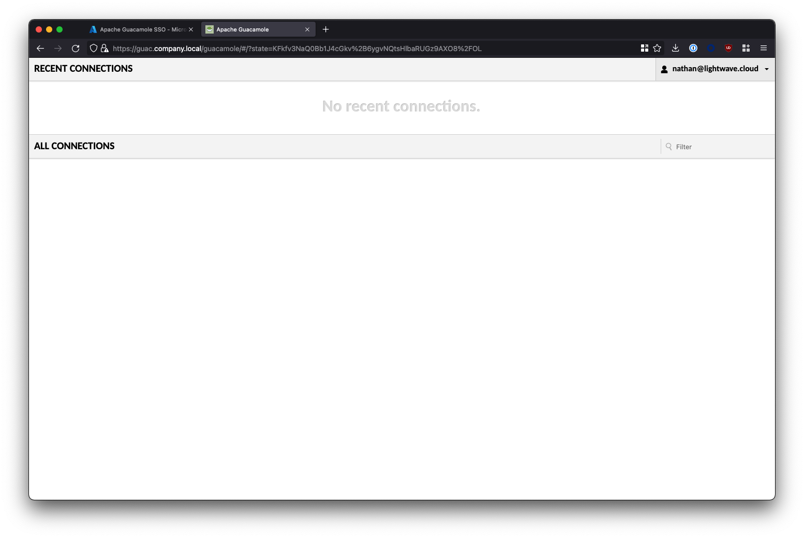
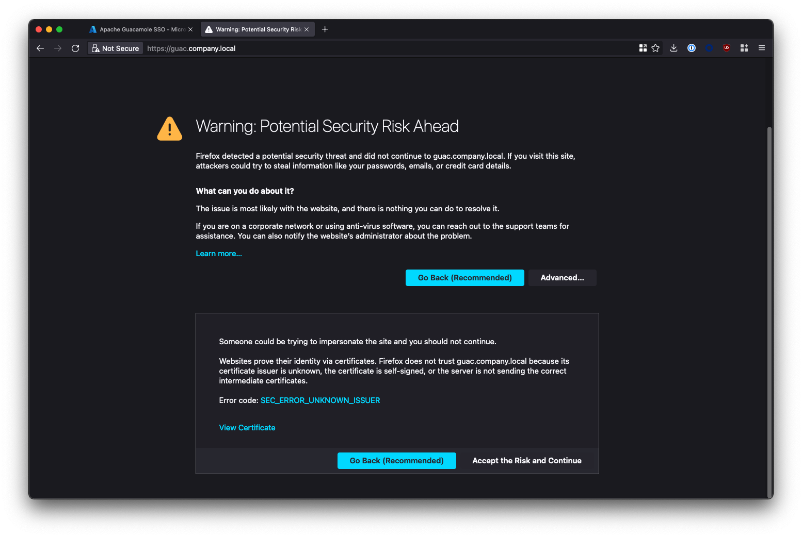

# Introduction

This post will cover how to configure Single-Sign-On (SSO) using SAML for Apache Guacamole while also ensuring that your deployment is secured behind auto-renewing SSL.

This is a BIG guide as I cover off an automated installation method (using `cloud-init`), a manual install method, and instructions for both Azure AD and Okta - so you might want to leverage the table of contents above to jump to the sections most approproate to you.

Anyway, let's go!

# What is Guacamole?

> *Apache Guacamole* is a clientless remote desktop gateway. It supports standard protocols like VNC, RDP, and SSH. We call it *clientless* because no plugins or client software are required. Thanks to HTML5, once Guacamole is installed on a server, all you need to access your desktops is a web browser.
>
> -- [Apache.org](https://guacamole.apache.org/)

Guacamole allows you to access servers, workstations, and infrastructure (essentially anything that connects using SSH or RDP) via a web browser.

It also provides a layer of isolation as the user is not directly connected to the resource themselves: rather Guacamole connects to the resource and the user interacts with a HTML5 canvas of what is on-screen; allowing you to control actions such as the ability to copy & paste between the remote host and user machine.

Gucamole is particularly useful in instances where you want to provide access to internal company resources to 3rd parties (such as MSPs or contractors), but don't want them to be able to connect to the resource directly.

# Why bother with SSO Integration?

SSO authentication for Guacamole is valuable as it means that the visibility of internal resources (ie: what servers/workstations a user can see and connect to within the Gucamole UI) can be entirely managed within your existing Identity Provider (IdP), rather than within Guacamole itself.

**That is, by simply assigning users to different Groups within the IdP, you can control what internal resources they have access to; without having to touch Guacamole itself.**

This has two benefits:

1. A reduction of operational overhead in having to manage system access in more than one location.
2. Ensuring that your IdP is the single-source of truth for validation of identity (critical if you moving your business towards a [Zero Trust Architecture](https://www.nist.gov/publications/zero-trust-architecture))

If you are a "homelabber" and want to start dabbling with SSO, Azure Active Directory's free tier will work fine for this guide.

---

# Requirements

You will need the following to install Guacamole and configure SAML integration:

* A Linux system capable of supporting the docker.io release of Docker, and Docker Compose.
  * I recommend Ubuntu Server 20.04 LTS.
  * This guide will use Ubuntu Server 20.04 LTS running in AWS (t2.micro instance == 1 vCPU, 1GB memory) 
* An Identity Provider (IdP) that supports SAML 2.0, such as Azure AD or Okta.
  * The Azure AD free tier is sufficient.
  * This guide will use Azure AD, but the steps will be applicable to any SAML 2.0 IdP (eg: Okta).
* The FQDN/domain you wish to use to access Guacamole, eg: `guac.company.local`
  * The domain must resolve internally to the IP address of the system that Guacamole is running on; eg: `guac.company.local` `->` `10.0.10.7`
  * If you will be accessing Guacamole through a Clientless ZTNA solution like Netskope Private Access, **then the domain you choose MUST be an external one and the same one that users will use to access it remotely**; eg: `guac.company.com`. You CANNOT use a local/internal domain like `.local`

This guide will deploy Guacamole as a series of Docker containers - hence as long as your system can run Docker, it will be able to run Guacamole.

# Prepare your SAML IdP (Azure AD, Okta)

## Azure Active Directory (Azure AD)


### 1. Create a new Enterprise Application

Log into the Azure AD [portal](https://portal.azure.com/), and go to “Enterprise Applications”. You may need to search for this at the top of the portal.


Click **New application**.



Click **Create your own application** and name the application `Apache Guacamole SSO`.

Select the 3rd option to create a non-gallery app: **Integrate any other application you don’t find in the gallery**.

Click **Create** when you are done.



### 2. Configure the Guacamole Enterprise App in Azure AD

From the left-side menu, click Properties, and set the "**Visible to Users?**" option to **No**.


Next, click **Single sign-on** from the left-side menu, and select **SAML** when prompted.


### 3. Provide the SAML Configuration

Under **Basic SAML Configuration**, click the *Edit* button and fill in the fields as follows. Substitute `<fqdn-of-your-guacamole-instance>` with the domain you wish to use to access the Guacamole UI. For example: `guac.company.com`:

* **Identifier (Entity ID)** --> `https://<fqdn-of-your-guacamole-instance>`
  * Eg: `https://guac.company.com`
* **Reply URL (Assertion Consumer Service URL)** --> `https://<fqdn-of-your-guacamole-instance>/guacamole/api/ext/saml/callback`
  * Eg: `https://guac.company.com/guacamole/api/ext/saml/callback`

Leave all the other fields blank (Sign on URL, Relay State, etc).

Save your configuration when done.


### 4. Copy the Azure AD Metadata URL

Scroll down. Under ***Section 3 - SAML Signing Certificate***, note down the **App Federation Metadata URL**. You will need this later. This will be of the form:

```
https://login.microsoftonline.com/a1b2c3d4-e5f6-0a1b-2c3d-4e5f6a1b2c3d/federationmetadata/2007-06/federationmetadata.xml?appid=a1b2c3d4-e5f6-0a1b-2c3d-4e5f6a1b2c3d
```


### 5. Add Users & Groups to the Enterprise Application

The last step we need to perform in Azure AD is to assign users and/or groups to the *Apache Guacamole SSO* app to provide them with access. Any user or group added here will be permitted to SSO through to and access your Guacamole instance; so be careful!

From the left-side menu within the *Apache Guacamole SSO* Enterprise Application, select **Users and groups**, then click **Add user/group**.


Select the users and/or groups that are permitted to access your Guacamole instance. Note that nested groups are not supported.


If you are deploying Guacamole to provide clientless access for 3rd parties/contractors to access internal resources via a ZTNA solution (like Netskope NPA), then you may want to create a group/security group specifically for these individuals and assign it to the Guacamole app; for example: `sg-External`. **Note down the groups you select here as these will be the same groups that you add to ZTNA policy later on** in order for the users in those groups to be able to reach your instance of Guacamole in the first place.

Note: If you are using Azure AD's free tier, you might not be able to correctly use Groups. Stick to assigning individual users only.

After assigning users/groups and applicable roles, your user/group list should look similar to the below:


### 6. Azure AD SAML Configuration Finished

You've now finished the configuration in Azure AD and can proceed to installing Guacamole.

Don't forget that you will need the  **App Federation Metadata URL** to properly configure Guacamole, so go back and copy this down now if you haven't already.

Jump to:

* [Automated Guacamole Installation (AWS, Azure, GCP)](#automated-guacamole-installation-azure-aws-gcp)
* [Manual Guacamole Installation](#manual-gucamole-installation)
* [Table of Contents](#toc)

---

## Okta


### 1. Create a new App Integration

Log in to your Okta administrator console and from the left-side menubar, navigate to **Applications > Applications**.

Select **Create App Integration**.


Select **SAML 2.0** as the sign-in method and click **Next**.



On the next screen, name the application `Apache Gucamole SSO` and check both of the app visibility boxes to hide the app icon from users. Click **Next** when you are done on this screen.


### 2. Configure Okta SAML Integration

Under **SAML Settings**, fill in the fields as follows. Substitute `<fqdn-of-your-guacamole-instance>` with the domain you wish to use to access the Guacamole UI. For example: `guac.company.com`:

* **Single sign on URL** --> `https://<fqdn-of-your-guacamole-instance>/guacamole/api/ext/saml/callback`
  * Eg: `https://guac.company.com/guacamole/api/ext/saml/callback`**
* **Audience URI (SP Entity ID)** --> `https://<fqdn-of-your-guacamole-instance>`
  * Eg: `https://guac.company.com`**
* **Name ID format** --> Set this to `EmailAddress`

Leave all the other fields blank or as their default values (Default RelayState, App username, etc).


Scroll down and click **Next** when done.

On the next page, check the box “*I’m an Okta customer adding an internal app*” and click **Finish**.


### 3. Get the Okta IdP Metadata URL

On the next page, ensure you are on the **Sign On** tab, and click the "**View Setup Instructions**" button on the right-side of the screen. You may need to scroll down.


Extract your `tenant ID` and `App ID` from the  **Identity Provider Single Sign-On URL**. This will be of the form:

```
https://<tenant-id>.okta.com/app/dev-01234567_apacheguacamolesso_1/<app-id>/sso/saml
```

For example, if your URL is:

```
https://dev-01234567.okta.com/app/dev-01234567_apacheguacamolesso_1/ezk5zbw26xt3cSSEC5d7/sso/saml
```

* The `tenant ID` is `dev-01234567`
* The `app ID` is `ezk5zbw26xt3cSSEC5d7`

Copy these into the below URL to form the Okta IdP Metadata URL:

```
https://<tenant-id>.okta.com/app/<app-id>/sso/saml/metadata
```

For example:

```
https://dev-01234567.okta.com/app/ezk5zbw26xt3cSSEC5d7/sso/saml/metadata
```



**Note down this URL! You will need it to configure Guacamole later.**

You will know your URL is correct if you visit it in your browser and it loads a bunch of XML:




### 4. Add Users & Groups to the Application

The last step we need to perform in Okta is to assign users and/or groups to the *Apache Guacamole SSO* app to provide them with access. Any user or group added here will be permitted to SSO through to and access your Guacamole instance; so be careful!

Click on the **Assignments** tab within the *Apache Guacamole SSO* app. Use the **Assign** button to select either the individual users or groups that are permitted to access your Guacamole instance.


If you are deploying Guacamole to provide clientless access for 3rd parties/contractors to access internal resources via a ZTNA solution (like Netskope NPA), then you may want to create a group/security group specifically for these individuals and assign it to the Guacamole app; for example: `sg-External`. **Note down the groups you select here as these will be the same groups that you add to ZTNA policy later on** in order for the users in those groups to be able to reach your instance of Guacamole in the first place.


### 5. Okta Configuration Finished

You've now finished the configuration in Okta and can proceed to installing Guacamole.

Don't forget that you will need the  **Okta IdP Metadata URL** that you created to properly configure Guacamole, so go back and copy it down if you haven't already.

Jump to:

* [Automated Guacamole Installation (AWS, Azure, GCP)](#automated-guacamole-installation-azure-aws-gcp)
* [Manual Guacamole Installation](#manual-gucamole-installation)
* [Table of Contents](#)


---

# Automated Guacamole Installation (Azure, AWS, GCP)

We can piggyback onto the `cloud-init` process that is used to configure a fresh VM in public cloud environments (AWS, Azure, GCP, etc) and tell it to also bring up Guacamole at the same time.

## 1. Get the Config File

Copy the content of this file into a text editor like VS Studio or Atom: [https://github.com/nathancatania/guacamole-sso-cloud-init/blob/main/user-data.yml](https://github.com/nathancatania/guacamole-sso-cloud-init/blob/main/user-data.yml)

If you are wondering what this configuration does, see the **Manual Guacamole Installation** section of this guide. It wraps every step up into one script that is automatically applied on boot of a fresh VM.

You can also review the [git repo for it here](https://github.com/nathancatania/guacamole-sso-cloud-init).


## 2. Configure the Required Settings

Before you can use the `user-data.yml` file to configure your VM, there are some values you will need to set/change.

**As a minimum, you MUST set the FQDN and Metadata URL:**

* The FQDN is the domain you've chosen to access your Gucamole instance at. This should be the same one you used in your SAML IdP configuration, eg: `guac.company.com`
* The Metadata URL is obtained from the IdP (see the instructions for Azure AD or Okta above).

```yaml
# {# ####### START SETTINGS ####### #}

# {# REQUIRED - Provide the FQDN that Guacamole will be accessed at! #}
# {# Leaving this as the default value will generate SSL certs for guac.company.local which you don't want! #}


# {# REQUIRED - IdP (Azure AD / Okta) Metadata URL #}
# {# Leaving this as the default value cause the SSO module to fail! #}

```

It is also recommended that you set the following:

* Change the default database password from something other than the default value. This database is used to store Guacamole configuration data.
* Assign an SSH key for the default user (`guacamole`). You can also optionally change the default user from `guacamole` to something else.

```yaml
# {# RECOMMENDED - Change the default Guacamole DB password #}
# {# The Guacamole DB is used to store settings/config data #}
{% set dbpass = "Y0u%$h0UlD%R3@Lly%CH@ng3%tH1$%P@$sW0rD" %}

# {# OPTIONAL - Import an SSH key from a public keyserver (GitHub). Enter your GitHub username, eg: "nathancatania" #}
# {# Leave default if not needed #}


# {# OPTIONAL - Add an authorized public SSH key to permit access to the Publisher host via npa username #}
# {# Leave default if not needed #}


# {# OPTIONAL - Set the default user/username for the system. This will be who you first SSH to the VM as #}
# {# Default: guacamole@vm-hostname #}

```


## 3. Paste the entire configuration

When you are done, paste the entire configuration into the **User-Data**, **Custom Data**, or **Metadata** fields when configuring a fresh Ubuntu VM on AWS/Azure/GCP. For specific instructions for each cloud provider, [see here](https://github.com/nathancatania/publisher-cloud-init#how-do-i-use-this).

Finish provisioning as per the normal workflow for AWS/Azure/GCP.

## 4. Deployment Finish

When your fresh VM comes up, even if you can SSH to it, `cloud-init` will still be running and executing our configuration in the background. You may need to wait up to 10 minutes for `cloud-init` to finish.

To check the status of `cloud-init`, run the command `cloud-init status`:

```
npa@i-097b1b0c65d4ef774:~$ cloud-init status
status: done
```

If the status shows `status: running`, cloud-init is still configuring the VM.

The configuration will be successfully complete if you can run the `docker ps` command and see multiple containers present.

```
guacamole@guactest:~$ docker ps
CONTAINER ID   IMAGE   NAME
c28788e9970e   guacamole/guacamole:1.4.0   guacamole
642b183e2dba   caddy:2.5.2                 caddy
1b41e5548211   guacamole/guacd:1.4.0       guacd
57acc7868cb7   mariadb/server:latest       guacdb
```

If the `cloud-init status` command returns `status: done`, but you don't see any containers (or if Guacamole is not accessible); [troubleshooting steps are covered in the git repo here](https://github.com/nathancatania/guacamole-sso-cloud-init#validation--troubleshooting-steps).

Jump to:

* [Access your Guacamole Instance](#access-your-guacamole-instance)
* [Troubleshooting Cloud-Init (GitHub)](https://github.com/nathancatania/guacamole-sso-cloud-init#validation--troubleshooting-steps)
* [Troubleshooting Guacamole](#troubleshooting)
* [Table of Contents](#)

---

# Manual Gucamole Installation

If you are deploying outside of an IaaS environment (VMware, KVM, etc), or if you'd rather configure things yourself (or at least understand what the scripts above are doing), then read on below.


## 1. Install Docker & Docker Compose

If you're using a fresh VM, you'll need to install Docker and Docker Compose. The below will install Docker CE (Community Edition), which is free but does not come with support. For a production environment, I recommend Docker Enterprise.

The commands below cover the installation of Docker on an Ubuntu host. **For RHEL 8+, you will need to use Podman instead of Docker (#justredhatthings).**

### A Note for Netskope Users

If you are planning on running Guacamole on the same host as an NPA Publisher, and the Publisher was deployed using the OVA or AWS/Azure Marketplace image: You only need to install Docker Compose - Docker itself will already be installed.

You should consider deploying Guacamole on it's own dedicated Publisher if you go down this route.


### Installing Docker

1. Update the existing packages on the system:

```bash
sudo apt update -y && sudo apt upgrade -y
```

2. Install Docker

```bash
curl -fsSL https://get.docker.com -o get-docker.sh
sudo sh get-docker.sh
```

Note: You should never run a script from the internet with sudo without vetting it first. Docker make information on the installation script [available here](https://docs.docker.com/engine/install/ubuntu/#install-using-the-convenience-script). Alternatively, if you wish to run the installation commands manually yourself, [see here](https://docs.docker.com/engine/install/#server). 

3. (Optional) Allow the `docker` command to be used without `sudo`. You will need to log out of the system and back in again for the change to take effect.

```bash
sudo usermod -aG docker ${USER}
```


### Installing Docker Compose

If you just installed Docker via the above, you will already have Docker Compose installed.

If not, install Docker Compose using the below:

```bash
sudo apt update -y && sudo apt upgrade -y && sudo apt install docker-compose-plugin
```

If (for whatever reason) the above does not work for you, you can also manually download and install the Docker Compose binary, although note that this will change the command from `docker compose` to `docker-compose`:

```bash
DOCKER_CONFIG=${DOCKER_CONFIG:-$HOME/.docker}

mkdir -p $DOCKER_CONFIG/cli-plugins

curl -SL https://github.com/docker/compose/releases/download/v2.6.1/docker-compose-linux-x86_64 -o DOCKER_CONFIG/cli-plugins/docker-compose

chmod +x $DOCKER_CONFIG/cli-plugins/docker-compose
```

Validate Docker Compose is installed:

```bash
docker compose version
> Docker Compose version v2.6.0
```


## 2. Create Folders to Store Container Data

Once Docker is installed, we need to create the folders that will house that data and configuration for our containers.

```bash
mkdir -p $HOME/configs/guacdb && mkdir -p $HOME/configs/caddy && mkdir -p $HOME/configs/guac/extensions
```


## 3. Create the Docker Compose File

`docker-compose.yml` is a manifest of the containers, networks, and volumes used to bring up a complete service.

Open a text editor and create a file called `docker-compose.yml`:

```
nano ~/docker-compose.yml
```

Paste the following:

```yaml
version: '3.9'

networks:
  web:
  internal:

services:
  guacdb:
    env_file: .env
    container_name: guacdb
    image: 'mariadb/server:latest'
    restart: unless-stopped
    environment:
      MYSQL_ROOT_PASSWORD: '${ROOTDBPASS}'
      MYSQL_DATABASE: '${DB}'
      MYSQL_USER: '${DBUSER}'
      MYSQL_PASSWORD: '${DBPASS}'
    volumes:
      - '${BASEDIR}/guacdb:/docker-entrypoint-initdb.d:ro'
      - '${BASEDIR}/guacdb:/var/lib/mysql'
    networks:
      - internal

  guacd:
    env_file: .env
    container_name: guacd
    image: guacamole/guacd
    restart: unless-stopped
    networks:
      - internal

  guacamole:
    env_file: .env
    container_name: guacamole
    image: 'guacamole/guacamole:latest'
    restart: unless-stopped
    volumes:
      - '${BASEDIR}/guac:/etc/guacamole'
      - '${BASEDIR}/guac/server.xml:/usr/local/tomcat/conf/server.xml'
    ports:
      - '8080'
    environment:
      GUACD_HOSTNAME: "guacd"
      EXTENSION_PRIORITY: "saml"
      SKIP_IF_UNAVAILABLE: "saml"
      GUACAMOLE_HOME: '/etc/guacamole'
      MYSQL_HOSTNAME: "guacdb"
      MYSQL_DATABASE: "${DB}"
      MYSQL_USER: "${DBUSER}"
      MYSQL_PASSWORD: "${DBPASS}"
    depends_on:
      - guacdb
      - guacd
    networks:
      - internal

  caddy:
    env_file: .env
    container_name: caddy
    image: 'caddy:latest'
    restart: unless-stopped
    ports:
      - "80:80"
      - "443:443"
    volumes:
      - '${BASEDIR}/caddy/Caddyfile:/etc/caddy/Caddyfile'
      - '${BASEDIR}/caddy/data:/data'
      - '${BASEDIR}/caddy/config:/config'
    networks:
      - web
      - internal
```

Press `CTRL+X` to exit and `Y` to save changes.

### Container Information

Guacamole itself requires 3 containers (`guacdb`, `guacd`, `guacamole`), and in addition we will be using Caddy as a reverse proxy to handle SSL for the Guacamole UI.

| Container   | Description                                                  |
| ----------- | ------------------------------------------------------------ |
| `guacdb`    | The SQL database where our Guacamole config will be stored   |
| `guacd`     | The main Guacamole service responsible for facilitating access between our browser window and backend SSH/RDP services |
| `guacamole` | The guacamole admin interface                                |
| `caddy`     | A reverse proxy used to uplift the Guacamole UI to SSL/HTTPS |

### Network Information

The compose file creates two Docker networks:

* `internal` - Interconnects the Guacamole and Caddy containers together - not accessible to the outside world.
* `web` - Exposes the Caddy reverse proxy on the host so that we can send it requests and access the Guacamole UI.


## 4. Create the `.env` Config File

Our `docker-compose.yml` file contains a number of variables that we need to set to ensure the service functions correctly. We can set these environmental variables in a hidden file called `.env` that will sit in the same directory as our `docker-compose.yml` file.

Create the `.env` file:

```
nano ~/.env
```

Paste the following; changing the `ROOTDBPASS` and `DBPASS` fields to something different (these are used to secure the SQL database which contains our Guacamole configuration).

```
BASEDIR=$HOME/configs

# Database
ROOTDBPASS=Y0u%$h0UlD%R3@Lly%CH@ng3%tH1$%P@$sW0rD
DBPASS=Y0u%$h0UlD%CH@ng3%tH1$%P@$sW0rD
DB=guacdb
DBUSER=guacdbuser
```

Press `CTRL+X` to exit and `Y` to save changes.


## 5. Create the Caddyfile

A `Caddyfile` contains the configuration that Caddy will use to reverse proxy the Guacamole UI and uplift it to SSL.

Create the `Caddyfile`

```
nano ~/configs/caddy/Caddyfile
```

Paste and edit the following:

```
guac.company.com {
    reverse_proxy guacamole:8080 {
        trusted_proxies private_ranges
        flush_interval -1
    }
    tls internal
}
www.guac.company.com {
    redir https://guac.company.com{uri}
    tls internal
}
```

Replace the 3 instances of `guac.company.com` with the FQDN you wish to use to access the Guacamole UI. **This must be resolve to the IP of the VM that is running Caddy, so ensure you have appropriate DNS entries in place!** Caddy will automatically generate SSL certificates for this domain and serve it up over HTTPS.

When you are finished, press `CTRL+X` to exit and `Y` to save.

### Self-Signed or CA Signed SSL?

By default, Caddy will generate and use self-signed SSL certificates to secure the Guacamole UI. This is perfectly fine, but if you're accessing Guacamole directly, this will result in an untrusted SSL error in your browser - nothing to worry about, as we trust the backend service in this case, but this can be annoying.

If you will be using a clientless ZTNA service (like NPA Browser Access) to access Guac, then you can disregard these SSL warnings, as the ZTNA service's own reverse proxy should be able to ignore any self-signed certificate warnings.

[See the appendix](#appendix-use-signed-ssl-certificates-with-caddy) at the end of this guide if you wish to use valid SSL certs signed by an appropriate root CA.


## 6. Create the `guacamole.properties` configuration file

`gucamole.properties` contains configuration that will tell Gucamole to use SAML for authentication and information about the IdP to be used (eg: Azure AD, Okta)

Create `guacamole.properties`:

```
nano ~/configs/guac/guacamole.properties
```

Paste and edit the following:

```yaml
# SAML Metadata URL from IdP (Azure AD, Okta, etc)
saml-idp-metadata-url: <metadata-URL-from-AzureAD-or-Okta>

# Alternative: Single Sign On URL
# saml-idp-url: https://login.microsoftonline.com/a1b2c3d4-e5f6-0a1b-2c3d-4e5f6a1b2c3d/saml2

# These must match what was entered into Azure AD or Okta
saml-entity-id: https://guac.company.com
saml-callback-url: https://guac.company.com/guacamole/

# Change this to true if SSO is not working
saml-debug: false

# Automatically redirect to SSO portal for sign-on
extension-priority: saml

# Alternative: Go to Guacamole local login before SSO
# extension-priority: *, saml

# SAML attribute/claim for group membership
saml-group-attribute: groups

# If SAML extension fails, default back to local login
skip-if-unavailable: saml
saml-strict: false
```

A description of the required values for each of these fields is below:

| Field                   | Description                                                  |
| ----------------------- | ------------------------------------------------------------ |
| `saml-idp-metadata-url` | The URL of the XML metadata file that from the SAML IdP (eg: Azure AD, Okta) that contains all of the information the SAML extension needs in order to know how to authenticate with the IdP. For **Azure AD** this is the ***App Federation Metadata URL***. For Okta, this is the **IdP Metadata URL** that you created. |
| `saml-idp-url`          | This field is ignored if you use the above metadata file. If you don't have a metadata file, you can specify the URL here that Guacamole will use to redirect to when requesting SAML authentication. For **Azure AD**, this is the "***Login URL***". For **Okta**, this is the "***Identity Provider Single Sign-On URL***". Always use a metadata file if available. |
| `saml-entity-id`        | The entity ID of the Guacamole SAML client. This must match what was entered into Azure AD or Okta and will be the FQDN you used in the Caddyfile. Eg: `https://guac.company.com` |
| `saml-callback-url`     | The URL that the IdP will use once authentication has succeeded to return the user to the Guacamole app. This must match what was entered into Azure AD or Okta and will be the FQDN you used in the Caddyfile, followed by `/guacamole/`. Eg: `https://guac.company.com/guacamole/` |
| `saml-group-attribute`  | The name of the attribute/claim provided by the SAML IdP that contains group membership of the user. These groups will be parsed and used to map group membership of the user logging in, which can be used for permissions management within Guacamole. This is optional and defaults to `groups` |
| `saml-debug`            | If you are having issues with your SAML configuration, set this to `true`. The Guacamole logs will then contain additional information to help you troubleshoot. |
| `extension-priority`    | Set this to `saml`. If you want your users to hit the local login screen for Guacamole and have the option of using SSO, set this to `*, saml` |
| `skip-if-unavailable`   | If the SAML module for Guacamole fails to load or encounters an error, Guac will redirect to the local login page so an administrator can still access the UI. |


## 7. Download the SAML extension for Guacamole

Select the latest version of the SSO extension for Gucamole (currently 1.4.0):

```
wget https://dlcdn.apache.org/guacamole/1.4.0/binary/guacamole-auth-sso-1.4.0.tar.gz
```

For newer releases, see here: [https://guacamole.apache.org/releases/](https://guacamole.apache.org/releases/)

Extract the archive:

```
tar -xvf guacamole-auth-sso-1.4.0.tar.gz
```

Copy the `.jar` file inside the `saml` directory of the archive to `~/configs/guac/extensions`

```
cp guacamole-auth-sso-1.4.0/saml/guacamole-auth-sso-saml-1.4.0.jar $HOME/configs/guac/extensions
```


## 8. Initialize the database

We need to initialize Gucamole's configuration database first before bringing up the service, or it will fail. Luckily we can do this in one simple command:

```
docker run --rm guacamole/guacamole:latest /opt/guacamole/bin/initdb.sh --mysql > $HOME/configs/guacdb/guacdb.sql
```


## 9. Update the config file for Tomcat

Because the Gucamole service will be behind a reverse proxy (Caddy), every user that connects to the service will appear to be coming from the same IP address (the IP of the Caddy container).

The original IP address of the user will be added to the header of the HTTP request by Caddy however, and we can tell Tomcat (the service Guacamole uses for its interface) to use this when logging the IP addresses of users that connect to Guacamole.

We will take the original `server.xml` file that Tomcat uses and append the following under the `<host>` section:

```xml
<Valve className="org.apache.catalina.valves.RemoteIpValve"
                remoteIpHeader="x-forwarded-for"
                remoteIpProxiesHeader="x-forwarded-by"
                protocolHeader="x-forwarded-proto" />
```

Create the `server.xml` file:

```bash
nano $HOME/configs/guac/server.xml
```

Paste in the following (no edits required):

```xml
<?xml version="1.0" encoding="UTF-8"?>
<!--
  Licensed to the Apache Software Foundation (ASF) under one or more
  contributor license agreements.  See the NOTICE file distributed with
  this work for additional information regarding copyright ownership.
  The ASF licenses this file to You under the Apache License, Version 2.0
  (the "License"); you may not use this file except in compliance with
  the License.  You may obtain a copy of the License at

      http://www.apache.org/licenses/LICENSE-2.0

  Unless required by applicable law or agreed to in writing, software
  distributed under the License is distributed on an "AS IS" BASIS,
  WITHOUT WARRANTIES OR CONDITIONS OF ANY KIND, either express or implied.
  See the License for the specific language governing permissions and
  limitations under the License.
-->
<Server port="8005" shutdown="SHUTDOWN">
  <Listener className="org.apache.catalina.startup.VersionLoggerListener" />
  <!-- APR library loader. Documentation at /docs/apr.html -->
  <Listener className="org.apache.catalina.core.AprLifecycleListener" SSLEngine="on" />
  <!-- Prevent memory leaks due to use of particular java/javax APIs-->
  <Listener className="org.apache.catalina.core.JreMemoryLeakPreventionListener" />
  <Listener className="org.apache.catalina.mbeans.GlobalResourcesLifecycleListener" />
  <Listener className="org.apache.catalina.core.ThreadLocalLeakPreventionListener" />

  <GlobalNamingResources>
    <Resource name="UserDatabase" auth="Container"
              type="org.apache.catalina.UserDatabase"
              description="User database that can be updated and saved"
              factory="org.apache.catalina.users.MemoryUserDatabaseFactory"
              pathname="conf/tomcat-users.xml" />
  </GlobalNamingResources>

  <Service name="Catalina">

    <Connector port="8080" protocol="HTTP/1.1"
               connectionTimeout="20000"
               URIEncoding="UTF-8"
               redirectPort="8443" />

    <Engine name="Catalina" defaultHost="localhost">

      <Realm className="org.apache.catalina.realm.LockOutRealm">

        <Realm className="org.apache.catalina.realm.UserDatabaseRealm"
               resourceName="UserDatabase"/>
      </Realm>

      <Host name="localhost"  appBase="webapps"
            unpackWARs="true" autoDeploy="true">

        <Valve className="org.apache.catalina.valves.AccessLogValve" directory="logs"
               prefix="localhost_access_log" suffix=".txt"
               pattern="%h %l %u %t &quot;%r&quot; %s %b" />

        <Valve className="org.apache.catalina.valves.RemoteIpValve"
                remoteIpHeader="x-forwarded-for"
                remoteIpProxiesHeader="x-forwarded-by"
                protocolHeader="x-forwarded-proto" />

      </Host>
    </Engine>
  </Service>
</Server>
```

Press `CTRL+X` to save and `Y` to confirm.


## 10. Bring up the Guacamole Instance

Our configuration is done and it is finally time to bring online our Guacamole Instance. Ensure you are in the same directory as the `docker-compose.yml` file you created above and run:

```
docker compose up -d
```

Docker will pull down the latest versions of the MariaDB, Guacd, Guacamole, and Caddy containers, bring them online, and handle all of the networking for us.

To check everything is going smoothly, review the logs of the Gucamole container:

```
docker logs guacamole
```


Jump to:

* [Access your Guacamole Instance](#access-your-guacamole-instance)
* [Troubleshooting Guacamole](#troubleshooting)
* [Table of Contents](#)

---

# Access your Guacamole Instance

You should now be able to type into your browser `https://<fqdn-of-your-guacamole-instance>/guacamole` to access the Gucamole service.

If everything has gone well, you will be redirected to SSO with your IdP of choice. Entering valid credentials will bring you to the Gucamole UI.



## Common Issue #1 - SSL / Security Warning

Don't be alarmed if you recieve an SSL error or Security Warning: Your connection between your Browser and Guacamole is secure.



Your're seeing this warning because Caddy generated a self-signed SSL certificate to secure the Guacamole UI with, and your browser doesn't trust it. If you want get rid of this warning, you have 3 options:

1. Whitelist the URL of your Gucamole instance in your browser to suppress the error
2. Import the certifcate generated by Caddy (stored under `~/configs/caddy/data`) into the trusted certificate store on your machine.
3. Configure Caddy to generate trusted signed certificates using Let's Encrypt (see Appendix).

## Common Issue #2 - Error 404 page when accessing Guacamole

If you receive a `HTTP Status 404 - Not Found` error when accessing your Guacamole instance, this is because you need to add `/guacamole` onto the end of the URL.

Gucamole is accessed at: `https://guac.company.com/guacamole` NOT `https://guac.company.com/`


## Common Issue #3 - Something is broken...

If you are having issues and need to validate that the UI is working OK, in the `guacamole.properties` file, change the `extension-priority` attribute to `*, saml`. You might also want to change the `saml-debug` attribute to `true` to enable more verbose SAML logging.

```
> nano $HOME/configs/guac/guacamole.properties

[...]
extension-priority: *, saml
saml-debug: true
[...]
```

Don't forget to restart the Guacamole container for the changes to apply:

```
docker compose restart guacamole
```

This will land you on the local login page for Guacamole by default, rather than automatically redirecting you to SSO.


You can login locally to Guacamole with the default credentials:

* Username: `guacadmin`
* Password: `guacamin`


---

# Troubleshooting

## Review Logs

To review the Guacamole logs, run the following:

```
docker logs guacamole
```

To review the Guacd logs (the main service behind the Guacamole UI), run the following:

```
docker logs guacd
```

To review the Caddy logs (reverse proxy/SSL uplift):

```
docker logs caddy
```


## Enable Debug Logging

To enable debug logging, create a file called `logback.xml` under `$HOME/configs/guac`:

```
nano $HOME/configs/guac/logback.xml
```

Paste in the following (no edits required):

```xml
<configuration>

    <!-- Appender for debugging -->
    <appender name="GUAC-DEBUG" class="ch.qos.logback.core.ConsoleAppender">
        <encoder>
            <pattern>%d{HH:mm:ss.SSS} [%thread] %-5level %logger{36} - %msg%n</pattern>
        </encoder>
    </appender>

    <!-- Log at DEBUG level -->
    <root level="trace">
        <appender-ref ref="GUAC-DEBUG"/>
    </root>

</configuration>
```

Restart the Guacamole service:

```
docker compose restart guacamole
```

To turn off debug logging (as it is VERY verbose), simply delete the `logback.xml` file and restart the guacamole service again.


## Enable SAML Logging

If you are having issues with getting SSO/SAML to work, it can be useful to enable SAML debug logging in the `guacamole.properties` file. Set the `saml-debug` attribute to `true`:

```
> nano $HOME/configs/guac/guacamole.properties

[...]
saml-debug: true
[...]
```

Restart the Guacamole container to apply the change:

```
docker compose restart guacamole
```


## SAML Issue #1 -  Signature validation failed

If you see the following log message:

```
WARN  o.a.g.a.s.a.AssertionConsumerServiceResource - Authentication attempted with an invalid SAML response: SAML response did not pass validation: Signature validation failed. SAML Response rejected
```

The SAML response from your IdP is signed, but Guacamole can't make sense of it because it isn't aware of the X.509 certificate used by the IdP to sign it.

You have likely configured SAML by NOT using a metadata file (as these contain the certificate needed), and instead have used the `saml-idp-url` attribute in your `guacamole.properties` file. Guacamole also needs the certificate from your IdP, but unfortunately doesn't include a way to specify this in config.

To solve this, use the XML metadata file provided by your IdP (`saml-idp-metadata-url` attribute in `guacamole.properties`) instead of using the `saml-idp-url` field.

For Azure AD, the metadata file is called the App Federation Metadata URL. 

For Okta, it can be tricky to find in the UI, but is available at the following URL:

```
https://<tenant-name>.okta.com/app/<app-id>/sso/saml/metadata
```

(Fill in `<tenant-name>` and `<app-id>` accordingly)

If you're using an IdP that doesn't provide a metadata file, you can generate one yourself by using [this online tool](https://www.samltool.com/idp_metadata.php). Save the metadata as an XML file called `metadata.xml` under `configs/guac/metadata.xml`. You then need to set your `gucamole.properties` file as follows:

```
[...]
saml-idp-metadata-url: file:///etc/guacamole/metadata.xml
[...]
```

Restart Guacamole for your changes to take effect.

```
docker compose restart gucacamole
```


## SAML Issue #2 - Could not parse SAML IdP Metadata file

This issue is likely because Gucamole cannot access the SAML metadata file specified in `guacamole.properties`.

* If this was the URL from Azure AD or Okta, then it can't reach the URL specified.
  * Make sure the VM can reach login.microsoft.com, or your Okta tenant.
  * You will need to bypass `login.microsoft.com` or `*.okta.com` from any SSL inspection mechanisms. Even if your server trusts the root CA you have installed, Gucamole/Tomcat/JDK uses it's own trust and does not.
* If you specified a local metadata file (eg: `saml-idp-metadataurl: file:///etc/guacamole/metadata/xml`), check that the file exists and the file path is correct. Also ensure that the metadata file is formatted correctly.


[Back to Table of Contents](#)

---

# Appendix: Use Signed SSL Certificates with Caddy

If you have your own signed SSL certificates you want Caddy to use instead having it generate and use it's own ones (resulting in untrusted SSL warnings); OR if you want Caddy to use Let's Encrypt to automatically request signed certificates for you, then read on!

## Using your own Root CA or signed SSL certificate

If you have an SSL certificate already that you would like to use, copy the certificate `.crt` and private key to `$HOME/configs/caddy/data` and ensure they have appropriate permissions.

Next, update your Caddyfile `~/configs/caddy/Caddyfile` as follows:

```
guac.company.com {
    reverse_proxy guacamole:8080 {
        trusted_proxies private_ranges
        flush_interval -1
    }
    tls /data/certificate.crt /data/private.key
}
www.guac.company.com {
    redir https://guac.company.com{uri}
    tls /data/certificate.crt /data/private.key
}
```

Replacing `certificate.crt` and `private.key` with the filenames of the certificate and associated private key respectively.

You may also need to need to specify additional options depending on how and where your certificates were generated. See the `tls` [directive page within the Caddy documentation](https://caddyserver.com/docs/caddyfile/directives/tls) for more information.

Don't forget to restart Caddy to apply your changes:

```
docker compose restart caddy
```

You can check the Caddy logs in case any errors occur by using the following:

```
docker logs caddy
```


## Using Let's Encrypt to request signed SSL certificates for free

Caddy can automatically request and manage free signed SSL certificates from Let's Encrypt for you, but you must have the following in place:

1. A non-internal TLD for Guacamole. Ie: The domain you access Guacamole on should be something like guac.company.com, and NOT guac.company.local
2. Have the DNS for the above domain hosted by a provider that allows DNS records to be managed via API; eg: Cloudflare.

Let's Encrypt will only generate and sign certificates for public (non-internal) TLDs; eg: `.com`, `.net`, `.app`, `.cool` etc (hence #1). 

Additionally, Let's Encrypt requires you to validate that you own and control the domain/server that it will be signing the certificate for,  and because our Guacamole instance is NOT exposed to the internet, our only method of validation is DNS-based validation (specifically a DNS-01 challenge) - hence #2.

To get the above to work, we need to build a special version of the Caddy Docker image, and provide it with a scoped API key for our DNS provider. Caddy uses this API key to insert a TXT record temporarily on Let's Encrypt's request, which validates we own the domain, and permits Let's Encrypt to generate and sign a certificate for us.

Let's Encrypt certificates are valid for 90 days, and Caddy will automatically handle renewal as long as the API key remains valid.

As Caddy has not bundled the different provider modules needed for a DNS-01 challenge into the official Docker image, we need to build our own Caddy image from scratch.

### 1. Build a new Caddy Image

First, locate the DNS provider module that you require within the `caddy-dns` repo here: [https://github.com/orgs/caddy-dns/repositories](https://github.com/orgs/caddy-dns/repositories)

Next, create and edit a new Dockerfile:

```
nano Dockerfile
```

Paste in and edit the following:

```dockerfile
FROM caddy:builder AS builder

RUN caddy-builder \
    github.com/caddy-dns/<your-dns-module>

FROM caddy:latest

COPY --from=builder /usr/bin/caddy /usr/bin/caddy
```

Replace `<your-dns-module>` with the name of the repository of your DNS providers module from github.com. I will be using Cloudflare DNS, so my Dockerfile looks as follows:

```dockerfile
FROM caddy:builder AS builder

RUN caddy-builder \
    github.com/caddy-dns/cloudflare

FROM caddy:latest

COPY --from=builder /usr/bin/caddy /usr/bin/caddy
```

Run the command to build the image:

```
docker build -t <image-name>:latest
```

Replace `<image-name>` with whatever you want your Caddy Docker image to be called. In my case, mine is called `nathancatania/caddy-cloudflare` as I'll be pushing it to my repository on Docker Hub.


## 2. Update the Caddyfile

We need to update our Caddy configuration and provide it with the API key details of our DNS provider.

Edit the existing Caddyfile:

```
nano ~/configs/caddy/Caddyfile
```

Replace it with the following:

```
{
    # Global options block. Entirely optional, https is on by default
    # Optional email key for lets encrypt
    email name@company.com
    
    # Optional staging lets encrypt for testing. Comment out for production.
    # acme_ca https://acme-staging-v02.api.letsencrypt.org/directory


}
guac.company.com {
    reverse_proxy guacamole:8080
    tls name@company.com {
        dns cloudflare <api-key>
        # resolvers 1.1.1.1
    }
}
www.guac.company.com {
    redir https://guac1.lightwave.cloud{uri}
    tls name@company.com {
        dns cloudflare <api-key>
        # resolvers 1.1.1.1
    }
}
```

Your configuration will vary!

Replace:

* `email name@company.com` with your own email address. This is used for Let's Encrypt notifications.
* `guac.company.com` with the domain used to host your Guacamole instance. This is the domain you will be receiving a signed SSL certificate for.

To test, you should uncomment the `# acme_ca https://acme-staging-v02.api.letsencrypt.org/directory` part of the configuration to use Let's Encrypt's test server. The proper server that issues signed certificates is rate limited, and you can lock yourself out if you request a signed certificate too many times with incorrect configuration.

Note the `tls` directive blocks. These will be different depending on the DNS provider you use. Check the GitHub repo for the Caddy-dns module you selected for documenation on what needs to be included in this block.

For example, for Azure DNS, your `tls` directive will look as follows:

```
tls {
  dns azure {
    tenant_id <tenant-id>
    client_id <azure-client-id>
    client_secret <azure-client-secret>
    subscription_id <azure-subscription-id>
    resource_group_name <azure-resource-group-name>
  }
}
```

For Cloudflare DNS (which is what I am using), you will need to replace/change the following:

* `tls name@company.com` -> Replace the email here with the username of your Cloudflare account/the account that the generated API key is for.
* `<api-key>` with your Cloudflare API key.
* The `# resolver 1.1.1.1` can be uncommented or changed if you have DNS issues internally. This forces Caddy to use the specified DNS resolver; rather than relying on Docker DNS.

## 3. Update `docker-compose.yml`

We need to update the `docker-compose.yml` file and tell it to use our freshly build Caddy image, instead of the official one.

First, bring down your Docker services:

```
docker compose down
```

Open `docker-compose.yml`

```
nano docker-compose.yml
```

Edit the `caddy` section and replace the `image` attribute with the name of your own Caddy image. In the example below, my Caddy image is called `nathancatania/caddy-cloudflare:latest`

```yaml
[...]

  caddy:
    env_file: .env
    container_name: caddy
    image: 'nathancatania/caddy-cloudflare:latest'
    restart: unless-stopped
    ports:
      - "80:80"
      - "443:443"
    volumes:
      - '${BASEDIR}/caddy/Caddyfile:/etc/caddy/Caddyfile'
      - '${BASEDIR}/caddy/data:/data'
      - '${BASEDIR}/caddy/config:/config'
    networks:
      - web
      - internal
      
 [...]
```

Bring up your Docker services again. This time, the new Caddy image will be used:

```
docker compose up -d
```

Navigate to your Guacamole instance, or check the Caddy logs to make sure everything is working:

```
docker logs caddy
```

[Back to Table of Contents](#)

