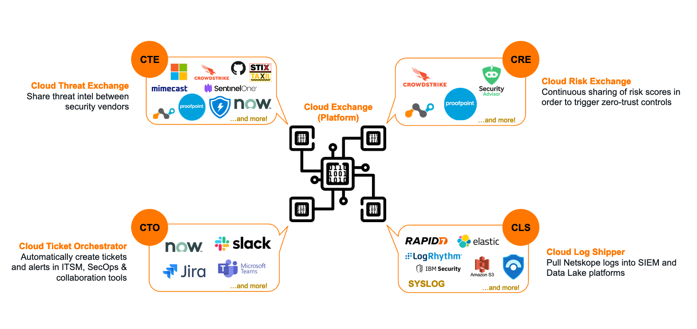
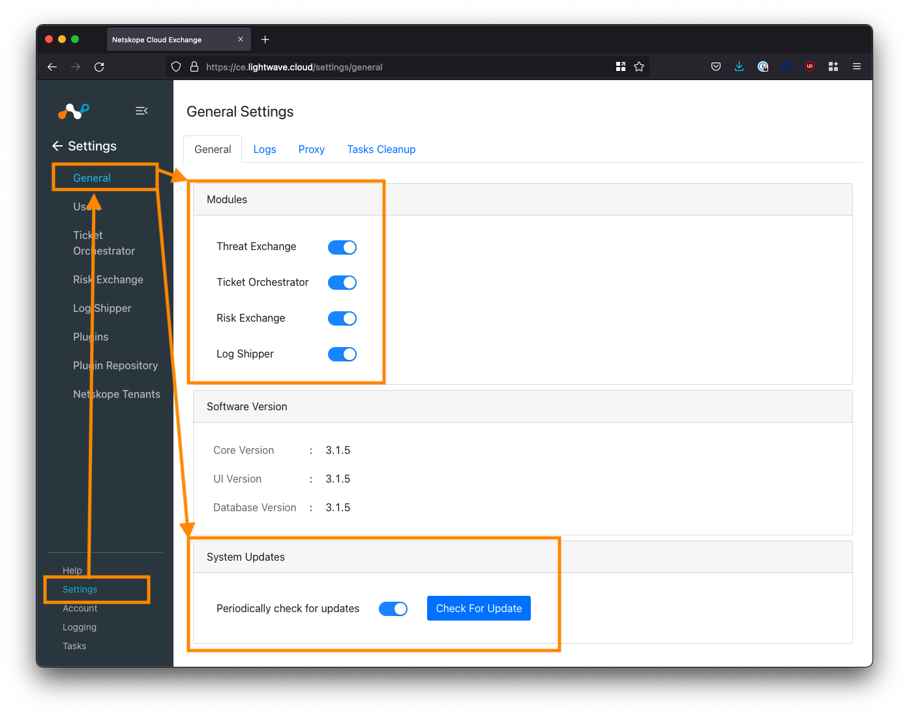
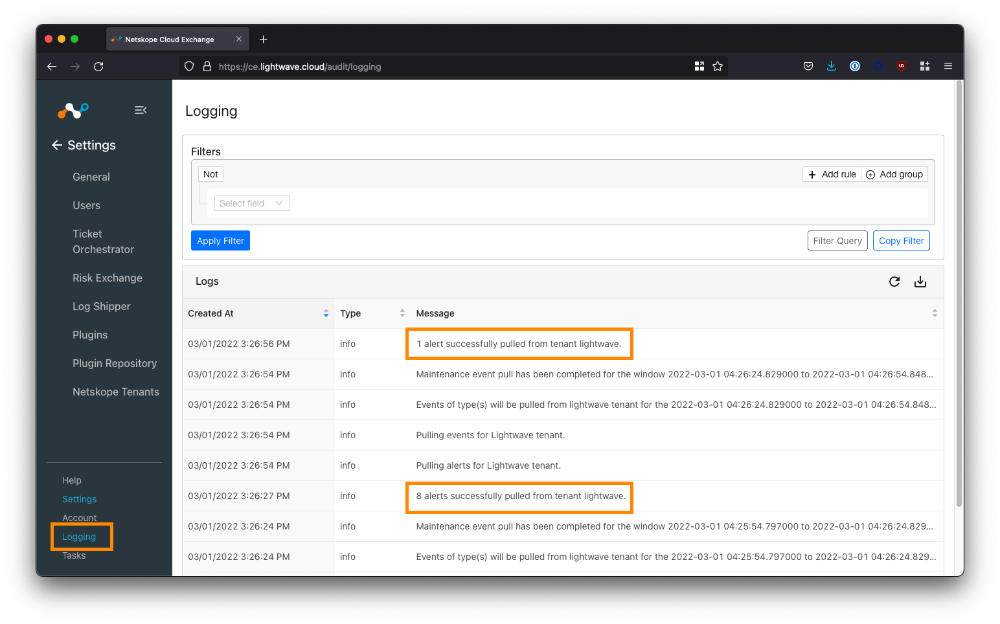

> The thoughts and opinions in this post are my own and do not reflect those of Netskope. Please follow this guide at your own risk.

# What is Cloud Exchange?
Cloud Exchange (CE) is a platform (free for all Netskope customers) that facilitates the exchange of information between your various security and operations platforms.



# What can Cloud Exchange do?
4 modules make up the Cloud Exchange platform; each with a particular area of focus. You don't have to use every module: only the ones that make sense based on the vendors in your current environment.

## Threat Exchange
The Cloud Threat Exchange (CTE) module is designed to streamline and automate the sharing of threat indicators between security platforms in use in your environment, to reduce the likelihood of a successful attack.

## Ticket Orchestrator
For incidents and alerts generated in the Netskope platform, the Cloud Ticket Orchestrator (CTO) module will automatically create tickets and/or notifications in 3rd-party ITSM/collaboration systems (like ServiceNow, JIRA, Slack, etc) to streamline incident response.

## Risk Exchange
As part of the User & Entity Behavior Analytics (UEBA) feature (behavior and anomaly tracking), Netskope generates a risk score for each user in the organization. This score is known as the User Confidence Index (UCI). The UCI can be leveraged in policy to automatically take specific actions as a user's risk increases or decreases.

Other platforms, like Crowdstrike, also offer their own risk scoring. The Cloud Risk Exchange (CRE) module takes the risk scores generated by these other security platforms and factors them / correlates them into the Netskope UCI score generated for each user.

## Log Shipper
The Cloud Log Shipper (CLS) module extracts the raw event, alert, and log data from your Netskope tenant, and streams it to one or more receivers, such as a SIEM like Splunk, Sentinel, Exabeam, and so on.

---

# Deploying Cloud Exchange
Cloud Exchange is deployed as a series of Docker containers within your environment - hence as long as your system can run Docker, it can also run Cloud Exchange!

This guide will focus on using Ubuntu 20.04 LTS as the host OS, but in an enterprise environment, you may also wish to use Red Hat Enterprise Linux (RHEL).

## Requirements
You will need the following to install Cloud Exchange:
* Linux system capable of supporting the docker.io release of Docker, and Docker Compose. We recommend Ubuntu 20.04 LTS.
* A virtual machine with the following system requirements:
  * 2 vCPU
  * 4 GB of memory
  * 20 GB of storage
  * For example: Azure = `Standard B2s`, AWS = `t2.medium`, GCP = `e2-standard-2`.


## Install Docker & Docker Compose
If you're using a fresh VM, you'll need to install Docker and Docker Compose. The below will install Docker CE (Community Edition), which is free but does not come with support. For a production environment, I strongly recommend using Docker Enterprise.

The commands below cover the installation of Docker on an Ubuntu host. **For RHEL 8+, you will need to use Podman instead of Docker (#justredhatthings). Please see here for instructions on how to deploy CE on RHEL.**

Update the existing packages on the system:
```
sudo apt update -y && sudo apt upgrade -y
```

Install the pre-requisite packages. These allow `apt` to use a repository over HTTPS:
```
sudo apt install apt-transport-https ca-certificates curl software-properties-common -y
```

Add the GPG key for the official Docker software repository:
```
curl -fsSL https://download.docker.com/linux/ubuntu/gpg | sudo apt-key add -
```

Add the Docker software repository:
```
sudo add-apt-repository "deb [arch=amd64] https://download.docker.com/linux/ubuntu focal stable"
```

Install Docker:
```
sudo apt install docker-ce -y
```

Install Docker Compose:
```
sudo curl -L "https://github.com/docker/compose/releases/download/1.29.2/docker-compose-$(uname -s)-$(uname -m)" -o /usr/local/bin/docker-compose
```

Make the Docker Compose binary executable:
```
sudo chmod +x /usr/local/bin/docker-compose
```

Set the Docker process to start at boot:
```
sudo systemctl enable docker
```

Check that the Docker service is running:
```
sudo systemctl status docker

● docker.service - Docker Application Container Engine
     Loaded: loaded (/lib/systemd/system/docker.service; enabled; vendor preset: enabled)
     Active: active (running) since Thu 2022-02-24 05:31:37 UTC; 31s ago
TriggeredBy: ● docker.socket
       Docs: https://docs.docker.com
   Main PID: 23100 (dockerd)
      Tasks: 8
     Memory: 31.4M
     CGroup: /system.slice/docker.service
             └─23100 /usr/bin/dockerd -H fd:// --containerd=/run/containerd/containerd.sock
```


After the install, if you attempt to run the `docker` command without `sudo`, you will get one of the following errors:
```
ERROR: Got permission denied while trying to connect to the Docker daemon socket at unix:///var/run/docker.sock:
```

OR

```
docker: Cannot connect to the Docker daemon. Is the docker daemon running on this host?
See 'docker run --help'.
```

If you don't mind this, you can jump ahead. Otherwise, you can add your username to the `docker` group that was created on install. This will allow you to use the `docker` command without `sudo`.
```
sudo usermod -aG docker ${USER}
```

You will then need to log out of the system, then log back in again for the updated membership to take effect.


## Clone the Netskope Cloud Exchange Repository
Clone the Cloud Exchange repository from [Netskope on GitHub](https://github.com/netskopeoss/ta_cloud_exchange).

```
mkdir netskope && cd netskope
git clone https://github.com/netskopeoss/ta_cloud_exchange
cd ta_cloud_exchange
```

The scripts in this repository will pull the containers from the Netskope repository on [Docker Hub](https://hub.docker.com/u/netskopetechnicalalliances), bring them up using Docker Compose, and perform the initial setup of Cloud Exchange.


## Secure Cloud Exchange with an SSL Certificate
When you run the setup script in the next step, you will be prompted to create a self-signed SSL certificate.

An SSL certificate is important as it will secure the communication between your device and the Cloud Exchange Web UI. You have 3 options when it comes to securing the UI with an SSL certificate:

| Option                                         | Pros                                                                                                                           | Cons                                                                                                                                                                                                                                                        |
|------------------------------------------------|--------------------------------------------------------------------------------------------------------------------------------|-------------------------------------------------------------------------------------------------------------------------------------------------------------------------------------------------------------------------------------------------------------|
| Use the self-signed SSL certificate            | Easy. Type 'y' when prompted by the setup script. Communication between your device and the Web UI is secured.                                     | Your browser will not trust the certificate generated and will throw an SSL error, warning you that the certificate is untrusted whenever you try to access the CE UI. This doesn't mean that your connection isn't secure, but the warning can be annoying. You can whitelist the CE URL in your browser to make the error go away. |
| Use your own SSL certificate                   | Your browser will trust the certificate and not throw any errors. Communication between your device and the Web UI is secured. | Certificate management falls to you to manage.                                                                                                                                                                                                              |
| Don't use an SSL certificate (NOT RECOMMENDED) | Easiest option. Just press ENTER to the prompt.                                                                                | The communication between your device and the CE UI is NOT secured and potentially vulnerable to Man-in-the-Middle attacks.                                                                                                                                 |

Option 1 or 2 are recommended.

To use your own certificate, type `y` to the SSL prompt when you run the setup script in the section below. When the setup completes, BEFORE starting Cloud Exchange, overwrite the self-signed certificate files generated under `data/ssl_certs/` with your own public and private key:
```
nathan1@ce:~/netskope/ta_cloud_exchange$ ls data/ssl_certs/
cte_cert.crt  cte_cert_key.key  seed
```
**WARNING: Ensure that you rename your public and private key to `cte_cert.crt` and `cte_cert_key.key` respectively, or your certificate will not be used!**


## Installing Cloud Exchange

Install Cloud Exchange:
```
sudo ./setup
```

When prompted:
* Type `y` to create a self-signed SSL certificate
* Enter `443` when prompted for a port.
* For security reasons, **do not use** the default `JWT_SECRET`: you should type your own value, eg: `netskopeiscool`


Example:
```
nathan1@ce:~/netskope/ta_cloud_exchange$ sudo ./setup

Setting permission for data/mongo-data folder...
Permission set successfully...

Setting permission for data/custom_plugins folder...
Permission set successfully...

Do you want to create self signed certificate? y

Generating self signed certificate...
Generating a RSA private key
................................++++
...........................................................................++++
writing new private key to 'data/ssl_certs/cte_cert_key.key'
-----

Type in 'yes' to opt-in for beta.
> Enter BETA_OPT_IN (Default: "No"): 

> Enter UI_PORT (Default: "80"): 443

> Enter JWT_SECRET (Default: "secret"): netskopeiscool


Setup completed successfully...
```

You can change your selected values at any time by running the `setup`.

**REMINDER: If you plan to use your own SSL certificate, be sure that you overwrite the current private and public keys under `data/ssl_certs/` BEFORE continuing! See the section above for more information.**

## Launching Cloud Exchange
To start Cloud Exchange:
```
sudo ./start
```

To stop Cloud Exchange:
```
sudo ./stop
```

On first run, the Cloud Exchange containers will be pulled from Docker Hub so it may take some time to come up.

```
nathan1@ce:~/netskope/ta_cloud_exchange$ sudo ./start
Pulling rabbitmq-stats  ... done
Pulling mongodb-primary ... done
Pulling core            ... done
Pulling ui              ... done
Pulling watchtower      ... done
Creating network "ta_cloud_exchange_default" with the default driver
Creating ta_cloud_exchange_watchtower_1      ... done
Creating ta_cloud_exchange_rabbitmq-stats_1  ... done
Creating ta_cloud_exchange_mongodb-primary_1 ... done
Creating ta_cloud_exchange_core_1            ... done
Creating ta_cloud_exchange_ui_1              ... done
```

When complete, you will be able to access the Cloud Exchange UI in your browser:
```
https://<host ip address>
```


If you can't access the UI, make sure that any host firewall (eg: `ufw`), network firewall, and/or Network Security Group (NSG) permits port 80 and 443 inbound towards the host IP address.

Inbound exposure should be local only: We do not recommend exposing Cloud Exchange to the internet. Ideally, you should site CE behind a ZTNA solution like Netskope Private Access (NPA).

If you want to be able to access Cloud Exchange from a nice domain name (eg: cloudexchange.company.com), you can create a CNAME record in your DNS or hosting provider pointing towards the IP address of your Cloud Exchange host.

---

# Configure Cloud Exchange
Now that you have deployed Cloud Exchange, we need to perform some initial configuration steps.

## Logging into Cloud Exchange
The default username/password for the Super Administrator for Cloud Exchange is `admin`/`admin`. Once you accept the EULA, you will be prompted to change the default password. There can only be one Super Administrator and the username cannot be changed.

## Enabling Cloud Exchange Modules & Updates
Once you are logged in, Cloud Exchange will place you into the **Settings > General** menu.



You should enable all 4 of the Cloud Exchange modules under the **General** tab. Only the Super Administrator (the `admin` user) can turn these modules on/off. Regular admins are not able to see the settings to enable/disable these modules.

Under **System Updates**, toggle ON *`Periodically check for updates`*.

## (Optional) Setting a Proxy

If you require Cloud Exchange to communicate through a proxy, you can configure this under the *Proxy* tab under **Settings > General**.

## Adding Users & Configuring SSO
By default, Cloud Exchange uses a local login mechanism where users sign into CE directly.

User Management is located under **Settings > Users**

To create a user, click the plus button on the top right-hand side of the Users table.


There are two roles available for assignment: **Admin** and **Read-Only**. Currently, it is not possible to create additional roles in Cloud Exchange.

The Super Administrator role is only assigned to the default `admin` user. Only the default `admin` user can add/remove users, add/remove CE modules, and change CE module-specific config.

While local login may be acceptable for some smaller organizations, most will want to configure Single-Sign On (SSO) so that the login can utilize federated identity.

To configure SSO, click the *SSO* tab under **Settings > Users**, and enable the SSO checkbox.

I will post a separate guide linked below on how to configure SSO for Cloud Exchange with both Okta and Azure Active Directory (AAD).

* [Guide] [How-to setup SSO for Netskope Cloud Exchange (Okta & Azure AD)](/posts/sso-cloud-exchange)


## Add Your Netskope Tenant(s)

The last configuration step is to pair your Netskope tenant with your Cloud Exchange deployment in order for data to be synchronized. Multiple tenants are supported.

### Get an API Key
You will need to get an API key from within your Netskope tenant. For this guide, we will use API v1. API v2 will not be used (for now).

Log into your Netskope tenant, and navigate to **Settings (bottom-left corner) > Tools > REST API v1**.


Copy the API token displayed. If this is your first time using the API, you may need to generate a new one.

### Add your Netskope Tenant(s) in Cloud Exchange

Navigate to **Settings > Netskope Tenants** and click the **Add Tenant** button.


Fill in the fields according to the table below:

| Field            | Description                                                                                                                                                                                                                                  |
|------------------|----------------------------------------------------------------------------------------------------------------------------------------------------------------------------------------------------------------------------------------------|
| Name             | Enter an easy to remember name for the tenant. Can be whatever you like.                                                                                                                                                                     |
| Tenant Name      | Enter the subdomain of your Netskope tenant - this is everything **before** the `.goskope.com` in the URL of your Netskope tenant. Eg: For `lightwave.goskope.com`, enter `lightwave`. For `lightwave.eu.goskope.com`, enter `lightwave.eu`. |
| V1 API Token     | Enter the API token copied from your tenant in the step above.                                                                                                                                                                              |
| V2 API Token     | Optional. Leave this blank for now.                                                                                                                                                                                                          |
| Initial Range    | Number of days of historical data to sync with CE initially. Enter any value between 1-60. 7-14 is a good default number if you are unsure.                                                                                                  |
| Use System Proxy | Check this if you would like the connection between CE and Netskope to use the configured system proxy.                                                                                                                                      |

Click **Save** to complete your configuration.


### Verify the Netskope Tenant Configuration
Navigate to **Logging** in the bottom-left corner of the UI.

If your Netskope tenant was successfully added, you will start to see events synchronized (provided your tenant has alerts to sync).



# Configure Your Plugins
Cloud Exchange uses the concept of "plugins" to determine where to send and receive data from. 

You can have multiple inputs and multiple outputs: Naturally, you will want to sync data to and from your Netskope tenant(s) in addition to your other vendors.

Navigate to **Settings > Plugins**


Here you will see a list of supported plugins; tagged according to the CE module the plugin aligns to data-wise:

| CE Tag | Associated CE Module                                                                                            |
|--------|-----------------------------------------------------------------------------------------------------------------|
| CTO    | Cloud Threat Exchange. Synchronize threat intel, including IOCs, between vendors.                               |
| CRE    | Cloud Risk Exchange. Synchronize risk scores between vendors.                                                   |
| CTO    | Cloud Ticket Orchestrator. Automatically raise tickets and alerts in apps like Jira, ServiceNow, and Slack.     |
| CLS    | Cloud Log Shipper. Automatically pull and push logs to SIEM and data lake applications like Splunk and Sentinel. |

To start, you will want to configure the Netskope plugins for the associated modules you wish to use. For example, if you wish to share IOCs between Netskope and Crowdstrike, ensure you configure the Netskope CTE plugin in addition to the Crowdstrike CTE plugin.

Vendors could potentially have multiple plugins depending on the CE modules supported. For example, Crowdstrike has both CTE and CRE plugins for sharing both threat and risk intel.


---

# Finish
Congratulations! You've just deployed Cloud Exchange! Where to from here? It's time to start exploring the different plugins across each of the Cloud Exchange modules.

* [Cloud Exchange Netskope documentation](https://docs.netskope.com/en/netskope-cloud-exchange.html)
* [List of 3rd party plugins](https://docs.netskope.com/en/supported-3rd-party-plugins.html) (see the Cloud Exchange UI for the most up-to-date list)

