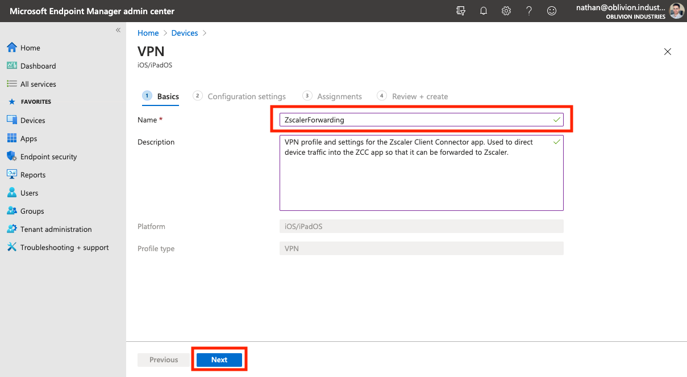
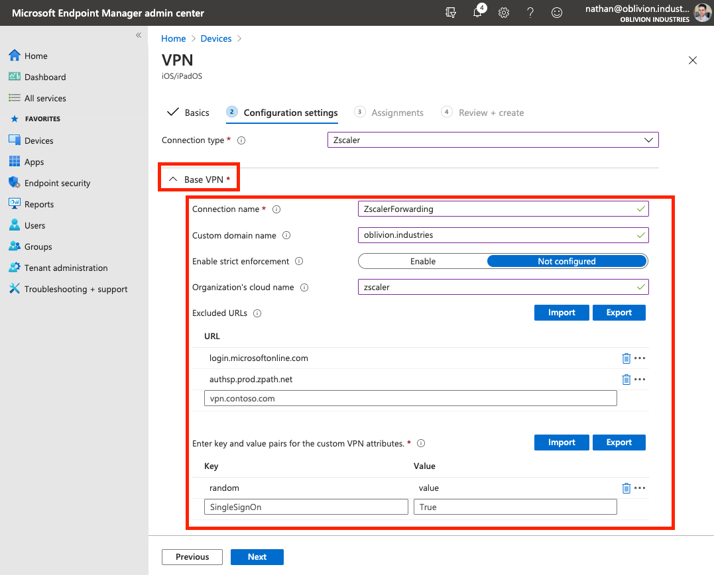
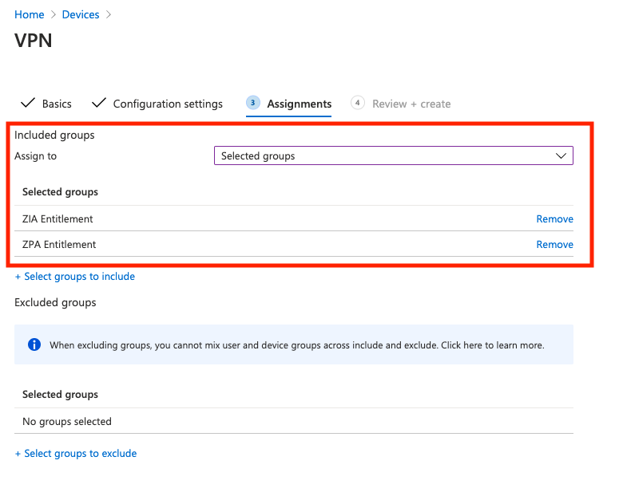
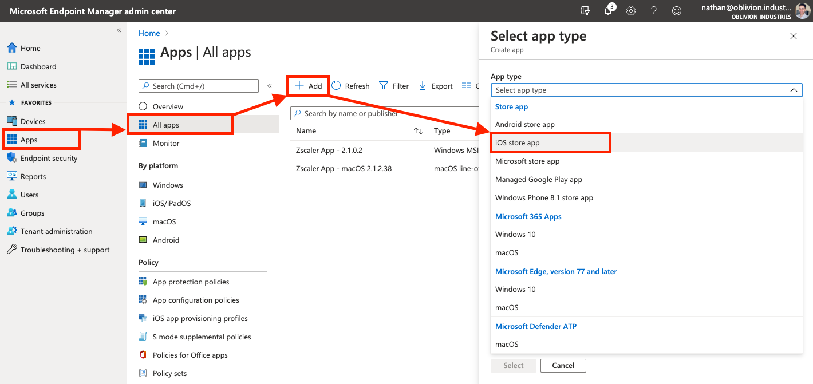
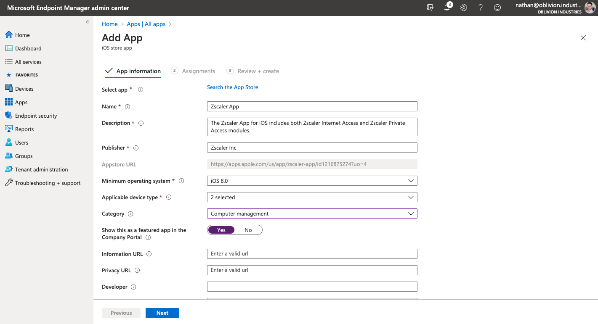
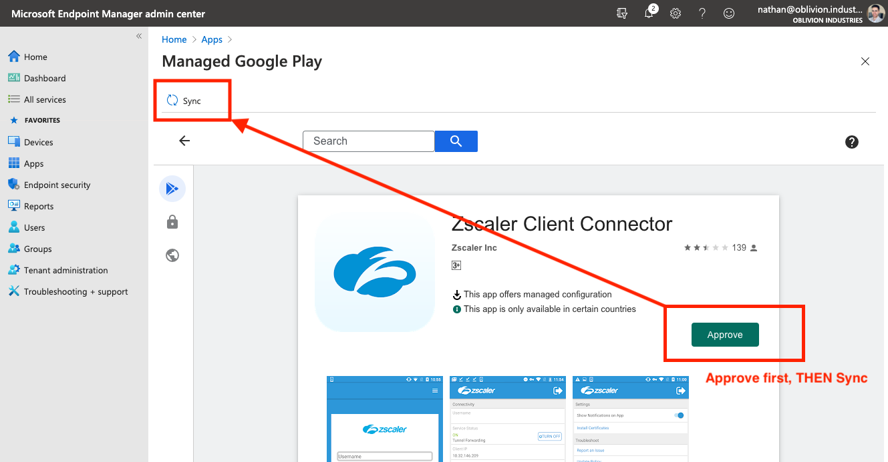
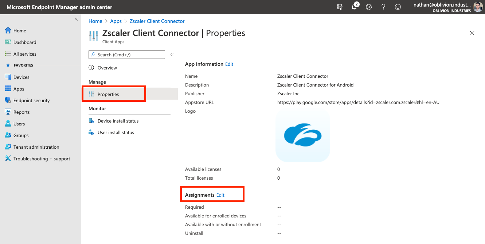
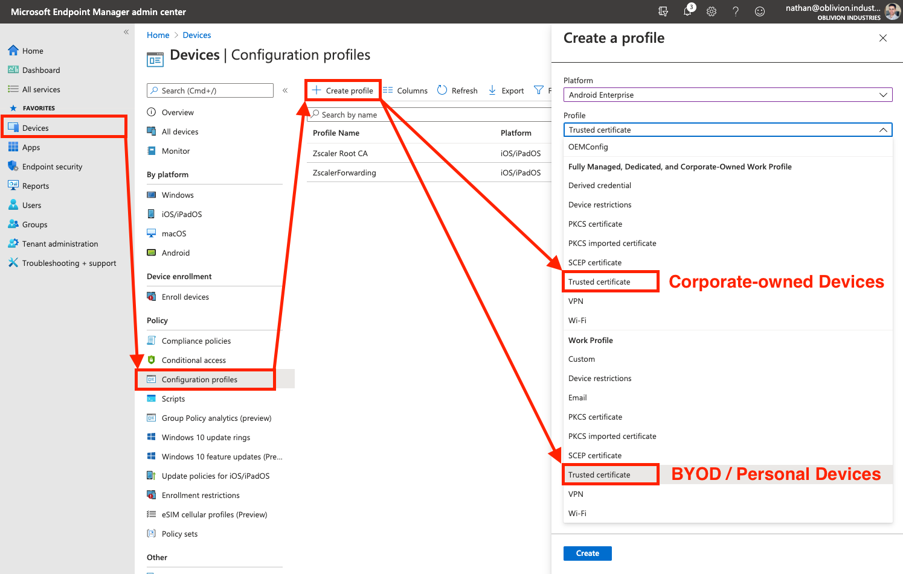
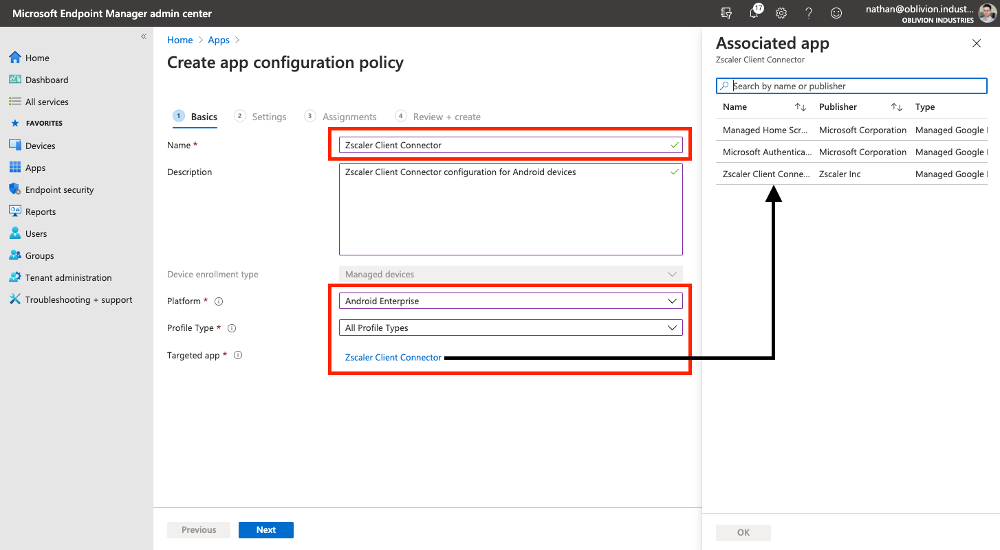

> The thoughts and opinions in this post are my own and do not necessarily reflect those of Zscaler.

In this guide, we'll walkthrough how to configure Microsoft Intune from scratch and use it to deploy the Zscaler Client Connector agent (ZCC) - formerly known as Zscaler Client Connector (ZCC).

Due to length, I've split this into two posts (the orginal was over 8000 words):

* This post covers deployment on iOS/iPadOS and Android.
* The other post, [available here](/posts/deploy-zapp-with-intune), covers Windows and macOS.

I suggest you use the Table of Contents to jump to the section that you need.

# What is Intune?

[According](https://docs.microsoft.com/en-us/mem/intune/fundamentals/what-is-intune) to Microsoft:

> Microsoft Intune is a cloud-based service that focuses on mobile device management (MDM) and mobile application management (MAM).
>
> With Intune, you can:
>
> - Set rules and configure settings on personal and organization-owned devices to access data and networks.
> - Deploy and authenticate apps on devices -- on-premises and mobile.
> - Be sure devices and apps are compliant with your security requirements.

In order to access Intune, you need to have either a Microsoft 365 or [Enterprise & Mobility E3/E5](https://www.microsoft.com/en-au/microsoft-365/enterprise-mobility-security/compare-plans-and-pricing) subscription. If you're using a free Azure account, you'll need to sign up to a trial, or pay per user (which can get costly).

# Before You Begin

When adding an app to Intune, you'll be prompted to allocate the groups of users (or devices) that the app will be rolled out to. Hence before beginning, ensure you have the users of Zscaler inside of an AD or Azure AD group that you can assign the Zscaler Client Connector app to.

Depending on whether you want the ZCC app to be mandatory or optional for certain groups of users, you may want to divide your users into two groups:

1. The users to which the app is MANDATORY. Any user in this group will have the app automatically pushed out to them.
2. The users to which the app is OPTIONAL. The app will not be automatically pushed for users in this group, allowing them to go to the Company Portal and download it themselves if they choose.

In my examples below, I have 3 groups:

| Group               | Description                                                  |
| ------------------- | ------------------------------------------------------------ |
| ZIA_Entitlement     | This is the group of all users that are entitled to use Zscaler Internet Access (ZIA) |
| ZPA_Entitlement     | This is the group of all users that are entitled to use Zscaler Private Access (ZPA). In my case, this is a subset of users from the ZIA_Entitlement group as I might not want to roll ZPA out to every user in the organization. |
| Zscaler - Mandatory | This group contains every user in the organization to which the ZCC app will be automatically rolled out to. Ie: The majority of users from the above two groups. If this is your organization, you might include the whole org in this group, except select users (eg: some from IT) for which the app will be optional. |


# A Warning on SSL Inspection for iOS & Android

You should be **very** careful before enabling SSL inspection for iOS and Android devices. Mobile devices and applications are notorious for "Certificate Pinning" or "Public Key Pinning" which breaks the connectivity of the app when subjected to SSL inspection.

In this instance, the app only trusts a hardcoded set of certificates, typically from it's developer. If the certificate the app sees is not in this hardcoded list, then the app will terminate the connection and not send any traffic; even if the certificate is trusted by the device. This is to protect against malicious Man-in-the-Middle (MitM) attacks, however it also prevents legitimate MitM functions, like SSL inspection, from working.

The only way around certificate pinning today is to bypass the application from SSL inspection; a solution that many enterprises are not happy doing as it prevents visibility of that application's traffic.

Turning on SSL inspection off the bat for iOS and Android will likely lead to a number of very angry users. I would typically recommend you leave it OFF in the first instance, gather data on the applications used by your users, and then switch it ON at a later date armed with a list of apps you might need to bypass.

For iOS and iPadOS, if you are enabling SSL inspection, iMessage, iCloud, and the iTunes and App Stores all implement Certificate Pinning. You will need to bypass the following domains under **Policy > SSL Inspection** in the Zscaler Admin Portal:

```
p24-keyvalueservice.icloud.com
*.apps.apple.com
.itunes.apple.com
.mzstatic.com
gs-loc.apple.com
gsa.apple.com
securemetrics.apple.com
swscan.apple.com
xp.apple.com
.icloud.com
ppq.apple.com
akadns.net
```


For Android, if you are enabling SSL inspection, Google Play implements Certificate Pinning, so you will need to bypass the following domains under **Policy > SSL Inspection** in the Zscaler Admin Portal:

```
.gvt1.com
.gvt2.com 
.vzw.com
.ggpht.com
play.googleapis.com
android.clients.google.com
.googleapis.com
.googleusercontent.com
.ggpht.com
.android.clients.google.com
.play.googlezip.net
connectivitycheck.gstatic.com
```

Zscaler maintains a list of commonly required SSL bypasses across platforms [here](https://help.zscaler.com/zia/certificate-pinning-and-ssl-inspection).

# Microsoft Endpoint Manager

We'll be using the **Microsoft Endpoint Manager console** (MEM) to orchestrate Intune. You can log in using the same Azure Portal credentials here: https://endpoint.microsoft.com


## (Optional) Setting the MDM Authority

If you're using an existing Office 365 account **and** have been using the Office 365 MDM, you'll need to change the MDM authority from Office 365 to Intune. [This](https://docs.microsoft.com/en-us/mem/intune/fundamentals/mdm-authority-set) Microsoft help article will guide you through it.

---

# iOS and iPadOS

This section will cover deploying ZCC onto iOS (and iPadOS) using Intune.


## 1. Create a Device Configuration Profile for VPN

ZCC requires the use of a VPN profile on the device which Intune will deploy for us. We need to create it first however. 

Note that ZCC does not use a VPN to forward traffic to Zscaler. On iOS the VPN profile is only used to direct device traffic into the ZCC application which then forwards it on to the closest Zscaler DC itself.


### Creating the VPN Profile

In the **Devices** menu of the [MEM portal](https://endpoint.microsoft.com/), go to **Configuration profiles** (this is under the "Policy" menu heading). Select **Create profile**.

Under **Platform** select **iOS/iPadOS** from the dropdown. Likewise, under **Profile**, select **VPN**. When you're done, click **Create** to continue.


On the next screen, give the VPN a name (eg: `ZscalerForwarding`) then click **Next** to got to the **Configuration Settings** tab.




### Configuring the Base VPN Profile

For the **Connection type**, select **Zscaler** from the dropdown.


Expand the **Base VPN** section and fill in the following:

| Field                         | Description                                                  |
| ----------------------------- | ------------------------------------------------------------ |
| **Connection name**           | The name of the VPN connection. This is what will show up on the user's device. Eg: `ZscalerForwarding` |
| **Custom domain name**        | Enter the primary domain name associated with your company's identity service / SSO provider. This is used to pre-populate the login field in ZCC. In my case, this is `oblivion.industries` as I authenticate with nathan@oblivion.industries as my username. |
| **Enable strict enforcement** | If enabled, Strict Enforcement blocks internet access on the device until the user signs into ZCC. Strict Enforcement requires a device be in Supervised Mode, which in turn, is only possible with corporate owned devices (those configured with Apple Configurator or DEP/Apple Business Manager) - BYOD or employee-owned devices can't be put into Supervised Mode and hence, won't work with Strict Enforcement (even if it's enabled). |
| **Organization's cloud name** | The name of the Zscaler cloud on which your organization is provisioned. When entering the cloud name, DO NOT enter the **.net** at the end. Eg: zscalertwo.net should be entered as `zscalertwo`, zscaler.net should be entered as `zscaler`. |



The **Excluded URLs** section allows you to specify URLs that are bypassed from Zscaler (typically this should be done within the Zscaler admin portal itself so you're not fragmenting the configuration).

If you're enabling strict enforcement, at a minimum you'll want to include the URL for your SSO/identity provider and the URL for Zscaler's authentication service. For example, for Azure AD:

```
login.microsoftonline.com
authsp.prod.zpath.net
```

You won't be able to proceed without adding some sort of entry to the **Key** and **Value** sections (more info is provided below, but this won't apply to most orgs). **You can enter any random key and value pair to proceed.**


### (Optional) Additional Customization

The **Key** and **Value** pairs you can enter allow you to further customize the install if:

* You need to use a token to log in a device (eg: a non-user, kiosk device)
* You need to enable FIPS compliant libraries.

Most deployments won't need to to this and can safely skip this section.

| Key           | Value                                                        |
| ------------- | ------------------------------------------------------------ |
| `deviceToken` | The appropriate device token from the Zscaler Client Connector Portal, if you want to use the [Zscaler Client Connector Portal as an IdP](https://help.zscaler.com/z-app/using-zscaler-app-portal-identity-provider-idp). |
| `username`    | The username for the user. For example, if the username is nathan@oblivion.industries, you would enter `nathan`. Only required if you're using `deviceToken` above. |
| `enableFips`  | Enabling this option indicates that ZCC uses FIPS compliant libraries for communication with Zscaler infrastructure. Enter 1 to enable or 0 to disable this option (enable only if you require FIPS level security within your org). |
| `userDomain`  | Not needed. Duplicate of the above "Custom domain name" field from the VPN profile configuration. |
| `cloudname`   | Not needed. Duplicate of the above "Organization cloud name" field from the VPN profile configuration. |


### (Optional) Configure the Automatic VPN settings

Scroll down and expand the **Automatic VPN** section. By default, you can leave this set to **Not configured**. In this instance, the device will direct all internet bound traffic from every app into the ZCC app to be forwarded to Zscaler. You can then control, from within the Zscaler Client Connector portal, what traffic should be sent to Zscaler and what traffic should be bypassed. This gives you a single point of control over how traffic is bypassed or directed towards Zscaler.


Optionally, you can configure an **On-demand** or **Per-App** VPN in order dictate at a device level through Intune what traffic should be directed towards Zscaler. An **On-demand** VPN allows you to set rules as to when the traffic should be directed to ZCC (eg: when the user is or isn't connected to specific specific SSIDs), while a **Per-App** VPN allows you to selectively steer traffic into the ZCC app based on specific apps on the device or URLs.

This guide won't cover configuring an **On-demand** or **Per-app** VPN here as it's quite straightforward. See [here](https://docs.microsoft.com/en-gb/mem/intune/configuration/vpn-settings-ios#connection-type) for more information.

When you're satisifed, click **Next** to continue.


### Assign Groups to the VPN Profile

In the next section, you need to select the Users, Groups, or Devices that will make use of this VPN Configuration Profile. As this profile is **required** for all users that will use the ZCC app on iOS/iPad OS, you should assign the AD groups that contain all of the users that are entitled to use Zscaler.

In my case, this was the groups `ZIA_Entitlement` (a group containing all users org wide that can use Zscaler Internet Access (ZIA)), and `ZPA_Entitlement` (a group containing all users org wide that can use Zscaler Private Access (ZPA)).



Select **Next** to proceed to review your profile configuration. When you're done, click **Review + Create** to create the profile.


## 2. Push the Zscaler Certificate for SSL Inspection

*NB: If you're **not** a ZIA customer (ie: ZPA only), then you can skip this section.*

For Windows and macOS, ZCC will automatically install the intermediate root certificate (required for SSL inspection) onto the device for you. 

With iOS, this is not possible as Apple requires application-installed certificates to be untrusted by default. This means that if ZCC *were* to try and install the certificate, the user would get an SSL error for every site they visited as Zscaler is inspecting all traffic and the device doesn't trust the certificate installed.

Instead, we need to have the certificate pushed out via Intune.


### Download the Zscaler Intermediate Root CA & Enable iOS SSL Inspection

Log into your ZIA admin portal, and navigate to **Policy > SSL Inspection**.


Scroll to the bottom of the page and under the section, **INTERMEDIATE ROOT CERTIFICATE AUTHORITY FOR SSL INSPECTION**, click **Download Zscaler Root Certificate**.

You can optionally enable SSL inspection for iOS on this screen, but be weary of Certificate Pinning when doing so.


**Save** and **activate** your changes.

On your computer, unzip the `.zip` file containing the certificate to obtain the `ZscalerRootCertificate-2048-SHA256.crt` certificate file. You'll need this in the next step.


### Create a Device Configuration Profile for a Trusted Certificate

Just like we did for the VPN profile, we need to create *another* Device Configuration Profile; this time for a **Trusted Certificate**.

In the **Devices** menu of the [MEM portal](https://endpoint.microsoft.com/), go to **Configuration profiles** (this is under the "Policy" menu heading). Select **Create profile**.

Under **Platform** select **iOS/iPadOS** from the dropdown. Under **Profile**, select Trusted Certificate.


On the next screen, give the Trusted Certificate a name (eg: `Zscaler Root CA`) then click **Next** to got to the **Configuration Settings** tab.


On the next screen, navigate to and select the `ZscalerRootCertificate-2048-SHA256.crt` file you downloaded from the Zscaler admin portal. Click **Next** once the file has uploaded.


On the **Assignments** tab, you can either assign this to **All devices** or explicitly select the groups containing your Zscaler users.


Click **Next** when you are done to review and create the profile.


## 3. Add a new iOS App in MEM

### Add a new iOS Store App

In the **Apps** menu of the [MEM portal](https://endpoint.microsoft.com/), navigate to **Apps > All Apps > Add**. In the panel that appears, under the **Store Apps** heading, select **iOS store app**.



When prompted, search for "**Zscaler**" and select the Zscaler Client Connector.


On the next page, most of the App information will be populated for you. Ensure **iOS 9.0** is selected as the minimum operating system, and click **Next** to move to the **Assignments** tab.




### Assign Users to the App

There are two different sections you can allocate users or groups to depending on how you want the app rolled out to users:

* **Required** = The app is MANDATORY for these users/groups. Any user or group in this section will have the App automatically pushed out to them.
* **Available for enrolled devices** = The app is OPTIONAL for these users/groups. The app will not be automatically pushed and the users can go to download the app themselves from within the Company Portal.

Assign your users or groups to the ZCC app for iOS accordingly.


Click **Next** to continue and then **Create** on the following screen. Your iOS application will be created and you'll be ready to go!


## 4. (Optional) Configure Intune for Apple Devices

Apple requires an MDM Push Certificate to enable management of iOS, iPadOS and macOS devices. If you haven't used any iOS/iPad OS devices with Intune before, you'll need to [follow the steps outlined by Microsoft here](https://docs.microsoft.com/en-us/mem/intune/enrollment/apple-mdm-push-certificate-get) before you can enroll and test any Apple devices.


## 5. Testing ZCC Deployment on iOS

If you haven't already:

1. Download and install the [Intune Company Portal](https://play.google.com/store/apps/details?id=com.microsoft.windowsintune.companyportal) app from Microsoft on the App Store.
2. Open the app and sign-in with your company SSO credentials.
3. Follow the prompts to complete the Intune device enrolment.

Following the device enrolment, provided that you signed in with a user in which the ZCC was mandatory, the ZCC app should automatically install on the user's device. If you specified the `cloudName` and `userDomain` flags in the VPN Configuration Profile, the user should automatically be prompted to sign in via SSO when opening the app.


## 6. Demo Video

Coming shortly...


## 7. Authentication Friction on iOS

### Removing the need for users to enter SSO credentials

Presently, our method for deploying ZCC on iOS works, however users still need to open the app and manually authenticate via SSO by typing their credentials. This creates user friction.

Authenticating the user without them having to enter their SSO credentials *is possible* on iOS using certificates, however given the length of this guide already, I might tackle this in a separate post... Check back later.


### The issue with Silent & Automatic Authentication

> Can I automatically and silently sign the user into the Zscaler Client Connector app on iOS when the app is rolled out with Intune?

This is a very common question I get from clients. **The answer is no, and you'll probably never be able to do this.**

Apple does not allow apps to automatically open and run themselves, and in order to silently authenticate the user during app rollout, the ZCC app would need to automatically open once installed to process the user authentication. From a security perspective, giving apps the ability to automatically open themselves would be a nightmare and something I can't see Apple allowing anytime soon.

What you need to do is create a "compelling event" so that your users *have* to open the app to authenticate.


### Creating a "Compelling Event"

Users are never going to open an app and sign in, just to ensure that your organization is secure: there is nothing in it for them to do so. You need to give them a reason and there are a few ways to do that:

1. Prevent certain apps, like Office 365, from working unless the user is signed into Zscaler.
2. Block all internet access from the device until the user opens the ZCC app to authenticate.
3. Prevent access to internal company applications unless the user is signed into Zscaler.

Number 1 is the easiest and involves either using the **Identity Proxy** feature in ZIA (this prevents your users from signing into apps like Office or Salesforce unless their traffic is going through Zscaler), or only allowing access to the application from the Zscaler IP space (eg: 165.225.0.0/17).

Number 2 is harder as it requires you to use Strict Enforcement, which requires the device be in Supervised Mode, which is only possible on corporate owned devices. BYOD and user-owned devices are out of the picture.

Number 3 can work in conjunction with Number 1, but requires ZPA. Essentially, ZPA provides access to your internal resources and won't work unless the user is signed in... so they have to sign in.


---

# Android

This section will cover deploying ZCC onto Android devices using Intune.


## 1. Add a new Android App in MEM

### Add a new Managed Google Play App

In the **Apps** menu of the [MEM portal](https://endpoint.microsoft.com/), navigate to **Apps > All Apps > Add**. In the panel that appears, under the **Store Apps** heading, select **Managed Google Play app**.


### Link Intune to Android Enterprise

**If this is your first time adding an Android app to Intune**, you'll be prompted to connect your Intune account to your Android Enterprise account before you can do anything else. After you've completed this step, go back and add a new Managed Google Play app again.


Note: If you are using a Samsung device, you have [additional steps you will need to go through](https://docs.microsoft.com/en-us/mem/intune/enrollment/android-samsung-knox-mobile-enroll) before proceeding.


### Approve the Zscaler Client Connector App

When prompted, search for "**Zscaler**" and select **Zscaler Client Connector**.


On the store page, click **Approve**. Follow the prompts to set your permission preferences for the app.

When you're finished, click **Select** under the app description, and then **Sync** at the top left. This will place you back into the All Apps section of Intune while your Managed Google Play preferences sync with Intune.



Wait 30-60 seconds, and refresh the app list. You should see the Zscaler Client Connector as a Managed Google Play store app appear in the list.


### Assign Users to the App

Click on the app and select **Preferences** from the menu pane. Under **Assignments** click **Edit**.



There are two different sections you can allocate users or groups to depending on how you want the app rolled out to users:

* **Required** = The app is MANDATORY for these users/groups. Any user or group in this section will have the App automatically pushed out to them.
* **Available for enrolled devices** = The app is OPTIONAL for these users/groups. The app will not be automatically pushed and the users can go to download the app themselves from within the Company Portal.

Assign your users or groups to the ZCC app for Android accordingly.


When you're done, click **Review and Save** at the bottom to save your configuration.


## 2. Push the Zscaler Certificate for SSL Inspection

*NB: If you're **not** a ZIA customer (ie: ZPA only), then you can skip this section.*

For Windows and macOS, ZCC will automatically install the intermediate root certificate (required for SSL inspection) onto the device for you. 

With Android, this is not possible: Google (by default) prevents non-default certificate authorities installed by 3rd party apps from being trusted by the device. Instead, we need to have the certificate pushed out via Intune.


### Download the Zscaler Intermediate Root CA & Enable Android SSL Inspection

Log into your ZIA admin portal, and navigate to **Policy > SSL Inspection**.


Scroll to the bottom of the page and under the section, **INTERMEDIATE ROOT CERTIFICATE AUTHORITY FOR SSL INSPECTION**, click **Download Zscaler Root Certificate**.

You can optionally enable SSL inspection for Android on this screen, but be weary of Certificate Pinning when doing so.


**Save** and **activate** your changes.

On your computer, unzip the `.zip` file containing the certificate to obtain the `ZscalerRootCertificate-2048-SHA256.crt` certificate file. You'll need this in the next step.


### Create a Device Configuration Profile for a Trusted Certificate

In the **Devices** menu of the [MEM portal](https://endpoint.microsoft.com/), go to **Configuration profiles** (this is under the "Policy" menu heading). Select **Create profile**.

Under **Platform** select **Android Enterprise** from the dropdown.

For the **Profile**:

* If you are deploying to **corporate-owned** Android devices, select the **Trusted Certificate** option under the "**Fully Managed, Dedicated, and Corporate-Owned Work Profile**" heading.
* If you are deploying to **BYOD** or **Employee-owned** Android devices, select the **Trusted Certificate** option under the "**Work Profile**" heading.
* If you plan on having a mix of **corporate-owned *AND* BYOD/Employee-owned devices**, you will need to follow this section twice; creating a separate configuration profile for each option.



On the next screen, give the Trusted Certificate a name (eg: `Zscaler Root CA`) then click **Next** to got to the **Configuration Settings** tab.


On the next screen, navigate to and select the `ZscalerRootCertificate-2048-SHA256.crt` file you downloaded from the Zscaler admin portal. Click **Next** once the file has uploaded.


On the **Assignments** tab, you can either assign this to **All devices** or explicitly select the groups containing your Zscaler users.


Click **Next** when you are done to review and create the profile.


## 3. Create an App Configuration Policy

An App Configuration Policy will allow us to customize the install of ZCC on Android.

### Creating the App Configuration Policy

In the **Apps** menu of the [MEM portal](https://endpoint.microsoft.com/), go to **App configuration policies** (this is under the "Policy" menu heading). Select **Add > Managed devices**.


1. Provide a name for the App Configuration Policy, eg: **Zscaler Client Connector**
2. For the Platform, select **Android Enterprise**.
3. For the Targeted App, click the link and select **Zscaler Client Connector** from the side panel that appears.

For the **Profile Type**:

* **Fully Managed, Dedicated, and Corporate-Owned Work Profile Only** applies this configuration to the ZCC app deployed on **Corporate-owned** devices.
* **Work Profile Only** applies this configuration to the ZCC app deployed on **BYOD / Employee-owned** devices.
* **All Profile Types** applies this configuration to all ZCC app deployments on Android, regardless of the device type. **This option should suffice for most organizations.**



Click **Next** to continue.


### A note on BYOD & Employee-owned devices

It is important to note that for BYOD / Employee-owned devices, Android for Work is used. **This creates a separate, sandboxed partition on the user's device for corporate data and apps; ensuring that they are segmented from personal data.** When you push apps using Intune, they are installed into the isolated Android for Work environment only and cannot interact with personal apps or data on the device.

If the user opens Chrome on their device, even though the Zscaler app is running, this traffic will NOT go through Zscaler as the Chrome app is from the personal partition; not Android for Work. However any apps that the user uses that are rolled out by the business via Intune WILL go through Zscaler.

For this reason, you might want to also add Chrome as a Managed Google Play app through Intune. This ensures that the user can use the work-instance of Chrome for access to corporate resources and applications, and the personal-instance of Chrome for all of their traffic.

If you would like ALL traffic from an employee owned device to go through Zscaler, you will need to push out a non-managed version of the ZCC app (which cannot be customized), or educate the user about installing ZCC themselves. Utimately you can't force them to do this though as it is their device.


### Customizing the App Configuration Policy

On the Settings tab, for **Configuration settings format**, select **Use configuration designer** from the dropdown.


Click the **Add** button to add in new attributes to customize the install. You can choose from the following:

| Key           | Value                                                        |
| ------------- | ------------------------------------------------------------ |
| `userDomain`  | Your organization’s domain name associated with your identity/SSO service, e.g., `oblivion.industries`. This is used to pre-populate the login field in ZCC. If your instance has multiple domains associated with it, enter the primary domain for your instance. |
| `cloudName`   | The name of the Zscaler cloud on which your organization is provisioned. When entering the cloud name, DO NOT enter the **.net** at the end. Eg: zscalertwo.net should be entered as `zscalertwo`, zscaler.net should be entered as `zscaler` |
| `deviceToken` | The appropriate device token from the Zscaler Client Connector Portal, if you want to use the [Zscaler Client Connector Portal as an IdP](https://help.zscaler.com/z-app/using-zscaler-app-portal-identity-provider-idp). Useful if ZCC is to be deployed to a shared or kiosk mobile device. |
| `userName`    | Only required if you're using `deviceToken` above. The username for the user. For example, if the username is nathan@oblivion.industries, you would enter `nathan` |
| `enableFips`  | Enabling this option indicates that ZCC uses FIPS compliant libraries for communication with Zscaler infrastructure. Enter 1 to enable or 0 to disable this option (enable only if you require FIPS level security within your org). |

**At a minimum, select the `userDomain` and `cloudName` fields as this is best practice.** This should suffice for most deployments - the other options are more specialized should not be needed in most circumstances.

> **Bug alert!** If you are using the `userDomain` and `cloudName` fields, you will also need to specify dummy values for `deviceToken` and `userName` as well, or the `userDomain` field won't actually function. This will be fixed in the next Android release (v.1.8)

Once you have entered values for the selected fields, click **Next**.


### Assign Users & Devices to the App Configuration Policy

In the next section, you need to select the Users, Groups, or Devices that will make use of this App Configuration Policy. Depending on whether this profile is for corporate-owned devices, personal/BYOD devices, or both, you should select groups accordingly.

In my case, this profile is for both corporate and employee-owned devices so I selected "**All users and devices**".


Select **Next** to proceed to review your policy configuration. When you're done, click **Create** to create the profile.

Your Android application should now be ready to rollout to users!


## 4. Testing ZCC Deployment on Android

If you haven't already:

1. Download and install the [Intune Company Portal](https://play.google.com/store/apps/details?id=com.microsoft.windowsintune.companyportal) app from Microsoft on the Google Play store.
2. Open the app and sign-in with your company SSO credentials.
3. Follow the prompts to complete the Intune device enrolment.

Following the device enrolment, provided that you signed in with a user in which the ZCC was mandatory, the ZCC app should automatically install on the user's device. If you specified the `cloudName` and `userDomain` flags in the App Configuration Policy, the user should automatically be prompted to sign in via SSO when opening the app.

If ZCC is deployed, but the user is prompted to enter a username from a blue Zscaler screen, this will be attributed to either of the following:

* The App Configuration Policy is not being applied against this user and device. Check the **Assignments** section under **Properties** for the App Configuration Policy and ensure your selection encompasses both the user and their device: **Apps > All Apps > App configuration policies > [Select your app policy]**
* You haven't specified the `cloudName` and `userDomain` flags correctly.
* You are hitting a bug where you also need to specify the `deviceToken` and `userName` fields in the App Configuration Policy (with dummy data).


## 5. Demo Video

Coming shortly...

