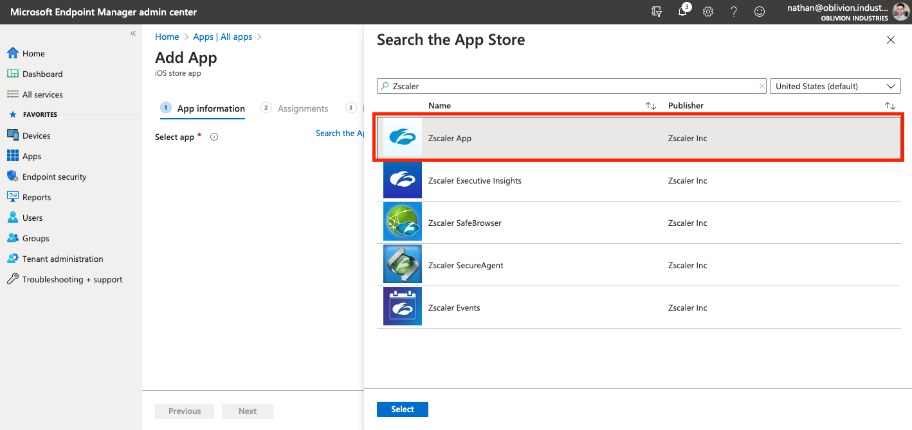
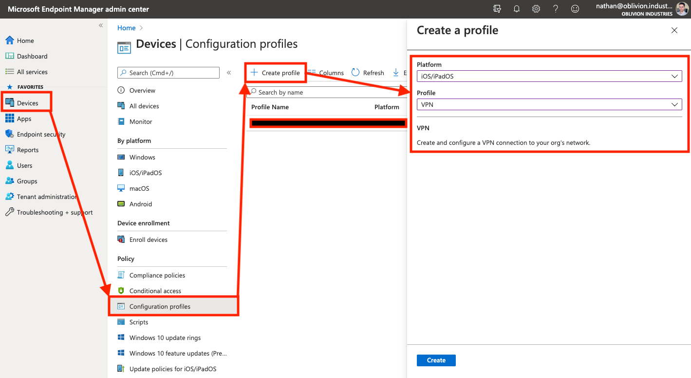

In this section you'll learn how to configure Microsoft Intune from scratch and use it to deploy Z-App.

What is Intune? [According](https://docs.microsoft.com/en-us/mem/intune/fundamentals/what-is-intune) to Microsoft:

> Microsoft Intune is a cloud-based service that focuses on mobile device management (MDM) and mobile application management (MAM).
>
> With Intune, you can:
>
> - Set rules and configure settings on personal and organization-owned devices to access data and networks.
> - Deploy and authenticate apps on devices -- on-premises and mobile.
> - Be sure devices and apps are compliant with your security requirements.

Note that in order to access Intune, you need to have either a Microsoft 365 or [Enterprise & Mobility E3/E5](https://www.microsoft.com/en-au/microsoft-365/enterprise-mobility-security/compare-plans-and-pricing) subscription. If you're using Azure Demo Labs, you're all set as this includes an Enterprise & Mobility Subscription. If you're using a free Azure account, you'll need to sign up to a trial, or pay per user (which can get costly).

Before proceeding, you'll need the following:

* M365 or Enterprise & Mobililty E3/E5 subscription (if you're using Azure Demo Labs, you would have allocated this license to your users in the last guide, so you're good to go!)
* Device(s) to test on and enrolling - ideally both a Windows 10 VM and mobile (iOS/Android) device would be great!
* Part 2 and Part 5 of this guide should have been completed.


# Video Demonstration

@scottyb has [posted a great 10 minute video](https://community.zscaler.com/t/z-app-deployment-with-microsoft-intune/4606) that runs through the user experience of enrolling a fresh Windows 10 device into Intune. Watch as Z-App is automatically pushed out and transparently authenticated for both ZIA and ZPA - all without the user having to lift a finger!


# Microsoft Endpoint Manager

We'll be using the new **Microsoft Endpoint Manager console** (MEM) to deploy Intune. You can log in using the same Azure Portal credentials here: https://endpoint.microsoft.com


## Setting the MDM Authority

You can skip this step if you've only just signed up to Intune or Azure Demo Labs.

If you're using an existing Office 365 account **and** have been using the Office 365 MDM, you'll need to change the MDM authority from Office 365 to Intune. [This](https://docs.microsoft.com/en-us/mem/intune/fundamentals/mdm-authority-set) Microsoft help article will guide you through it.


# Adding Apps

In this section we'll cover adding the Zscaler App for Windows, Mac, Android, and iOS devices.

Navigate to **Apps** in the MEM side menu.

NB: Apps are added to **Categories** in MEM for ease of management. There are default categories in place or you can create your own under **Apps > App categories**.


## Windows

### 1. Download the Zscaler App MSI

To start you'll need the .MSI installer for Z-App from the Zscaler App Portal. Log into the portal (either through ZIA or ZPA) and navigate to **Administration > Zscaler App Store**.


In the **Windows** panel, download the **MSI** for the latest **2.X.X** version. Do not use the older 1.X.X releases.


### 2. Add a new Windows App

Back in the **Apps** menu of the MEM portal, navigate to **Apps > All Apps > Add**. In the panel that appears, scroll to the bottom and under the **Other** heading, select **Line-of-business app**.


When prompted to select an app package file, **upload the MSI of the Zscaler App** you downloaded above and click OK.

Fill in the required details about the app:

* For **Name**, enter **Zscaler App 2.X.X.X** (where 2.X.X.X is the version number of the app - this will help you distinguish what version is being distributed by Intune)
* For **Description**, enter **Zscaler App**
* For **Publisher**, enter **Zscaler, Inc**
* Set **Ignore app version** to **Yes** - Z-App will automatically update itself once deployed, so Intune can ignore the version the user has installed after deployment.
* (Optional) Select an app category to allocate the Zscaler App to.


For the **Command-line arguments** section, enter the following (substituting in your own cloud and domain info):

```
CLOUDNAME=<cloudname>
USERDOMAIN=<your-custom-domain>
```

When entering the cloud name, DO NOT enter the **.net** at the end. Eg: zscalertwo.net should be entered as `zscalertwo`

Command-line arguments can be used for each platform to customize the install. For example, `STRICTENFORCEMENT` can be used to block access to the internet until your users enroll in the Zscaler App.

For a list and description of all the MSI customization options, scroll down to point #5 in [this help article](https://help.zscaler.com/z-app/customizing-zscaler-app-install-options-msi).

Click **Next** when ready to move onto the **Assignments** tab.


In the next panel, we'll select the groups of users to which the Zscaler App for Windows is mandatory (Required), and the groups of users in which we want to make it available to install as an option (Available for enrolled devices).

If you've been following along previous parts of this guide, you'll already have Groups (from Azure AD) available. It's now time to put them to use!

* For **Required**, select the group **ZscalerApp_Mandatory**.
* For **Available for enrolled devices**, select the groups **ZIA_Entitlement** and **ZPA_Entitlement**


Click **Next** to continue and then **Create** on the following screen. Your application will be created and the MSI will upload - be sure to wait until it's complete.

If you don't wish to add Mac, Android or iOS devices, you can skip the next few sections and jump to where we add users to specific apps.


---


## Mac OS
Mac OS requires a little bit more effort to get going than Windows does. We need to do the following on a local Mac OS machine:

1. Download the Zscaler App installer for Mac OS (this is a `.app` file)
2. Populate the post-installation script (to customize the install of Z-App with our chosen arguments)
3. Process the .app file and convert to .pkg (Intune can only work with pkg files on Mac OS)
4. Wrap the .pkg file using the [Intune App Wrapping Tool](https://github.com/msintuneappsdk/intune-app-wrapping-tool-mac) (creates an `.intunemac` file)

> **If you're using MacOS Catalina 10.15 or higher, you MUST use Z-App v2.1.X or above.** Catalina introduced the requirement that apps are notarized by their developers. Only Z-App releases v2.1 and above are notarized by Zscaler.


### Do I need an Apple Developer Account?

An Apple Developer Account is recommeneded.

You can proceed and deploy the agent *without* an Apple Developer account, however you will not be able to sign and notarize the .pkg file created below without a valid Developer ID. This will result in your users receiving an error about an the software coming from an 'Unidentified Developer', and depending on security settings, may block the install altogether.


If you enroll in the [Apple Developer program](https://developer.apple.com/enroll/) (US$99), you can sign and notarize your package which will make this error go away. If you're an organization running a Mac OS deployment, you will most likely have a developer account for the company already.

> But shouldn't Zscaler have already signed the app I'm deploying?

Yes, Zscaler HAS both signed and notarized the .app package that will be installed. The problem with Intune is that it can only deploy .pkg files to Mac OS. **We need to wrap our .app file inside a .pkg file for it to work with Intune, and it is this pkg file that needs to be signed and notarized as well.**

To sign an notarize the `.pkg`, you will need both the **Developer ID Installer** and **Developer ID Application** certificates. You can create these under the [**Certificates, Identifiers & Profiles**](https://developer.apple.com/account/resources/) section of your developer account, but will need a Certificate Signing Request (CSR) to do so: Apple have a brief guide on how to generate one using Keychain, [here](https://help.apple.com/developer-account/#/devbfa00fef7).


Download the certificates when you have them and click to open the `.cer` files in Keychain. Add them as a **login** certificate.

You can check the certificates have been installed correctly by running the following command:

```
security find-identity -p basic -v

  1) XXXXX[REDACTED] "Developer ID Installer: Nathan Catania (XXXXXXXXXX)"
  2) XXXXX[REDACTED] "Developer ID Application: Nathan Catania (XXXXXXXXXX)"
  3) [REDACTED] "[REDACTED]"
     3 valid identities found
```

If you have the **Developer ID Installer** and **Developer ID Application** certificates, you're good to proceed.


### 1. Download the Zscaler App .app

To start you'll need the `.app` installer for Z-App from the Zscaler App Portal. Log into the portal (either through ZIA or ZPA) and navigate to **Administration > Zscaler App Store**.


In the **macOS** panel, click the download link for the latest **2.X.X** version. Do not use the older 1.X.X releases.

Unzip the file downloaded to obtain the .app installer.


### 2. Create the post-installation script

We need to create a post-installation script to actually install the .app package. Intune will push out and install the .pkg file - which is just our .app file wrapped up as a pkg file for the purposes of Intune deployment.

We need a way to run and install the .app file itself *after* Intune has pushed out the `.pkg` to the user's device; including arguments to customize the install. This is what the post-installation script will do for us.

To start, on a Mac OS device **open Terminal**:

Create a folder called `scripts`. Inside this folder, create a file called `postinstall`. 
```
mkdir scripts && cd scripts && touch postinstall && pwd
...
> /Users/nathan/package/scripts
```
Note down the full path to the `scripts` directory - we'll need this later.

Open the postinstall file for editing:
```
nano postinstall
```

Copy and paste the following into the Terminal window (modify the arguments as required):

```
#!/bin/sh
open /tmp/<NAME-OF-ZSCALER-APP-INSTALLER>.app --args --unattendedmodeui none --userDomain <you-custom-domain> --cloudName <cloud-name> --hideAppUIOnLaunch 1 --mode unattended
```

To exit Nano, press `Control + X` and then `Y` to save.

This will do a silent installation of the Zscaler App (unattended mode) and automatically redirect the user to your company SSO page to sign in.

When entering the cloud name (`--cloudName`), DO NOT enter the **.net** at the end. Eg: zscalertwo.net should be entered as `zscalertwo`


Command-line arguments can be used for each platform to customize the install. For example, `--strictEnforcement 1` can be used to block access to the internet until your users enroll in the Zscaler App.

For a list and description of all the .app customization options, scroll down to point #4 in [this help article](https://help.zscaler.com/z-app/customizing-zscaler-app-install-options-macos).

As an example, the script for my installation looks like the following:
```shell
#!/bin/sh
open /tmp/Zscaler-osx-2.1.2.38-installer.app --args --unattendedmodeui none --userDomain oblivion.industries --cloudName zscaler --hideAppUIOnLaunch 1 --mode unattended
```

Lastly, we need to make the script executable. Run the following in Terminal:
```shell
chmod a+x postinstall
```


### 3. Create the PKG file

Intune only supports `pkg` files for Mac OS. A `.pkg` file is analogous to an MSI for Windows. All we are essentially doing is wrapping the .app file inside a .pkg file so that it can be deployed by Intune.

We'll be using the built-in `pkgbuild` tool to do this. Open Terminal and run the following command (change the file paths before running):
```shell
pkgbuild --install-location /tmp \
--scripts /Path/to/scripts/directory \
--component "/Path/to/Zscaler-Installer.app" \
--sign "Developer ID Installer: MY-DEV-NAME (UXXXXXXXXX)" \
--identifier "com.zscaler.zscalerappinstaller" \
--version "1.0" \
"/Path/to/save/pkg-file.pkg"
```

* `--install-location` should point to the `tmp` folder, or somewhere writeable. The `.pkg` will unpack itself here, then run the `.app` installer; which will install Z-App to the `/Applications` directory as required. If you change this from `/tmp`, you'll need to update the `postinstall` script as well.
* Make sure the `--scripts` argument is the path to the `scripts` folder you created in the step above.
* For the `--component` argument, the file path should point to the Zscaler App .app installer file you downloaded in Step #1.
* If you don't want your users to recieve an error that your package is from an 'Unidentified Developer' (which will prevent installation entirely), you will need to sign the package using a valid Apple Developer ID. To do this, you will need to enroll in the Apple Developer program (US$99). If you are an organization, you probably have already done this. Make sure you correctly substitute `MY-DEV-NAME` with your correct Developer name / org name.
  * __If you don't care about the 'Unidentified Developer' error, you can remove the__ `--sign` __argument.__
  * If you're not sure about your team / developer / org certificate name, you can check this under the **Certificates, Identifiers & Profiles** section of your developer account, [here](https://developer.apple.com/account/resources/).
* `--version` has no relationship to the actual Zscaler App version. This is only used by Intune. If you ever deploy another pkg via Intune for a different version of Z-App, you'll need to increment this (eg: Version 1.1) so that Intune can tell the pkg files apart. Note that Z-App has it's own update mechanism, so you don't need to worry about using Intune to push out updates to the Zscaler App software.
* The last path listed points to the location where you want to save the output pkg file.

For example:
```shell
pkgbuild --install-location /tmp \
--scripts /Users/nathan/package/scripts \
--component "/Users/nathan/package/Zscaler-osx-2.1.2.38-installer.app" \
--sign "Developer ID Installer: Nathan Catania (UXXXXXXXXX)" \
--identifier "com.zscaler.zscalerappinstaller" \
--version "1.0" \
"/Users/nathan/package/zappinstaller.pkg"

pkgbuild: Adding component at /Users/nathan/package/Zscaler-osx-2.1.2.38-installer.app
pkgbuild: Adding top-level postinstall script
pkgbuild: Using timestamp authority for signature
pkgbuild: Signing package with identity "Developer ID Installer: Nathan Catania (UXXXXXXXXX)" from keychain
pkgbuild: Adding certificate "Developer ID Certification Authority"
pkgbuild: Adding certificate "Apple Root CA"
pkgbuild: Wrote package to /Users/nathan/package/zappinstaller.pkg
```


If you signed your package, you can validate the signatures using `pkgutil`:

```
pkgutil --check-signature /path/to/pkg.pkg
```

For example:

```
pkgutil --check-signature /Users/nathan/package/zappinstaller.pkg 
Package "zappinstaller.pkg":
   Status: signed by a certificate trusted by Mac OS X
   Certificate Chain:
    1. Developer ID Installer: Nathan Catania (UXXXXXXXXX)
       SHA1 fingerprint: E3 CB 24 EA 50 74 B6 82 EF DA 5C 43 17 8D BA D2 40 CC ED F5
       -----------------------------------------------------------------------------
    2. Developer ID Certification Authority
       SHA1 fingerprint: 3B 16 6C 3B 7D C4 B7 51 C9 FE 2A FA B9 13 56 41 E3 88 E1 86
       -----------------------------------------------------------------------------
    3. Apple Root CA
       SHA1 fingerprint: 61 1E 5B 66 2C 59 3A 08 FF 58 D1 4A E2 24 52 D1 98 DF 6C 60
```


### 4. (OPTIONAL) Notorize the PKG

You only need to do this step if you signed the `.pkg` file in the previous step. Otherwise you can skip to the next step.

What is notarization? According to Apple:

> Notarization gives users more confidence that the Developer ID-signed software you distribute has been checked by Apple for malicious components. If there are no issues, the notary service generates a ticket for you to staple to your software; the notary service also publishes that ticket online where Gatekeeper can find it.
>
> Beginning in macOS 10.14.5, software signed with a new Developer ID certificate and all new or updated kernel extensions must be notarized to run. Beginning in macOS 10.15 [Catalina], all software built after June 1, 2019, and distributed with Developer ID must be notarized.

We're going to notarize the `.pkg` file via the command-line. To do this, you'll need to [generate an **App Specific Password**](https://support.apple.com/en-us/HT204397) for your the Apple ID of your Developer Account:

> **How to generate an app-specific password**
>
> 1. Sign in to your [Apple ID account page](https://appleid.apple.com/account/home).
> 2. In the Security section, click Generate Password below App-Specific Passwords.
> 3. Follow the steps on your screen.

Next, open **Keychain** and click the "+" icon to add a new Keychain Item.

* For **Keychain Item Name**, enter `notarization-tool`
* For **Account Name**, enter the email associated with your Developer Account / Apple ID.
* For **Password**, copy and paste the app-specific password from your Apple ID account.


To request notarization from Apple, run the following command (replacing the values with your own):

```shell
xcrun altool --notarize-app \
--username "appleid@example.com" \
--password "@keychain:notarization-tool" \
--asc-provider "UXXXXXXXXX" \
--primary-bundle-id "com.zscaler.zscalerappinstaller" \
--file "/Path/to/pkg.pkg"
```


| Field               | Value                                                        |
| ------------------- | ------------------------------------------------------------ |
| `username`          | The Apple ID username associated with your Apple Developer Account |
| `password`          | Enter `@keychain:` followed by the name of the Keychain Item which you saved your app-specific password to. This will fetch the password from the keychain. |
| `asc-provider`      | This is the Team ID from your Developer Account. You can find this by logging into your Developer Account and reviewing your profile |
| `primary-bundle-id` | This should match the identifier you specified when you created the pkg. |
| `file`              | The path to the .pkg file                                    |

For example:

```shell
xcrun altool --notarize-app \
--username "[redacted]@gmail.com" \
--password "@keychain:notarization-tool" \
--asc-provider "UXXXXXXXXX" \
--primary-bundle-id "com.zscaler.zscalerappinstaller" \
--file "/Users/nathan/package/zappinstaller.pkg"

...
RequestUUID = 53acc70a-XXXX-XXXX-XXXX-XXXXXXXXXXXX
```

The command will take a while to run as it is uploading your `.pkg` file to Apple. Once done, it will return a UUID which you can use to check the status of your notarization request:

```shell
xcrun altool --notarization-info "53acc70a-XXXX-XXXX-XXXX-XXXXXXXXXXXX" \
--username "[redacted]@gmail.com" \
--password "@keychain:notarization-tool"

...
Date: 2020-07-06 10:37:20 +0000
Hash: [redacted]
LogFileURL: https://osxapps-ssl.itunes.apple.com/itunes-assets/Enigma114/[redacted]
RequestUUID: 53acc70a-XXXX-XXXX-XXXX-XXXXXXXXXXXX
Status: success
Status Code: 0
Status Message: Package Approved
```

Once the process is complete (mine took under 10 minutes), you'll recieve a confirmation email as to whether your request was successful or not.

The last step is to staple the notarization ticket to the `.pkg` file. This ensures that a Mac device that is offline can still validate that the `.pkg` file is notarized:

```
xcrun stapler staple /path/to/pkg.pkg
```

Note: If your command fails, wait a few minutes and try again. If your command continuously fails, and your traffic is going through ZIA or another proxy, you will need to bypass `api.apple-cloudkit.com` from SSL inspection due to certificate pinning.

Validate the staple action was successful:

```
xcrun stapler validate /path/to/pkg.pkg
```


### 5. Test the PKG

Before going further, test your PKG file by running it and seeing if it successfully installed the Zscaler App silently. Make sure you don't already have Z-App installed when doing this however!

If you have an existing installation of Z-App, you can remove it under `Applications/Zscaler/Uninstall-Zscaler-App`


### 6. Create an .intunemac file

Once you've verified your PKG file functions correctly, we need to wrap it for use with Intune.

Download the [Intune App Wrapping Tool for Mac](https://github.com/msintuneappsdk/intune-app-wrapping-tool-mac/releases/) (this is a Microsoft-owned repository).

Next:
1. Unzip the source code folder
2. Open Terminal
3. Change directory to where the `IntuneAppUtil` file is located
4. Make the `IntuneAppUtil` file executable:
```
chmod +x IntuneAppUtil
```

Locate the PKG file you created above and use the `IntuneAppUtil` tool to wrap the `.pkg` file to a `.intunemac` file:
```
./IntuneAppUtil -v -c /path/to/zscaler-installer.pkg -o /output/directory/path
```

For example:
```
./IntuneAppUtil -c /Users/nathan/package/zappinstaller.pkg -o /Users/nathan/package

...
Creating intunemac file for /Users/nathan/Downloads/Zscaler-osx-2.1.2.38-installer.pkg
Composing the intunemac file output
Output written to /Users/nathan/Downloads/ZscalerInstaller.pkg.intunemac.

IntuneAppUtil successfully processed "ZscalerInstaller.pkg",
to deploy refer to the product documentation.
```

If everything went well, you should see the `.intunemac` file in your specified output directory.


### 7. Add a new Line-of-Business app in MEM

In the **Apps** menu of the [MEM portal](https://endpoint.microsoft.com/), navigate to **Apps > All Apps > Add**. In the panel that appears, scroll to the bottom and under the **Other** heading, select **Line-of-business app**.


When prompted to select an app package file, **upload the** `.intunemac` **file you created above** and click OK.

Fill in the required details about the app:

* For **Name**, enter **Zscaler App - Mac OS 2.X.X.X** (where 2.X.X.X is the version number of the app - this will help you distinguish what version is being distributed by Intune)
* For **Description**, enter **Zscaler App for Mac OS**
* For **Publisher**, enter **Zscaler, Inc**
* For **Minimum operating system**, select **OS X Yosemite 10.10** (Z-App supports Mac OS 10.10+)
* Set **Ignore app version** to **Yes** - Z-App will automatically update itself once deployed, so Intune can ignore the version the user has installed after deployment.
* (Optional) Select an app category to allocate the Zscaler App to.


Click **Next** to move to the **Assignments** tab.


In the next panel, we'll select the groups of users to which the Zscaler App for Mac OS is mandatory ("Required" heading), and the groups of users in which we want to make it available to install as an option ("Available for enrolled devices" heading).

If you've been following along previous parts of this guide, you'll already have Groups (from Azure AD) available. It's now time to put them to use!

* For **Required**, select the group **ZscalerApp - Mandatory**.
* For **Available for enrolled devices**, select the groups **ZIA_Entitlement** and **ZPA_Entitlement**


Click **Next** to continue and then **Create** on the following screen. Your application will be created and the `.intunemac` file will upload - be sure to wait until it's complete.

If you don't wish to add Android or iOS devices, you can skip the next few sections and jump to where we add users to specific apps.

---


## iOS and iPadOS

### 1. Create a Device Configuration Profile for VPN

Z-App requires the use of a VPN profile on the device which Intune will deploy for us. We need to create it first however.

In the **Devices** menu of the 

On the next screen, give the VPN a name then click **Next** to got to the **Configuration Settings** tab.

<PIC>

Under **Assignments** select **All users and all devices**. Review your configuration, then add the profile.


In the **Apps** menu of the [MEM portal](https://endpoint.microsoft.com/), navigate to **Apps > All Apps > Add**. In the panel that appears, under the **Store Apps** heading, select **iOS store app**.


When prompted, search for "**Zscaler**" and select the Zscaler App.



On the next page, most of the App information will be populated for you. Click **Next** to move to the **Assignments** tab.


In the next panel, we'll select the groups of users to which the Zscaler App for for iOS/iPadOS is mandatory ("Required" heading), and the groups of users in which we want to make it available to install as an option ("Available for enrolled devices" heading).

If you've been following along previous parts of this guide, you'll already have Groups (from Azure AD) available. It's now time to put them to use!

* For **Required**, select the group **ZscalerApp - Mandatory**.
* For **Available for enrolled devices**, select the groups **ZIA_Entitlement** and **ZPA_Entitlement**

<PIC>


Google Play https://play.google.com/store/apps/details?id=zscaler.com.zscaler


# Enroll your device with Intune

## Configure Intune for Apple Devices

Apple requires an MDM Push Certificate to enable management of iOS, iPadOS and macOS devices. You'll need to [follow the steps outlined by Microsoft here](https://docs.microsoft.com/en-us/mem/intune/enrollment/apple-mdm-push-certificate-get) before you can enroll any Apple devices.




There are some additional steps you need to complete before you 

In order for software to be pushed out to your devices, you need to enroll them in Intune as either a User-owned (BYOD) or Company-owned device. This is outside the scope of this guide, but is not difficult to do. You will need to download the Intune Installer for your device, sign-in via SSO using a valid user in Azure AD, and complete the installation.

* Enroll Windows 10: https://docs.microsoft.com/en-us/mem/intune/user-help/enroll-windows-10-device
* Enroll Mac OS: https://docs.microsoft.com/en-us/mem/intune/user-help/enroll-your-device-in-intune-macos-cp
* Enroll iOS: https://docs.microsoft.com/en-us/mem/intune/user-help/enroll-your-device-in-intune-ios
* Enroll Android: https://docs.microsoft.com/en-us/mem/intune/user-help/enroll-device-android-company-portal


