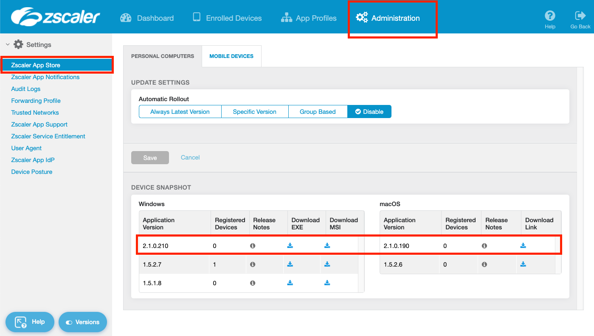
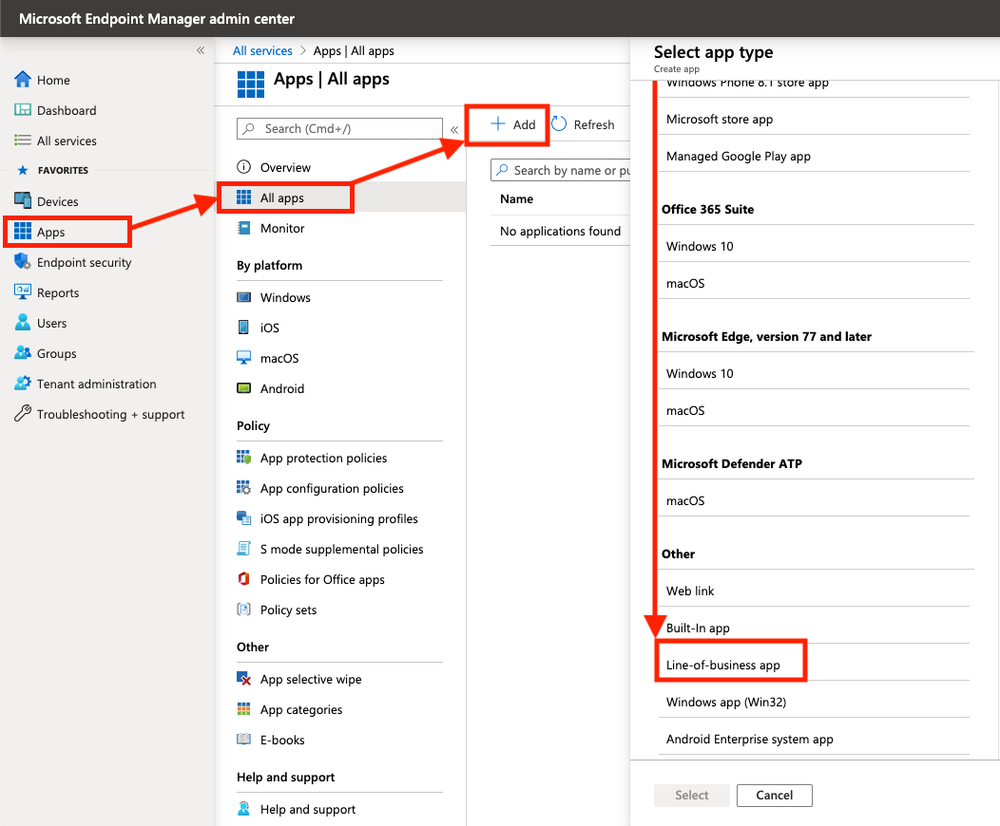
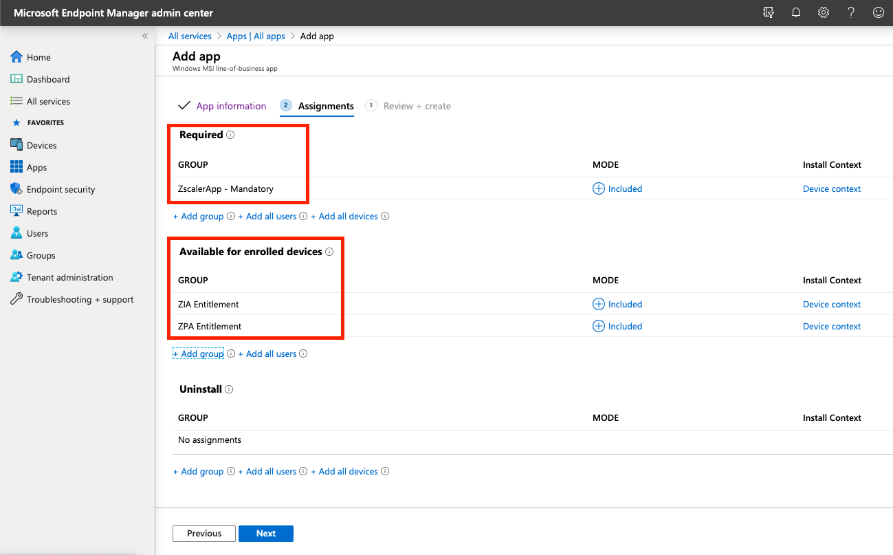
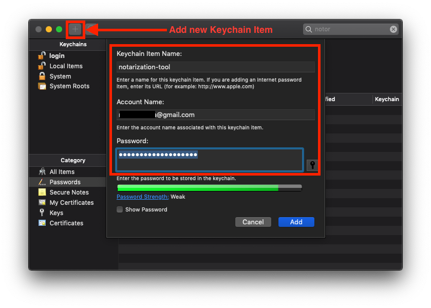

> The thoughts and opinions in this post are my own and do not necessarily reflect those of Zscaler.

In this guide, we'll walkthrough how to configure Microsoft Intune from scratch and use it to deploy the Zscaler Client Connector agent (ZCC) - formerly known as Zscaler Client Connector (ZCC).

Due to length, I've split this into two posts (the orginal was over 8000 words):

* This post covers deployment on Windows and macOS.
* The other post, [available here](/posts/deploy-zapp-mobile-with-intune), covers iOS and Android.

I suggest you use the Table of Contents to jump to the section that you need.

# What is Intune?

[According](https://docs.microsoft.com/en-us/mem/intune/fundamentals/what-is-intune) to Microsoft:

> Microsoft Intune is a cloud-based service that focuses on mobile device management (MDM) and mobile application management (MAM).
>
> With Intune, you can:
>
> - Set rules and configure settings on personal and organization-owned devices to access data and networks.
> - Deploy and authenticate apps on devices -- on-premises and mobile.
> - Be sure devices and apps are compliant with your security requirements.

In order to access Intune, you need to have either a Microsoft 365 or [Enterprise & Mobility E3/E5](https://www.microsoft.com/en-au/microsoft-365/enterprise-mobility-security/compare-plans-and-pricing) subscription. If you're using a free Azure account, you'll need to sign up to a trial, or pay per user (which can get costly).

# Video Demonstration

Scott Bullock of Zscaler (@scottyb) has [posted a great 10 minute video](https://community.zscaler.com/t/z-app-deployment-with-microsoft-intune/4606) in their community forum that runs through the user experience of enrolling a fresh Windows 10 device into Intune. ZCC is automatically pushed out and transparently authenticated for both ZIA and ZPA.


# Before You Begin

When adding an app to Intune, you'll be prompted to allocate the groups of users (or devices) that the app will be rolled out to. Hence before beginning, ensure you have the users of Zscaler inside of an AD or Azure AD group that you can assign the Zscaler Client Connector app to.

Depending on whether you want the ZCC app to be mandatory or optional for certain groups of users, you may want to divide your users into two groups:

1. The users to which the app is MANDATORY. Any user in this group will have the app automatically pushed out to them.
2. The users to which the app is OPTIONAL. The app will not be automatically pushed for users in this group, allowing them to go to the Company Portal and download it themselves if they choose.

In my examples below, I have 3 groups:

| Group               | Description                                                  |
| ------------------- | ------------------------------------------------------------ |
| ZIA_Entitlement     | This is the group of all users that are entitled to use Zscaler Internet Access (ZIA) |
| ZPA_Entitlement     | This is the group of all users that are entitled to use Zscaler Private Access (ZPA). In my case, this is a subset of users from the ZIA_Entitlement group as I might not want to roll ZPA out to every user in the organization. |
| Zscaler - Mandatory | This group contains every user in the organization to which the ZCC app will be automatically rolled out to. Ie: The majority of users from the above two groups. If this is your organization, you might include the whole org in this group, except select users (eg: some from IT) for which the app will be optional. |


# Microsoft Endpoint Manager

We'll be using the **Microsoft Endpoint Manager console** (MEM) to orchestrate Intune. You can log in using the same Azure Portal credentials here: https://endpoint.microsoft.com


## (Optional) Setting the MDM Authority

If you're using an existing Office 365 account **and** have been using the Office 365 MDM, you'll need to change the MDM authority from Office 365 to Intune. [This](https://docs.microsoft.com/en-us/mem/intune/fundamentals/mdm-authority-set) Microsoft help article will guide you through it.

---

# Windows

This section will cover deploying ZCC onto Windows using Intune.

## 1. Download the Zscaler Client Connector MSI

To start you'll need the .MSI installer for ZCC from the Zscaler Client Connector Portal. Log into the portal (either through ZIA or ZPA) and navigate to **Administration > Zscaler Client Connector Store**.



In the **Windows** panel, download the **MSI** for the latest **2.X.X** version. Do not use the older 1.X.X releases.


## 2. Add a new Line-of-Business App

### Add a new Line of Business (LoB) App

Back in the **Apps** menu of the MEM portal, navigate to **Apps > All Apps > Add**. In the panel that appears, scroll to the bottom and under the **Other** heading, select **Line-of-business app**.



When prompted to select an app package file, **upload the MSI of the Zscaler Client Connector** you downloaded above and click OK.

### Customize the App Details

Fill in the required details about the app:

| Field                      | Content                                                      |
| -------------------------- | ------------------------------------------------------------ |
| **Name**                   | Enter **Zscaler Client Connector 2.X.X.X** (where 2.X.X.X is the version number of the app - this will help you distinguish what version is being distributed by Intune) |
| **Description**            | Enter **Zscaler Client Connector**                           |
| **Publisher**              | Enter **Zscaler, Inc**                                       |
| **Ignore app version**     | Set to **Yes**. ZCC will automatically update itself once deployed, so Intune can safely ignore the version the user has installed after deployment. |
| **Category**               | (Optional) Select an app category to allocate the Zscaler Client Connector to. |
| **Command-line arguments** | See below.                                                   |


For the **Command-line arguments** section, enter the following (substituting in your own cloud and domain info):

```
CLOUDNAME=<cloudname> USERDOMAIN=<your-custom-domain>
```

**Important!**

1. When entering the cloud name, DO NOT enter the **.net** at the end. Eg: zscalertwo.net should be entered as `zscalertwo`
2. All command-line arguments should be on a single line with a space separating them. Do not linebreak each argument or they will fail.

Command-line arguments can be used for each platform to customize the install. For example, `STRICTENFORCEMENT` can be used to block access to the internet until your users enroll in the Zscaler Client Connector.

For a list and description of all the MSI customization options, scroll down to point #5 in [this help article](https://help.zscaler.com/z-app/customizing-zscaler-app-install-options-msi).

Click **Next** when ready to move onto the **Assignments** tab.


### Assign Users to the App

There are two different sections you can allocate users or groups to depending on how you want the app rolled out to users:

* **Required** = The app is MANDATORY for these users/groups. Any user or group in this section will have the App automatically pushed out to them.
* **Available for enrolled devices** = The app is OPTIONAL for these users/groups. The app will not be automatically pushed and the users can go to download the app themselves from within the Company Portal.

Assign your users or groups to the ZCC app accordingly.



Click **Next** to continue and then **Create** on the following screen. Your Line-of-Business application will be created and the MSI will upload - be sure to wait until it's complete.

Done!

---

# macOS

This section will cover deploying ZCC onto macOS using Intune.

macOS requires a little bit more effort to get going than Windows does. We will need to do the following on a local macOS machine:

1. Download the Zscaler Client Connector installer for macOS (this is a `.app` file)
2. Create a post-installation script (to customize the install of ZCC with our chosen arguments)
3. Convert the .app file and script to .pkg (Intune can only work with pkg files on macOS)
4. Wrap the .pkg file using the [Intune App Wrapping Tool](https://github.com/msintuneappsdk/intune-app-wrapping-tool-mac) (creates an `.intunemac` file)

> **If you're using MacOS Catalina 10.15 or higher, you MUST use ZCC v2.1.X or above.** Catalina introduced the requirement that apps are notarized by their developers. Only ZCC releases v2.1 and above are notarized by Zscaler.


## Do I need an Apple Developer Account?

**An Apple Developer Account is recommended.**

You can proceed and deploy the agent *without* an Apple Developer account, however you will not be able to sign and notarize the `.pkg` file created below without a valid Developer ID. This will result in your users receiving an error about an the software coming from an 'Unidentified Developer', and depending on security settings, the device may block the install altogether.


If you enroll in the [Apple Developer program](https://developer.apple.com/enroll/) (US$99), you can sign and notarize your package which will make this error go away. If you're an organization running a macOS deployment, you will most likely have a developer account for the company already.

> But shouldn't Zscaler have already signed the app I'm deploying?

Yes, Zscaler HAS both signed and notarized the .app package that will be installed. The problem with Intune is that it can only deploy `.pkg` files to macOS; NOT `.app` files. **We need to wrap our .app file inside a .pkg file for it to work with Intune, and it is *this* pkg file that needs to be signed and notarized as well.**


### Obtaining Developer ID Certificates

To sign an notarize the `.pkg`, you will need both the **Developer ID Installer** and **Developer ID Application** certificates. You can create these under the [**Certificates, Identifiers & Profiles**](https://developer.apple.com/account/resources/) section of your developer account, but will need a Certificate Signing Request (CSR) to do so: Apple have a brief guide on how to generate one using Keychain, [here](https://help.apple.com/developer-account/#/devbfa00fef7).


Download the certificates when you have them and click to open the `.cer` files in Keychain. Add them as a **login** certificate.

You can check the certificates have been installed correctly by running the following command:

```
security find-identity -p basic -v

  1) XXXXX[REDACTED] "Developer ID Installer: Nathan Catania (XXXXXXXXXX)"
  2) XXXXX[REDACTED] "Developer ID Application: Nathan Catania (XXXXXXXXXX)"
  3) [REDACTED] "[REDACTED]"
     3 valid identities found
```

If you have the **Developer ID Installer** and **Developer ID Application** certificates, you're good to proceed.


## 1. Download the Zscaler Client Connector .app

To start, you'll need the `.app` installer for ZCC from the Zscaler Client Connector Portal.

Log into the portal (either through ZIA or ZPA) and navigate to **Administration > Zscaler Client Connector Store**.


In the **macOS** panel, click the download link for the latest **2.X.X** version. Do not use the older 1.X.X releases.

Unzip the file downloaded to obtain the .app installer.


## 2. Create the post-installation script

Intune will push out and install the `.pkg` file - which is just our `.app` file wrapped up as a `.pkg` for the purposes of Intune deployment.

The problem is however, that when Intune deploys the `.pkg`, it just saves the wrapped `.app` to the user's device without doing anything else. We need a way to *run and install* the `.app` *after* Intune has deployed the `.pkg`, PLUS a way to include arguments to customize the install. A post-installation script will do all of this for us.

To start, on a macOS device **open Terminal**:

Create a folder called `scripts`. Inside this folder, create a file called `postinstall`
```
mkdir scripts && cd scripts && touch postinstall && pwd
...
> /Users/nathan/package/scripts
```
Note down the full path to the `scripts` directory - we'll need this later.

Open the postinstall file for editing:
```
nano postinstall
```

Copy and paste the following into the Terminal window (modify the arguments as required):

```
#!/bin/sh
open /tmp/<NAME-OF-ZSCALER-APP-INSTALLER>.app --args --unattendedmodeui none --userDomain <your-custom-domain> --cloudName <cloud-name> --hideAppUIOnLaunch 1 --mode unattended
```

To exit Nano, press `Control + X` and then `Y` to save.

This will do a silent installation of the Zscaler Client Connector (unattended mode) and automatically redirect the user to your company SSO page to sign in.

**Important!** When entering the cloud name (`--cloudName`), DO NOT enter the **.net** at the end. Eg: zscalertwo.net should be entered as `zscalertwo`


Command-line arguments can be used for each platform to customize the install. For example, `--strictEnforcement 1` can be used to block access to the internet until your users enroll in the Zscaler Client Connector.

For a list and description of all the .app customization options, scroll down to point #4 in [this help article](https://help.zscaler.com/z-app/customizing-zscaler-app-install-options-macos).

As an example, the script for my installation looks like the following:
```shell
#!/bin/sh
open /tmp/Zscaler-osx-2.1.2.38-installer.app --args --unattendedmodeui none --userDomain oblivion.industries --cloudName zscaler --hideAppUIOnLaunch 1 --mode unattended
```

Lastly, we need to make the script executable. Run the following in Terminal:
```shell
chmod a+x postinstall
```


## 3. Create the PKG file

Intune only supports `pkg` files for macOS. A `.pkg` file is analogous to an MSI for Windows. All we are essentially doing is wrapping the .app file inside a .pkg file so that it can be deployed by Intune.

We'll be using the built-in `pkgbuild` tool to do this. Open Terminal and run the following command (change the file paths before running):
```shell
pkgbuild --install-location /tmp \
--scripts /Path/to/scripts/directory \
--component "/Path/to/Zscaler-Installer.app" \
--sign "Developer ID Installer: MY-DEV-NAME (UXXXXXXXXX)" \
--identifier "com.zscaler.zscalerclientconnector" \
--version "1.0" \
"/Path/to/save/pkg-file.pkg"
```


| Field                | Description                                                  |
| -------------------- | ------------------------------------------------------------ |
| `--install-location` | This should point to the `tmp` folder, or somewhere writeable on the user machine. The `.pkg` will unpack itself here, then run the `.app` installer; which will install ZCC to the  `/Applications` directory as required. If you change this from `/tmp`, you'll need to update the `postinstall` script as well. |
| `--scripts`          | This should be the path to the scripts folder you created in the step above. |
| `--component`        | This file path should point to the Zscaler Client Connector `.app` file you downloaded in Step #1. |
| `--identifier`       | Specify a unique identifier for this package. It is advisable to set a meaningful, consistent              identifier, eg: **com. zscaler. zscalerclientconnector** |
| `--version`          | This has no relationship to the actual Zscaler Client Connector version. This is only used by Intune. If you ever deploy another pkg via Intune for a different version of ZCC, you'll need to increment this (eg: Version 1.1) so that Intune can tell the pkg files apart. Note that ZCC has its own update mechanism, so you don't need to worry about using Intune to push out updates to the Zscaler Client Connector software. |
| `--sign`             | If you don't want your users to recieve an error that your package is from an 'Unidentified Developer' (which will prevent installation entirely), you will need to sign the package using a valid Apple Developer ID. To do this, you will need to enroll in the Apple Developer program (US$99). If you are an organization, you probably have already done this. Make sure you correctly substitute `MY-DEV-NAME` with your correct Developer name / org name. __If you don't care about the 'Unidentified Developer' error, you can remove the__ `--sign` __argument.__ |

The last file path listed points to the location where you want to save the output pkg file.

If you're signing the package and are not sure about your team / developer / org certificate name, you can check this under the **Certificates, Identifiers & Profiles** section of your Apple Developer account, [here](https://developer.apple.com/account/resources/).

As an example, my completed `pkgbuild` command is below:
```shell
pkgbuild --install-location /tmp \
--scripts /Users/nathan/package/scripts \
--component "/Users/nathan/package/Zscaler-osx-2.1.2.38-installer.app" \
--sign "Developer ID Installer: Nathan Catania (UXXXXXXXXX)" \
--identifier "com.zscaler.zscalerclientconnector" \
--version "1.0" \
"/Users/nathan/package/zccinstaller.pkg"

pkgbuild: Adding component at /Users/nathan/package/Zscaler-osx-2.1.2.38-installer.app
pkgbuild: Adding top-level postinstall script
pkgbuild: Using timestamp authority for signature
pkgbuild: Signing package with identity "Developer ID Installer: Nathan Catania (UXXXXXXXXX)" from keychain
pkgbuild: Adding certificate "Developer ID Certification Authority"
pkgbuild: Adding certificate "Apple Root CA"
pkgbuild: Wrote package to /Users/nathan/package/zccinstaller.pkg
```


If you signed your package, you can validate the signatures using `pkgutil`:

```
pkgutil --check-signature /path/to/pkg.pkg
```

For example:

```
pkgutil --check-signature /Users/nathan/package/zccinstaller.pkg 
Package "zccinstaller.pkg":
   Status: signed by a certificate trusted by macOS X
   Certificate Chain:
    1. Developer ID Installer: Nathan Catania (UXXXXXXXXX)
       SHA1 fingerprint: E3 CB 24 EA 50 74 B6 82 EF DA 5C 43 17 8D BA D2 40 CC ED F5
       -----------------------------------------------------------------------------
    2. Developer ID Certification Authority
       SHA1 fingerprint: 3B 16 6C 3B 7D C4 B7 51 C9 FE 2A FA B9 13 56 41 E3 88 E1 86
       -----------------------------------------------------------------------------
    3. Apple Root CA
       SHA1 fingerprint: 61 1E 5B 66 2C 59 3A 08 FF 58 D1 4A E2 24 52 D1 98 DF 6C 60
```


## 4. Notorize the PKG

__You only need to do this step if you signed the `.pkg` file in the previous step.__ Otherwise you can skip to the next step.

What is notarization? According to Apple:

> Notarization gives users more confidence that the Developer ID-signed software you distribute has been checked by Apple for malicious components. If there are no issues, the notary service generates a ticket for you to staple to your software; the notary service also publishes that ticket online where Gatekeeper can find it.
>
> Beginning in macOS 10.14.5, software signed with a new Developer ID certificate and all new or updated kernel extensions must be notarized to run. Beginning in macOS 10.15 [Catalina], all software built after June 1, 2019, and distributed with Developer ID must be notarized.

### Create an App Specific Password

We're going to notarize the `.pkg` file via the command-line. To do this, you'll need to [generate an **App Specific Password**](https://support.apple.com/en-us/HT204397) for your the Apple ID of your Developer Account:

> **How to generate an app-specific password**
>
> 1. Sign in to your [Apple ID account page](https://appleid.apple.com/account/home).
> 2. In the Security section, click Generate Password below App-Specific Passwords.
> 3. Follow the steps on your screen.

Next, open **Keychain** and click the "+" icon to add a new Keychain Item.

* For **Keychain Item Name**, enter `notarization-tool`
* For **Account Name**, enter the email associated with your Developer Account / Apple ID.
* For **Password**, copy and paste the app-specific password from your Apple ID account.



### Request Notorization

To request notarization from Apple, run the following command (replacing the values with your own):

```shell
xcrun altool --notarize-app \
--username "appleid@example.com" \
--password "@keychain:notarization-tool" \
--asc-provider "UXXXXXXXXX" \
--primary-bundle-id "com.zscaler.zscalerclientconnector" \
--file "/Path/to/pkg.pkg"
```


| Field               | Value                                                        |
| ------------------- | ------------------------------------------------------------ |
| `username`          | The Apple ID username associated with your Apple Developer Account |
| `password`          | Enter `@keychain:` followed by the name of the Keychain Item which you saved your app-specific password to. This will fetch the password from the keychain. |
| `asc-provider`      | This is the Team ID from your Developer Account. You can find this by logging into your Developer Account and reviewing your profile |
| `primary-bundle-id` | This should match the identifier you specified when you created the pkg. |
| `file`              | The path to the .pkg file                                    |

For example:

```shell
xcrun altool --notarize-app \
--username "[redacted]@gmail.com" \
--password "@keychain:notarization-tool" \
--asc-provider "UXXXXXXXXX" \
--primary-bundle-id "com.zscaler.zscalerclientconnector" \
--file "/Users/nathan/package/zccinstaller.pkg"

...
RequestUUID = 53acc70a-XXXX-XXXX-XXXX-XXXXXXXXXXXX
```

If you receive an error that the tool is not on your machine, ensure you have [Xcode](https://developer.apple.com/xcode/resources/) and [Xcode Command-line Tools](https://developer.apple.com/download/more/?=command%20line%20tools) installed.

The command will take a while to run as it is uploading your `.pkg` file to Apple. Once done, it will return a UUID which you can use to check the status of your notarization request:

```shell
xcrun altool --notarization-info "53acc70a-XXXX-XXXX-XXXX-XXXXXXXXXXXX" \
--username "[redacted]@gmail.com" \
--password "@keychain:notarization-tool"

...
Date: 2020-07-06 10:37:20 +0000
Hash: [redacted]
LogFileURL: https://osxapps-ssl.itunes.apple.com/itunes-assets/Enigma114/[redacted]
RequestUUID: 53acc70a-XXXX-XXXX-XXXX-XXXXXXXXXXXX
Status: success
Status Code: 0
Status Message: Package Approved
```

Once the process is complete (mine took under 10 minutes), you'll recieve a confirmation email as to whether your request was successful or not.

### Staple the Notorization Ticket

The last step is to staple the notarization ticket to the `.pkg` file. This ensures that a Mac device that is offline can still validate that the `.pkg` file is notarized:

```
xcrun stapler staple /path/to/pkg.pkg
```

Note: If your command fails, wait a few minutes and try again. If your command continuously fails, and your traffic is going through ZIA or another proxy, you may need to bypass `api.apple-cloudkit.com` from SSL inspection due to certificate pinning.

Validate the staple action was successful:

```
xcrun stapler validate /path/to/pkg.pkg
```


## 5. Test the PKG

Before going further, test your PKG file by running it and seeing if it successfully installs the Zscaler Client Connector silently. Make sure you don't already have ZCC installed when doing this however!

If you have an existing installation of ZCC, you can remove it under `Applications/Zscaler/Uninstall-Zscaler-App`


## 6. Create an .intunemac file

Once you've verified your PKG file functions correctly, we need to wrap it for use with Intune.

Download the [Intune App Wrapping Tool for Mac](https://github.com/msintuneappsdk/intune-app-wrapping-tool-mac/releases/) (this is a Microsoft-owned repository).

Next:
1. Unzip the source code folder
2. Open Terminal
3. Change directory to where the `IntuneAppUtil` file is located
4. Make the `IntuneAppUtil` file executable:
```
chmod +x IntuneAppUtil
```

Locate the PKG file you created above and use the `IntuneAppUtil` tool to wrap the `.pkg` file to a `.intunemac` file:
```
./IntuneAppUtil -v -c /path/to/zscaler-installer.pkg -o /output/directory/path
```

For example:
```
./IntuneAppUtil -c /Users/nathan/package/zappinstaller.pkg -o /Users/nathan/package

...
Creating intunemac file for /Users/nathan/Downloads/Zscaler-osx-2.1.2.38-installer.pkg
Composing the intunemac file output
Output written to /Users/nathan/Downloads/ZscalerInstaller.pkg.intunemac.

IntuneAppUtil successfully processed "ZscalerInstaller.pkg",
to deploy refer to the product documentation.
```

If everything went well, you should see the `.intunemac` file in your specified output directory.


## 7. Add a new Line-of-Business app in MEM

### Add a new Line of Business (LoB) App

In the **Apps** menu of the [MEM portal](https://endpoint.microsoft.com/), navigate to **Apps > All Apps > Add**. In the panel that appears, scroll to the bottom and under the **Other** heading, select **Line-of-business app**.


When prompted to select an app package file, **upload the** `.intunemac` **file you created above** and click OK.

### Customize the App Details

Fill in the required details about the app:

| Field                        | Content                                                      |
| ---------------------------- | ------------------------------------------------------------ |
| **Name**                     | Enter **Zscaler Client Connector 2.X.X.X - macOS 2.X.X.X** (where 2.X.X.X is the version number of the app - this will help you distinguish what version is being distributed by Intune) |
| **Description**              | Enter **Zscaler Client Connector for macOS**                 |
| **Publisher**                | Enter **Zscaler, Inc**                                       |
| **Minimum operating system** | Select **OS X Yosemite 10.10** (ZCC supports macOS 10.10+)   |
| **Ignore app version**       | Set to **Yes**. ZCC will automatically update itself once deployed, so Intune can safely ignore the version the user has installed after deployment. |
| **Category**                 | (Optional) Select an app category to allocate the Zscaler Client Connector to. |


Click **Next** to move to the **Assignments** tab.


### Assign Users to the App

There are two different sections you can allocate users or groups to depending on how you want the app rolled out to users:

* **Required** = The app is MANDATORY for these users/groups. Any user or group in this section will have the App automatically pushed out to them.
* **Available for enrolled devices** = The app is OPTIONAL for these users/groups. The app will not be automatically pushed and the users can go to download the app themselves from within the Company Portal.

Assign your users or groups to the ZCC app for macOS accordingly.


Click **Next** to continue and then **Create** on the following screen. Your macOS Line-of-Business application will be created and the `.intunemac` file will upload - be sure to wait until it's complete.

Done!