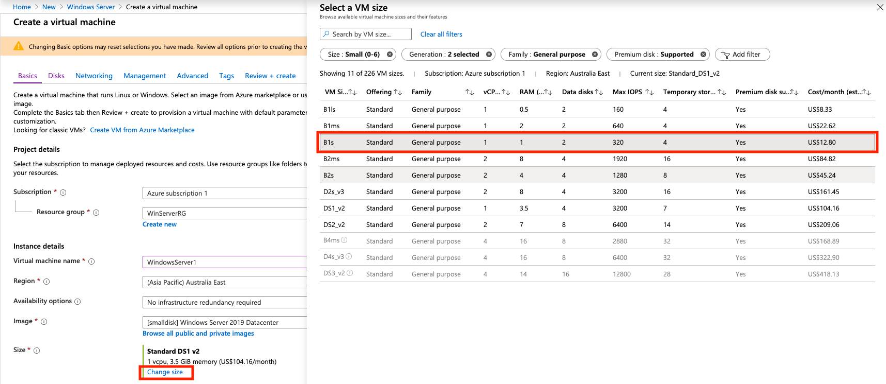
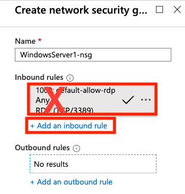
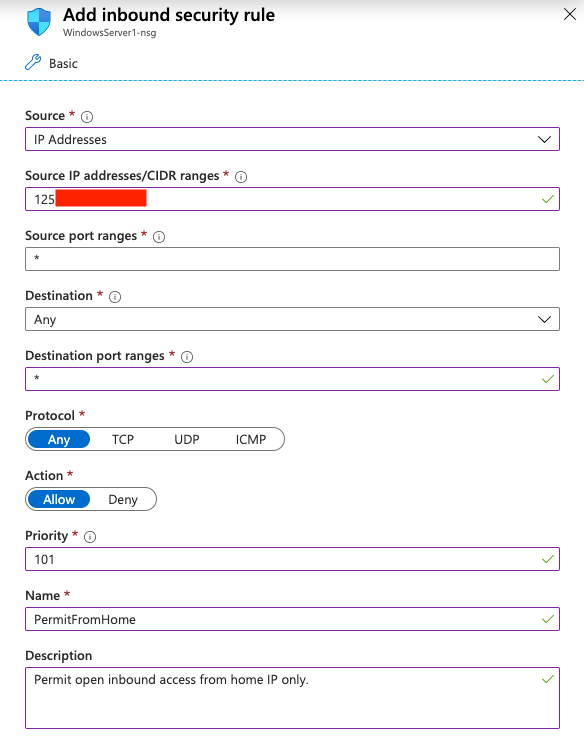
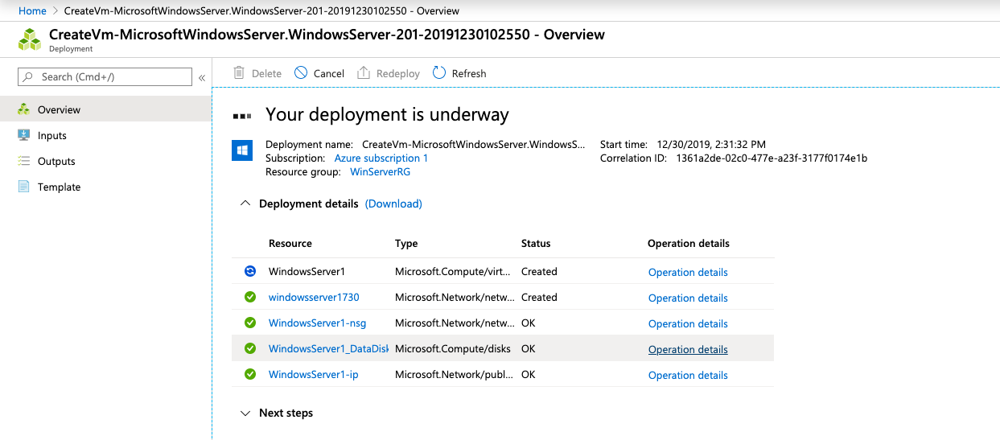
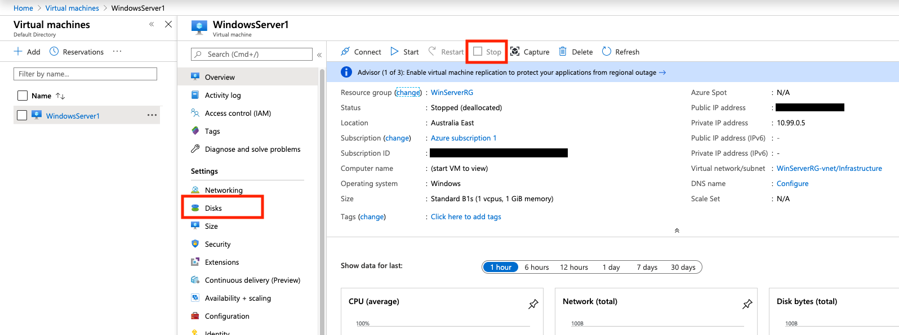
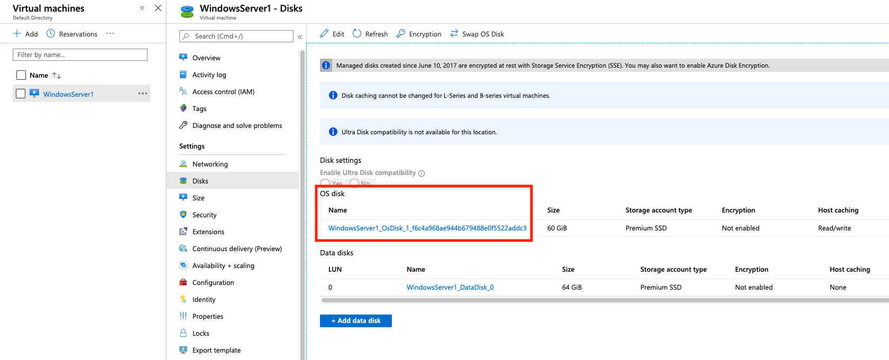
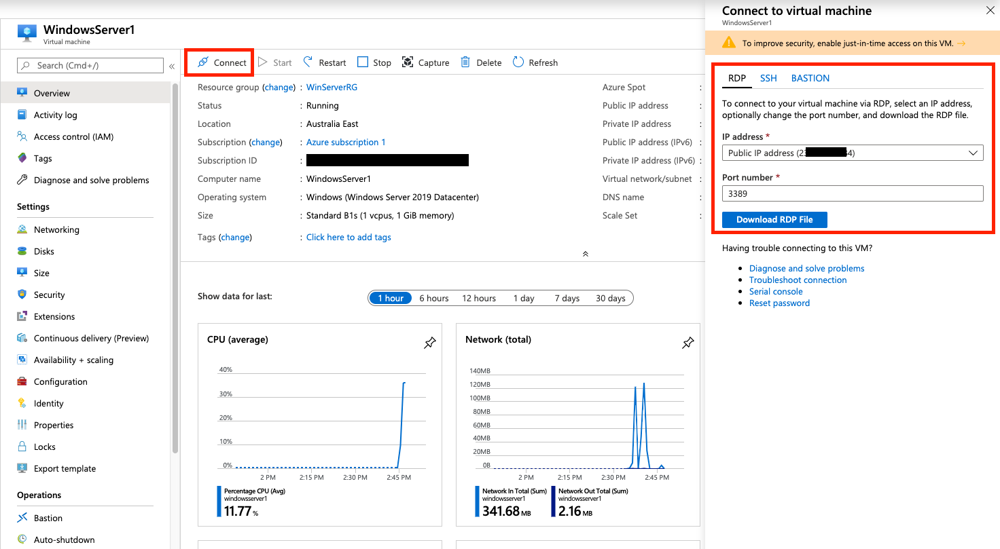

# Get an Azure Free Account

Before you start, you will need to sign up for a free Azure account: https://azure.microsoft.com/en-au/free/

This gives you some Azure services, like Windows & Linux VMs, free for 12 months, while other Azure services (like Azure Active Directory) are free permanently up to certain usage limits.

To see everything included in the free account, click [here](https://azure.microsoft.com/en-au/free/free-account-faq/).

Note: Don't expect the server deployed under the free tier to be fast - we are limited to 1GB RAM and 1 vCPU with the B1s instance size.

# This guide

This guide will cover deploying a Windows Server VM to Azure and ensuring (at the time of writing this at least) that usage is contrained to the free account limits. This means that if you do everything correctly, you shouldn't have any on-going charges for the first 12 months - provided your usage doesn't exceed the free tier limits.

The Azure free account gives you approx US$200 to use on services for the first 30 days, so if you happen to make a mistake, you'll know the next time you log into Azure as you're available credit will have decreased.

# Create a Windows Server Virtual Machine

From Azure Home, click **Create a resource**.

 In the **Search the Marketplace** box, type `Windows Server` and select it from the autocomplete box.

Leave the software plan as the default (we will change it in the next step) and click **Create**.

## Basics

On the next page:

1. Leave **Subscription** as the default. It should say `Azure subscription 1` or similar.
2. Create a new **Resource Group**. Call it whatever you like. I called mine `WinServerRG`
3. Give your VM a name.
4. Select the appropriate Azure region to deploy your VM. This should be as close to your location as possible. I chose `Australia East`.
5. Leave **Availability Options** as `No infrastructure redundancy required`.

For the **Image** field, click **Browse all public and private images**. Scroll down the list and select an image prefixed with `[smalldisk]`. I selected **[smalldisk] Windows Server 2019 Datacenter**.

The `[smalldisk]` image options limit the OS disk to 30GB which allows us to stay within the limitations of the Azure free tier. Microsoft give us 2x 64GB of Premium SSD storage as part of the free tier, but by default, a normal Windows Server instance will deploy an OS disk with a 128GB Premium SSD disk.
**This will cause you to be charged for a 128GB disk if you use a normal Windows Server image.**

Note that this still doesn't keep us within the free tier. Azure will attribute the 30GB OS disk size to a 32GB Premium SSD... which is not covered by the free tier. After we deploy the VM, we can re-size the OS drive to ~60GB which will be covered by one of our free 64GB Premium SSDs.

Next, we need to select the size of the VM.
**Warning: Be sure to change this! The default size selected is typically very expensive!**

Click **Change size** and select **B1s** as the size of the VM instance. 
For the Windows OS, Microsoft include 750 hours per month (for the 1st 12 months) of B1s usage as part of the free tier. 
NB: 750 hours is just over 31 days. So your entire month is covered, every month, for the first 12 months for this single VM.

Next, give your VM a username and **STRONG** password.

For **Inbound port rules**, select **RDP (3389)** as the allowed inbound service. This will allow you to remotely connect to your VM once deployed. I also selected **HTTP (80)** and **HTTPS (443)**.

It is critical that you have a strong password defined and that you have very restrictive inbound network security rules in the coming steps. **If you don't, you have a significant change of your VM being hacked or attacked by a malicious entity.**

Click **Next** to go to the **Disks** tab where we will define the storage to be used.

## Disks

Leave **Premium SSD** selected as the OS disk type.
This allocates a 32GB Premium SSD as the OS drive. However, only 2x 64GB disks are covered by the free tier.
**As such, after we create the VM, we will need to change the OS disk size to ensure Azure uses a 64GB disk which will be free.**

For **Data disks** select **Create and attach a new disk**.

On the next screen change the size of the disk to `64GB`, leave the **Source type** as `None`, and give it whatever name you want.

Click OK to return to the **Disks** tab and you will see your new disk listed under the **Data disks** section.

Now click **Next** to go to the **Networking** tab where we will define how our VM will be connected to the network and how open it will be for remote access.

## Networking

First, click to create a new Virtual Network.

The **Address range** will be populated to `10.0.0.0/16` by default. You can change this to whatever you want. I set my vnet address range to `10.99.0.0/16`.

Next you need to carve out a smaller subnet from within the `/16` vnet we specified above. Give it a name (it can be anything - I called mine `Infrastructure`), and set the CIDR range. I used `10.99.0.0/24`.

Click OK when you are done and select both the Virtual network and subnet you created.

Next click to create a new Public IP. Give it a name, set the *SKU* as `Basic` and the **Assignment** as `Static`.

Your first 3 fields will look something like this:

This next step is **CRITICAL** to get correct. Failing to do so will expose your VM to the internet making it vulnerable to attack.

For **NIC network security group**, select **Advanced**, and click to create a new security group.

Give the new security group a name and **delete the default inbound rule present**. Click to add a new inbound rule.

We are going to restrict remote access to your Windows Server VM from your current IP address only. For me, this was my home IP, meaning I'll only be able to access the VM when I'm at home. Not a big deal and we can always change or update this later.

To find your current public IP address, open a new tab and simply search Google for `What is my IP?`. You'll see something like this:

I've modified this image to obscure my own IP. Select and copy the IP shown and go back to your Azure tab.

Change **Source** field for the inbound security rule to `IP Address`. Under **Source IP address/CIDR ranges** paste in your IP address from Google.

Leave **Source port ranges** as an asterisk `*`, **Destination** as `Any`, but change the **Destination port ranges** as needed. At the very least, add port `3389` which is the inbound port for RDP. Without this, you won't be able to remotely connect to the VM. You can add other ports in too, like `80` (for HTTP) or `443` (for HTTPS) - just separate ports with a comma, eg: `3389,80,443`

To open all inbound ports to your VM, you can use an asterisk `*` instead to denote *any* port.

Make sure the **Action** is set to **Allow**. Give the rule a name, and you can change the priority if needed. Click **Add** when finished.

Your rule will look something like the following:

Next, click to add a new outbound rule. We will explicitly set a rule that allows our VM to reach any destination on the internet.

You can leave the **Source**, **Source port ranges**, and **Destination** as `Any`. Change the default **Destination port ranges** from `8080` to an asterisk `*`
**Without this, your VM will only be able to connect to remote destinations on port 8080**.

Make sure the **Action** is set to `Allow`. GIve the outbound rule a name and click **Add** when you are done.

You are now finished configuring your network secutity group. It should look similar to the following:

Click OK to create it.

Leave **Accelerated networking** set to `Off` and **Load Balancing** set to `No`. Click Next to go to the **Management** tab next.

## Management

Not much to do on this page. Under the **Monitoring** section, set the **Identity** and **Auto-shutdown** options to `Off`.

You can skip the **Advanced** and **Tags** tabs. Go to the **Review + create** tab when ready.

## Review and Create

Make sure everything here is as expected, particularly the VM size/instance type selected. **This should be `B1s` to qualify for free tier usage.**

Keep in mind that if you make a change to the first **Basics** tab, it will typically wipe all the other tabs meaning you'll need to fill in all of the above all over again.

Click **Create** when you're ready to initialize the VM.

# Deployment

After you click **Create** you'll be redirected to the deployment screen for your VM where you can see the status for each element (like the VM itself, disks, security group, etc) being created.

Sit back as this can 2-5 minutes to complete. You'll see the deployment complete screen when your VM is ready.

If you have any errors during deployment. Make sure you followed the guide exactly. My first deployment failed because I didn't explicitly click to create resources like the Virtual network or subnet - thinking that these would be automatically created and I wouldn't have to do anything. If you still have issues, [Microsoft's Quickstart Guide for Windows VMs](https://docs.microsoft.com/en-us/azure/virtual-machines/windows/quick-create-portal) may help.

# Adjust the OS Disk Capacity for Free Tier Compatibility

As explained above, the `[smalldisk]` Windows Server image only requires 30GB of OS disk space, however this places us within the threshold of the 32GB Premium SSD - which is NOT included in the free Azure tier.

As such, we must expand the 30GB OS disk to ensure we hit the 64GB SSD thereshold and are therefore not billed.

From the Azure Home page, open the menu and go to **Virtual Machines**. If you can't find the **Virtual Machines** page, you can search for it at the top.

This will show you a list of your VMs. Click the VM you just created to view it in detail.

If your VM is running, you will need to STOP it by clicking the **Stop** button. This can take several minutes. You cannot resize a disk in Azure while the VM it is attached to is running.

When the VM has stopped, under **Settings**, click **Disks**.

Select the disk listed under **OS disk**.

Click **Configuration** in the side navigation menu and enter a new size for the drive. Make sure it is greater than 32GB and less than 64GB. When you are done, click **Save**. You can then return to the VM screen and power it on again.

If you want to make use of this extra space inside the VM, you will need to expand the OS drive via **Computer Management** in Windows.

# Connecting to your Virtual Machine

From the Azure Home page, open the menu and go to **Virtual Machines**. If you can't find the **Virtual Machines** page, you can search for it at the top.

This will show you a list of your VMs. Click the VM you just created to view it in detail.

Click the **Connect** button in the top menu. Note down the public IP assigned to your VM and the port number displayed (this should be 3389 for RDP). You will use these to connect to your VM.

If you are on a Windows PC, you can download the RDP file and open it to connect to your VM.

If you are on MacOS, you'll need something like [Microsoft's Remote Desktop Client from the Mac App Store](https://itunes.apple.com/us/app/microsoft-remote-desktop/id715768417?mt=12), or [Royal TSX](https://www.royalapps.com/ts/mac/features) to connect.

The username and password are the ones you specified when you created the VM.

# Basic Configuration Tasks

## 1 - Check for System Updates and Configure Updates

Go to **Start** **>** **Settings** (the gear icon on the left side) **>** **Update & Security**

Check for any system updates that are available, and configure the active hours for the server (the times outside of which the server can restart to install it's updates). I set my active hours to be 7AM to 1AM daily, which means updates and restarts can occur between 1AM and 7AM each day.

## 2 - Set the Server Name

Under **Server Manager > Local Server**, on the right side, click the **Computer name** field to modify.

You could have also accessed the Windows Update settings from the previous step in this page.

Click on the **Refresh** button at the top of the screen to make the Server Manager window reflect the changes.

## 3 - Set the Time Zone

This time under Server Manager, click **Time zone**. Azure sets the server to `UTC` by default. Change this to your time zone as applicable.

## 4 - Set a Static Private IPv4 Address

We're currently accessing the server via a public IP address. Azure performs NAT to convert this to one of our private virtual network IPs on the server side. That is, the public IP is mapped to one of our 253 usable IP addresses in the `10.99.0.0/24` address space (or similar depending on how you configured your network).

By default, it is assigned one of these IPs dynamically. We need to change this to static to ensure the server always has the same private IP.

Open Command Prompt and issue the command `ipconfig`

My server has been assigned the IP of `10.99.0.5`. Note down the **IP**, **subnet mask**, and **default gateway**.

Go back to **Server Manager > Local Server** again, and this time click **Ethernet** on the left side.

Right-click on the network adaptor and click **Properties**. Select **Internet Protocol Version 4 (TCP/IPv4)** and click **Properties**. Optionally, untick **Internet Protocol Version 6 (TCP/IPv6)** to disable IPv6.

Enter the IP address, subnet mask, and default gateway obtained above. Additionally, manually specify IPs for DNS. I used Cloudflare: `1.1.1.1` and `1.0.0.1`.

**Make sure you triple check the IPs entered!** You may lose access to your VM otherwise!

Click OK when done.

Your RDP connection will drop. Don't panic. Wait a few seconds, then reconnect.

## 5 - Restart the Server

You should restart the server so your changes can take effect (and updates can be installed).

# Finish

Well done! You should now have a working Windows Server deployed using the Azure free tier with a very basic configuration applied.

