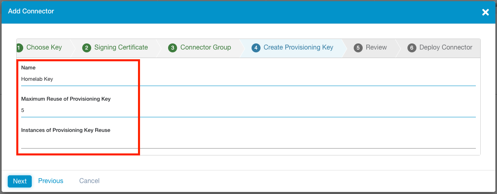
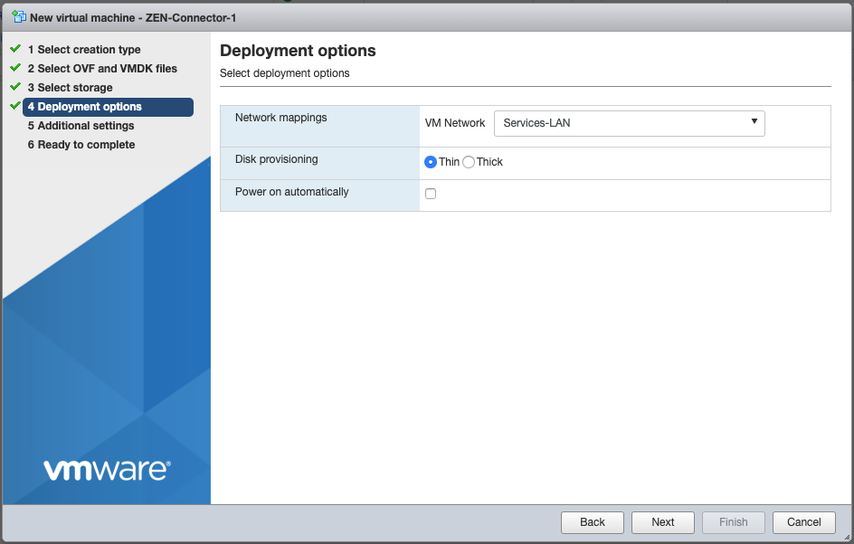

> Disclaimer: I am an employee of Zscaler. These are my own notes from a ZPA homelab deployment and may be incorrect or against best practice. You should consult the [Zscaler help portal](https://help.zscaler.com) for official documentation.


# Connector Provisioning

First, we are going to define the connector in the ZPA admin portal and generate the required provisioning key. The provisioning key authenticates the connector when it calls home to the ZPA cloud (via it's established control channel), and associates it to your ZPA instance.

Log into the ZPA admin portal and navigate using the side menu to **Administration** > **Connectors**.



In the top-right corner, click **Add Connector** to open the wizard workflow.


## Step 1 - Provisioning Key

Create a new provisioning key, or choose an existing one if you already have one that is able to be used.

If you elect to use an existing key, ensure it has not reached the maximum number of uses defined or the connector connector provisioning will fail. You can alter how many times an existing key can be used under **Administration** > **Connector Provisioning Keys**.

Click **Next**.


## Step 2 - Signing Certificate

Next choose the intermediate CA to be used to sign the identity and server certificates on the connector. When prompted, select **Connector**, then click **Next**.


## Step 3 - Connector Groups

Create a new **Connector Group**, or select an existing one.

Connector Groups are a logical grouping of connectors, and help facilitate high availability and horizontal scaling. Each connector belongs to a specific Connector Group. Connectors are updated weekly and are brought down and up again for automatic software updates on a round-robin basis within the group.

If creating a new group, you will need to specify a 4 hour weekly upgrade interval in which all connectors within this group will take turns automatically updating and rebooting. You will also need to specify the geographic location of the connectors in the group.

When you are finished, click **Next**.


## Step 4 - Provisioning Key Details

If in Step 1 you elected to create a NEW Provisioning Key, you will be prompted to **give it a name and set the MAXIMUM number of times it can be re-used** for other new connectors. This is an API enforced value, meaning it can be changed from within the ZPA admin portal (Administration > Connector Provisioning Keys) at a later stage.

It may be worth setting a key re-usabilty value based on the number of connectors you plan on deploying in a single Connector Group. This will assist you when it comes to scaling your connectors for a specific LAN segment.

**Any connectors deployed with this Provisioning Key will be named after the key, so you'll want to give it a descriptive name.** For example, a key with the name 'Melbourne', will have its associated connectors automatically named `Melbourne-1`, `Melbourne-2`, and so on.

If you elected to use an existing key, you will be shown how many times it has already been used.

Click **Next** when ready.




## Step 5-6 - Review Selection and Generate the Provisioning Key

Once you have reviewed the information on the **Review** tab, click **Save**.

**Your Provisioning Key will be generated and displayed.**

**IMPORTANT: This key is CONFIDENTIAL INFORMATION and should be stored securely.** Depending on the number of times you specified the key can be re-used, anyone with your provisioning key could deploy a connector and have it associated with your Connector Group and ZPA instance. Treat it like an API key and secure it.

Selecting a deployment platform at the bottom of the window will load an inline help article from `help.zscaler.com` guiding you through the deployment process.


## Next Steps

Click **Done** when you are ready.

**Only connectors that have been BOTH provisioned and enrolled will show up under Administration > Connectors!** We have provisioned the connector in the admin portal, but still need to deploy the connector and wait until it calls home to the ZPA cloud to enroll itself. Only then will it show in the list.

You can click on the **Connector Groups** tab or **Connector Provisioning Keys** tab at the top to review these details respectively.


# Connector Minimum Requirements

## Requirement 1 - Deploy Connectors in pairs

Zscaler recommends you deploy connectors in pairs. Why? To ensure high-availability of your private applications.

As you would have specified when creating a Connector Group above, connectors have a weekly scheduled slot in which they perform an automatic software update. This causes the connector briefly go offline as it needs to reboot to complete the update process. Connectors in a group are never updated at the same time.

Hence, if you deploy connectors (at least) in pairs, when one connector begins to update, your applications will still be accessible through the second connector. When the first connector comes back up, the second connector will begin to update. This process repeats until all connectors in a group are updated.


## Requirement 2 - Compute Resources per Connector

Every connector has the following minimum resource requirements:

* 2 vCPUs
* 4GB RAM
* 8GB Disk (~1GB thin provisioning)
* 1 NIC

This provides each connector with a maximum throughput capacity of ~500 Mbps. If you need to scale beyond that, Zscaler recommends you deploy multiple connectors rather than simply increasing the resources allocated to the connector VM. This has an added bonus of increasing your overall resiliency to connector failure.

In a lab environment, you will get away with 2GB RAM allocation, but this is not supported.


## Requirement 3 - Static MAC address

The connector must have a static MAC address.

This is to do with the virtual hardware fingerprinting that ZPA does for connectors. MAC address is one element used to generate the unique fingerprint. If the MAC is changed at all, including on reboot, then the fingerprint will have been altered and the connector access to the ZPA cloud will be blocked for security reasons.


## Requirement 4 - Internal and External DNS Resolution

The connector must be able to resolve both internal and external hostnames.

The connector should be deployed on the same LAN segment as the private applications it is providing access to.


## Requirement 5 - Outbound connectivity on port 443

The connector requires outbound access on port 443 in order to function. No inbound ports are required to be open.

For a complete list outbound firewall rules required, see https://ips.zscaler.net/zpa


## Requirement 6 - Bypass SSL Inspection

You cannot do SSL inspection or decryption on any traffic coming from a connector. Only the Zscaler ZPA certificates are trusted. If the connector sees another certificate other than the ZPA one (due to how SSL inspection works), it will not pass traffic for security reasons.

You must bypass SSL inspection/decryption for connector traffic.

If you are using Zscaler Internet Access (ZIA), then the bypasses are automatically done for you.


## Static IPs & DHCP

Both static assignment of networking details and DHCP are supported connectors. Given that a connector is a key piece of networking infrastructure, static addressing is recommended.


# Connector Deployment - VMware vSphere (ESXi)

For this guide, I'll be using the free vSphere Hypervisor (6.7).


1. Download the connector OVA using the URL below:

   [https://dist.private.zscaler.com/vms/VMware/2018.10/zpa-connector-2018.10.ova](https://dist.private.zscaler.com/vms/VMware/2018.10/zpa-connector-2018.10.ova)

   If you are using vCenter, then you should be able to simply paste in the URL to the OVF deployment tool.

   

2. Login to the vSphere UI. Select **Virtual Machines** from the side menu and select **Create / Register VM** at the top-left.

3. Select option 2 **Deploy a virutal machine from an OVF or OVA file**, then on the next screen give the VM a name (I called mine `Z-Connector-1` and `Z-Connector-2`), and click to upload the `ZPA_Connector.ova` file.


4. Select storage options, click **Next**, then select the network segement you wish to deploy the connector to. This should ideally be the same LAN segment that some of your applications are on.
   For **Disk Provisioning**, leave it set to **Thin**.



   

5. Review your settings and click **Finish** to deploy the OVA.

If you get an `Unsupported attribute 'initialBoot' on element 'InstallSection'` error when deploying, try again using one one of the OVAs below:

* If you are using vSphere:
  [https://dist.private.zscaler.com/vms/VMware/Latest/ZPA_Connector_Basic.ova](https://dist.private.zscaler.com/vms/VMware/Latest/ZPA_Connector_Basic.ova)
* If you are using vCenter
  [https://dist.private.zscaler.com/vms/VMware/Latest/ZPA_Connector.ova](https://dist.private.zscaler.com/vms/VMware/Latest/ZPA_Connector_Basic.ova)

If you are still hitting the error, try updating your ESXi client.


# Connector Configuration & Housekeeping

Here we will login to the connector, change the default password, set network information (if not obtained via DHCP), and (optionally) enable SSH.

We will also manually update the connector from the command line. **This is highly recommended the first time you deploy a connector.**

Some of these steps may only be required if you deployed the connector as a VM, and not as a package or in AWS/Azure.

It may take 15 minutes for the default `admin` user to be created. If login to the connector initially fails, wait some time and then try again.


## Change the default password

1. Log in to the connector using the **username** `admin` and **default password** `zscaler`


2. Use the `passwd` command to change the current password for the `admin` user

   ```shell
   [admin@zpa-connector ~]$ passwd 
   Changing password for user admin. 
   Changing password for admin. 
   (current) UNIX password:
   New password:
   Retype new password:
   passwd: all authentication tokens updated successfully. 
   [admin@zpa-connector ~]$
   ```

3. Log out of the connector when finished.

   ```shell
   [admin@zpa-connector ~]$ logout
   ```

   

## Set Network Information

VM based connectors are set to use DHCP by default. Alternatively, to set static information:

1. To set a static IP address, edit `/etc/sysconfig/network-scripts/ifcfg-eth0`

   ```shell
   [admin@zpa-connector ~]$ sudo nano /etc/sysconfig/network-scripts/ifcfg-eth0
   ...
   DEVICE=eth0
   BOOTPROTO=none
   ONBOOT=yes
   NETWORK=10.0.10.0
   NETMASK=255.255.255.0
   IPADDR=10.0.10.16
   USERCTL=no
   ```

2. To set the default gateway, edit `/etc/sysconfig/network`

   ```shell
   [admin@zpa-connector ~]$ sudo nano /etc/sysconfig/network
   ...
   NETWORKING=yes 
   GATEWAY=10.0.10.1
   ```

3. To set DNS (connectors must be able to resolve internal and external hostnames), edit `/etc/resolv.conf`

   ```shell
   [admin@zpa-connector ~]$ sudo nano /etc/resolv.conf
   ...
   nameserver 10.0.10.2
   nameserver 10.0.10.22 
   search example.com
   ```

4. To set NTP servers, edit `/etc/chrony.conf`
   These should ideally be internal NTP servers.

   ```shell
   [admin@zpa-connector ~]$ sudo nano /etc/chrony.conf
   ...
   server 0.zscaler.pool.ntp.org iburst
   server 1.zscaler.pool.ntp.org iburst
   server 2.zscaler.pool.ntp.org iburst
   server 3.zscaler.pool.ntp.org iburst
   ```

5. Restart the `network` and `chronyd` services for your changes to take effect.

   ```shell
   [admin@zpa-connector ~]$ sudo systemctl restart network
   [admin@zpa-connector ~]$ sudo systemctl restart chronyd
   ```


The Zscaler [documentation](https://help.zscaler.com/zpa/connector-deployment-guide-vmware-platforms) has additonal information on how to:

* Configure additional network interfaces
* Set static routes
* Configure the connector and/or yum to use a Proxy Server.


## Enable SSH (temporarily or permanently)

To **temporarily** enable SSH:

```shell
[admin@zpa-connector ~]$ sudo systemctl start sshd
```

This will persist until next reboot. You can use `stop` in place of `start` to disable SSH once you are done.


To **permanently** enable SSH, also run the following command:

```shell
[admin@zpa-connector ~]$ sudo systemctl enable sshd
```


## [Highly Recommended] Manually Update the Connector

Update the system packages:

```shell
[admin@zpa-connector ~]$ sudo yum update -y
```

Reboot the connector (preferred) or restart the `zpa-connector` service:

```shell
[admin@zpa-connector ~]$ sudo reboot
OR
[admin@zpa-connector ~]$ sudo systemctl restart zpa-connector
```

The Zscaler [documentation](https://help.zscaler.com/zpa/managing-deployed-connectors#upgradingtheconnectorpackage) covers alternative scenarios, such as updating with a proxy server, or without access to the package repository.


## View Connector Logs

Use `journalctl` to view the logs for the `zpa-connector` service:

```shell
[admin@zpa-connector ~]$ sudo journalctl -u zpa-connector
...
-------- Connector Status:ID=144133100000000000:Name=Homelab Key-1:Ver=19.65.2 --------
Certificate will expire in 377 days, 23 hours, 47 minutes, 38 seconds
Control connection state: fohh_connection_connected, local:[10.0.10.30]:53040 
remote:broker1c.syd4.prod.zpath.net...2.196]:443
RPC Messages: BrkRq = 0, BrkRqAck = 0|0, BindReq = 0|0, BindReqAck = 0, ...
Broker data connection count = 0, backed_off connections = 0
Data Transfer: Total ToBroker = 0 bytes, Total FromBroker = 0 bytes
Mtunnels: Total Created = 0, Total Freed = 0, Current Active = 0, Alloc = 0, ...
Registered apps count = 0, alive app = 0, passive_health = 0, service_count = 0, ...
Time skew: + 0.000000s
Control channel successfully connected to Zscaler Cloud
Connector- waiting for time synchronization
Connector- Time synchronized, Local time - 737.427447s = cloud_time
zscaler-update: Zscaler software update: Currently installed version verified as 19.65.2
```

This can also be dumped to a file:

```shell
[admin@zpa-connector ~]$ sudo journalctl -u zpa-connector > zpa-logs.txt
```


## Start, Stop, or Restart the Connector Service

The ZPA connector runs as a service called `zpa-connector and can be controlled via `systemctl`:

```shell
[admin@zpa-connector ~]$ sudo systemctl start zpa-connector
[admin@zpa-connector ~]$ sudo systemctl stop zpa-connector
[admin@zpa-connector ~]$ sudo systemctl restart zpa-connector
```

You can also check the status of the connector service:

```shell
[admin@zpa-connector ~]$ sudo systemctl status zpa-connector
```


# Enrolling the Connector

In this section we will provide the connector with the Provisioning Key (PK) and complete its enrollment. After this step, you will see the connector listed in the admin portal.

You must stop the `zpa-connector` service first. If the connector does not detect the PK after it boots, it will only check for it again once every 24 hours.

```shell
[admin@zpa-connector ~]$ sudo systemctl stop zpa-connector
```

Create a file `/opt/zscaler/var/provision_key` with permissions `644`:

```shell
[admin@zpa-connector ~]$ sudo touch /opt/zscaler/var/provision_key
[admin@zpa-connector ~]$ sudo chmod 644 /opt/zscaler/var/provision_key
```

Copy the PK into the `provision_key` file. Make sure you encase it in double quotes `" "`:

```shell
[admin@zpa-connector ~]$ sudo echo "<Your-Provisioning-Key>" | sudo tee /opt/zscaler/var/provision_key
```

Note: **Beware of the type of double quotation marks you use** when you paste in the provisioning key! If you're copying and pasting into a console window, this can be auto-corrected to a left or right quotation mark (Unicode `U+201C` and `U+201D`) instead of the standard neutral double quotes (Unicode `U+0022`). If this happens the command will fail and the provisioning key will be incorrect.

You might be better off manually typing `sudo echo "`, pasting the provisioning key, manually typing the closing quote mark, then pasting the remaining part of the command ` | sudo tee /opt/zscaler/var/provision_key`.

Check the key is correct:

```shell
[admin@zpa-connector ~]$ sudo cat /opt/zscaler/var/provision_key
```

Start the `zpa-connector` service again:

```shell
[admin@zpa-connector ~]$ sudo systemctl start zpa-connector
```

Check the logs (see above) to verify enrollment progress.


# Verifying Connector Status and Health

If the connector has been enrolled successfully, you'll now see it present in the list of connectors under **Administration** > **Connectors**.


Don't worry if some of the fields have not populated yet.

You can check the health of the connector under the **Dashboard** > **Health** tab.


This tab will only show healthy connectors by default.


# Next Steps

Congratulations! You've deployed your first ZPA connector!
Now go and repeat the same process for a second one so they are deployed in a pair.

In the next guide we'll define some Applications in the admin portal and get them working with the connector(s).

