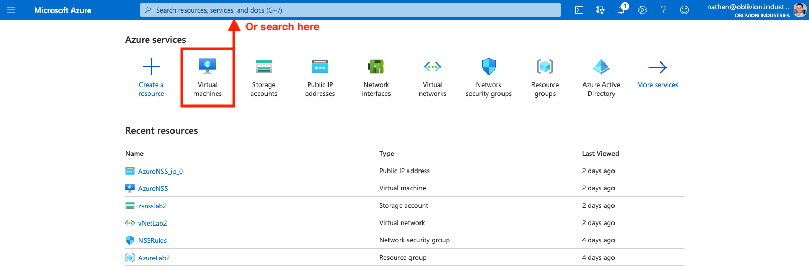
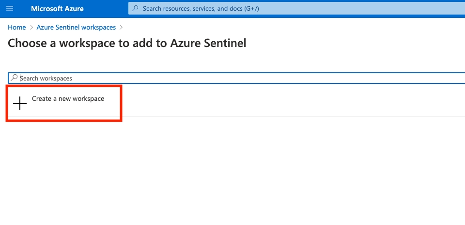
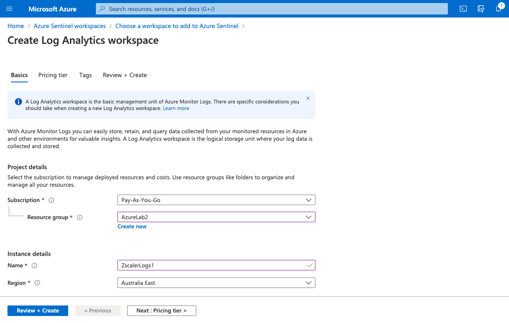
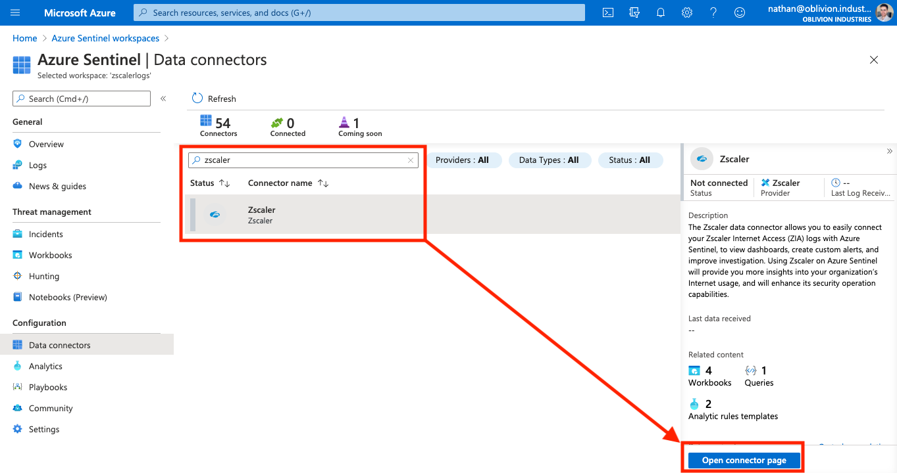
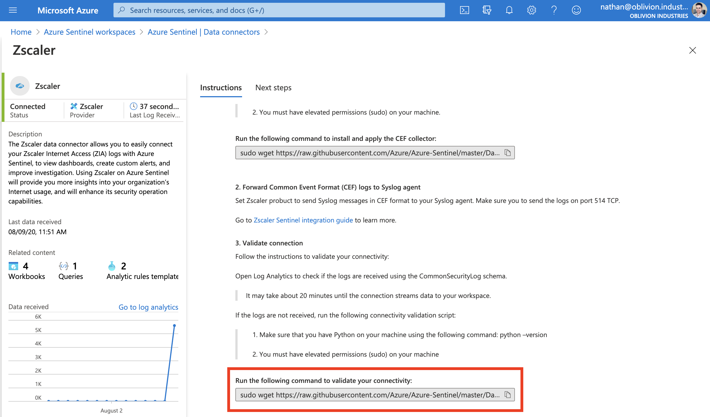
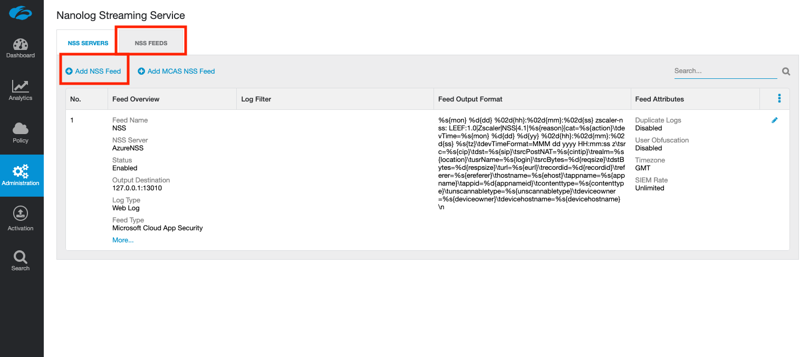
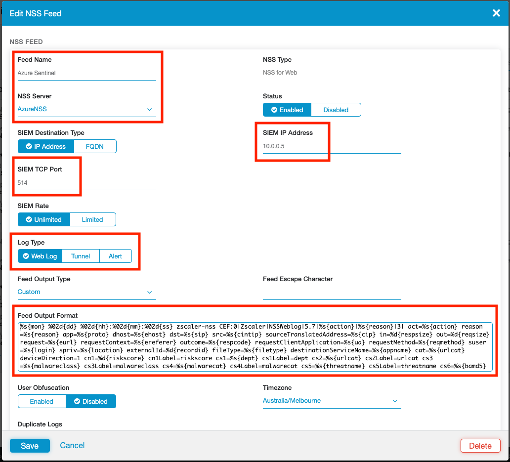

Azure Sentinel is a cloud-based SIEM solution by Microsoft. Zscaler Internet Access (ZIA) integrates with a wide variety of SIEM solutions, and Sentinel is no different. In this guide, we'll walk through how to configure ZIA to send logs in real-time to Sentinel.


> **Caution!** Be very careful if you're deploying this as part of a demo or lab environment as the costs we will incur can ramp up quickly! You will incur charges for one new VM as part of this guide (in addition to an existing NSS VM if you also deployed it in Azure), PLUS data ingestion charges for an Azure Sentinel workspace.

# Requirements

## 1. Zscaler NSS

To stream Zscaler logs to Sentinel, you will need to have deployed Zscaler's Nanolog Streaming Service (NSS) VM and configured it in the ZIA admin portal. This will allow you to stream logs from Zscaler's logging clusters (called Nanolog) towards a SIEM or product of your choice (in this case, Sentinel).

**Nanolog Streaming Service** is an option under the Administration panel in ZIA. If you don't see it there, check that your subscription contains the NSS feature.

You can deploy the VM for NSS on-prem (available as an OVA image) or in AWS or Azure. **For Sentinel integration, I  strongly recommend you deploy NSS in Azure**: you can [review my guide on how to do so here](/posts/deploy-zscaler-nss-in-azure/). Zscaler documentation is available for [VMware](https://help.zscaler.com/zia/nss-deployment-guide-vmware-vsphere) and [AWS](https://help.zscaler.com/zia/nss-deployment-guide-amazon-web-services).

Your NSS VM must have a state of **Healthy** to be able to integrate with Sentinel.


> Why do I need to deploy a VM to stream logs to a SIEM? Can't Zscaler just send logs to my SIEM directly?

Your logs are stored in Zscaler's Nanolog clusters in a highly compressed and encoded format. For security reasons, the logging cluster has no mechanism to decode these before they are sent. The NSS VM connects to both the Nanolog cluster and the Zscaler control plane, grabs the logs, decodes them, and forwards them to your SIEM over a TCP connection.


## 2. Azure Subscription + Administrator Credentials

As part of this guide, we will be creating a small VM that will ingest our logs into Sentinel, and a Log Analytics Workspace to store our ingested data. Both of these will result in billable charges (VM running costs + storage for the logs), hence you will need an active Azure billing subscription and administrator access to your Azure Portal.


# Configure Sentinel

In this section, we will cover the Azure-specific configuration required for Sentinel integration; including:

* Deploying a Data Connector VM
* Creating & Configuring a Sentinel Instance
* Configuring the Zscaler Connector in Sentinel


## 1. Create the Data Connector VM

In order to ingest Zscaler logs into Sentinel, we need to deploy a "Data Connector VM". This VM will run the Microsoft agent required to send log messages to Sentinel and will be the destination to which we will stream the Zscaler logs from NSS.

> Why do I need all these VMs? First I had to deploy NSS, and now I need this Data Connector VM! Why can't I just send logs straight from Zscaler to Azure Sentinel?

I talked briefly about why NSS is required for log streaming above. Think of it as an intermediate log gateway.

NSS forwards the uncompressed logs via a TCP connection towards one or more destinations (as defined by you in the ZIA portal). Sentinel doesn't have an open endpoint that you can stream to, hence we need to create one in the form of the Data Connector VM.

### Create a new Virtual Machine

To start, from the Azure Portal, search for or select **Virtual Machines**.



Click **Add** to create a new **Virtual Machine**.


On the next screen, populate the basic info for your new VM.

* For the Image / OS, select the latest Ubuntu Server LTS version (currently 18.04 LTS).
* For the VM size, you shouldn't need anything too big. I used **Standard B2s**, which provides 2 vCPUs and 4GB memory.
  * If you are expecting data from a large number of users, I would pick a size with 8GB memory (or 16GB if you have more than 45,000 users in your organization).
* If you deployed your NSS instance in Azure (and I highly recommend that you do), you should try and use the same Resource Group and vNet as the NSS VM.
* **Note down the username for the VM** as you will be unable to connect to the VM later on without this. You can change this to whatever you like.

My basic settings are shown in the screenshot below:


For disks:

* You won't need a great deal of disk space and shouldn't need any additional data disks beyond the OS disk.
* I would definitely recommend an SSD over HDD for the faster IO as the VM will be handling logs.

For Networking:

* If you deployed your NSS VM in Azure, try and use the same vNet and Subnet for the Data Connector VM as the NSS Service Interface.
* The data connector **must** have **TCP 514 open inbound**. You will want to restrict this to only accept connections from the source IP of your NSS VM. If you deployed NSS in Azure, this will the private IP of the **service interface of the NSS VM**; most likely a 10.0.0.0/24 address.
* You may also want to enable inbound access on port 22 from your own source IP so you can SSH to and configure the VM.

On the **Networking** tab, select **Advanced** for **NIC network security group**, and then click **Create new**, to create a new Network Security Group (NSG).


If you're not familiar with NSGs, think of them as a firewall. We're going to define rules to allow/deny connectivity to and from our VM.

In the screenshot below, I've created 3 rules:

* Permit inbound SSH access from my own IP address to the Data Connector VM.
  * There should be a default SSH rule already, but you may want to modify it to restrict access from your own source IP address. Else, anyone will be able to hit your VM on port 22.
* Permit inbound connectivity on TCP port 514 from the source IP of my NSS VM's service interface (10.0.0.4 in the example screenshot below).
  * This rule is absolutely **critical** if you want Sentinel integration to work.
* Permit outbound connectivity to all destinations for internet access on the VM.
  * NSGs should have a default outbound rule already, but in the example below I explicitly created the rule for illustration purposes.


Once you've configured your NSG, save and create your VM once you're satisfied with the rest of your settings. Once provisioned, you will see the Data Connector VM running alongside any existing VMs in your portal:


### Connect to the Data Connector VM

We will SSH to our new VM to verify connectivity and prepare it for the configuration package to be installed later.

```
ssh <username>@<DataConnectorVM-IP>

...
Welcome to Ubuntu 18.04.4 LTS (GNU/Linux 5.3.0-1032-azure x86_64)

 * Documentation:  https://help.ubuntu.com
 * Management:     https://landscape.canonical.com
 * Support:        https://ubuntu.com/advantage
 
nathan@SentinelDataConnector:~$

```


First, check you have connectivity to the internet:

```
nathan@SentinelDataConnector:~$ ping 1.1.1.1
...
PING 1.1.1.1 (1.1.1.1) 56(84) bytes of data.
64 bytes from 1.1.1.1: icmp_seq=1 ttl=56 time=1.26 ms

--- 1.1.1.1 ping statistics ---
1 packets transmitted, 1 received, 0% packet loss, time 0ms
rtt min/avg/max/mdev = 1.261/1.261/1.261/0.000 ms
```

Next, check you have connectivity to the NSS VM (specifically the service interface). For me, this is 10.0.0.4 in the same vNet:

```
nathan@SentinelDataConnector:~$ ping 10.0.0.4
...
PING 10.0.0.4 (10.0.0.4) 56(84) bytes of data.
64 bytes from 10.0.0.4: icmp_seq=1 ttl=64 time=1.40 ms
^C
--- 10.0.0.4 ping statistics ---
1 packets transmitted, 1 received, 0% packet loss, time 0ms
rtt min/avg/max/mdev = 1.408/1.408/1.408/0.000 ms
```

Lastly, fetch the latest updates for the VM and install them. Reboot the VM when you're finished for good measure.

```shell
nathan@SentinelDataConnector:~$ sudo apt-get update && apt-get dist-upgrade
...
nathan@SentinelDataConnector:~$ sudo reboot
```


### Troubleshooting VM Connectivity

If you can't SSH to your VM, have no outbound/internet connectivity, or can't reach the NSS VM, then your first point of  call should be checking the Network Security Group you assigned to the VM.

You can edit the NSG by searching for "Network Security Groups" in the Azure Portal. Select your NSG, and alter or add to the inbound and outbound rules as required.


For SSH, you must enable destination port TCP 22 in the inbound direction. If you're restricting this to your source IP, you could temporarily open this up to any IP, but I would revert this once you gain connectivity as this exposes the VM to the broader internet. If you're still having issues connecting via SSH, check that the IP assigned to the VM is correct, wait a little bit longer for the VM to finish booting (although this should be quick), or restart the VM from the Azure Virtual Machines menu.

For connectivity to the NSS VM: If you've deployed the NSS VM in Azure, connectivity should be covered by the default`AllowVnetOutBound` outbound rule, although you may wish to explicitly define a rule restricting TCP 514 from the source IP of the NSS VM only.

Allowing internet access should be one of the default outbound rules, `AllowInternetOutBound`, but you should verify this rule is set to `Allow` and is above the `DenyAllOutBound` rule.

Rule order matters when working with NSGs. Rules are evaluated top-to-bottom and on a "first match" basis. Your own rules should all have low priority values so that they don't get overwritten by the default rules at the bottom of the list. Specifically, make sure the priority of your rules is **less than** 65000.


## 2. (Optional) Create a Sentinel Instance

Once the Data Connector VM has been configured we can move on to creating a Sentinel Instance. If you already have an existing Sentinel Instance, you can skip this step.

In your Azure Portal, search for "**Azure Sentinel**".


Click **Add** to connect a new workspace.


Click **Create a new workspace**.



On the next screen, select a Resource Group, region, and give your workspace a globally unique name. When you're ready, review your config and create the workspace.



You should now see your new workspace listed under your Azure Sentinel workspaces (if you've lost this screen, simply search for the "Azure Sentinel" app again at the top of the Azure Portal).


## 3. Configure the Zscaler Connector & Data Connector VM

In this section, we will enable the Zscaler Connector for Azure Sentinel and copy the config needed by the Data Connector VM.

### Copy the Configuration Command

Select your workspace from your list of Sentinel workspaces (if you've lost this screen, simply search for the "Azure Sentinel" app again at the top of the Azure Portal).


Under **Configuration** in the left-side menu of your Sentinel workspace, select **Data connectors**.


In the search box, type "**Zscaler**" to filter down the list of available data connectors. Select the **Zscaler** connector and click **Open connector page** to add and configure it.



Under the **Configuration** section, copy the command highlighted in the screenshot below (this is unique to your Sentinel instance).


### Configure the Data Connector VM

Connect back to the Data Connector VM you provisioned earlier:

```
ssh <username>@<DataConnectorVM-IP>

...
nathan@SentinelDataConnector:~$
```

Paste in and execute the command you copied above from the Zscaler Connector configuration page:

```
nathan@SentinelDataConnector:~$ sudo wget https://raw.githubusercontent.com/Azure/Azure-Sentinel/master/DataConnectors/CEF/cef_installer.py&&sudo python cef_installer.py [snip]
...
...
Resolving raw.githubusercontent.com (raw.githubusercontent.com)... 151.101.28.133
Connecting to raw.githubusercontent.com (raw.githubusercontent.com)|151.101.28.133|:443... connected.
HTTP request sent, awaiting response... 200 OK
...
...
Restarting rsyslog daemon.
sudo service rsyslog restart
Rsyslog daemon restarted successfully
Trying to restart omsagent
Omsagent restarted successfully
Installation completed
nathan@SentinelDataConnector:~$ 
```

Note: I've included part of the command above as an example. Don't copy and paste this though as it won't work for you. Copy and paste it from the config page of the Zscaler Connector - the command contains a token that is unique to you.

### Verifying Connectivity

If everything was installed and is running correctly, the Data Connector VM should be listening on TCP 514:

```
root@SentinelDataConnector:~# netstat -lnpt
Active Internet connections (only servers)
Proto Recv-Q Send-Q Local Address      Foreign Address    State       PID/Program name    
tcp        0      0 127.0.0.1:25226    0.0.0.0:*          LISTEN      107202/ruby         
tcp        0      0 0.0.0.0:25324      0.0.0.0:*          LISTEN      107202/ruby         
tcp        0      0 127.0.0.53:53      0.0.0.0:*          LISTEN      97325/systemd-resol 
tcp        0      0 0.0.0.0:22         0.0.0.0:*          LISTEN      1617/sshd           
tcp        0      0 0.0.0.0:514        0.0.0.0:*          LISTEN      107103/rsyslogd     
```

You may need to run the above as the `root` user to see the program name.

You should also see the Azure collector agent running (as two ruby scripts).


### Troubleshooting

Back on the Zscaler Connector page, there is a second command available to troubleshoot the data connector and Azure collection scripts. Scroll down and copy/paste the second command at the bottom of the page.



This will check connectivity and restart the rsyslog and collection processes.

# Configure the Zscaler Log Feeds

If you have reached this point without issue, well done! We're almost there! In this section, we'll configure the NSS log feed required to send data to Sentinel.

An NSS log feed specifies the data you wish to stream from Nanolog: You can stream everything, or filter the data to only receive what you care about (security events, information relating to a specific user, etc).

Note that there are two types of NSS VM deployments: One dedicated to Web Logs, and the other dedicated to Firewall Logs. You pick the type when you first deploy an NSS VM. While Sentinel can ingest both web and firewall logs, this guide will only focus on web logs. To stream firewall logs, you will need to deploy a second NSS VM and associate it with the **Firewall** log type. A single NSS instance can only stream one type of logs: either web or firewall; not both.

Streaming both types of logs to Sentinel is recommended to give you the biggest dataset to work with. If you decide to go down this path, only a single instance of the Data Connector VM is needed, although you may also wish to deploy a second one to keep a logical separation between log streaming components (and to help with scale if you are a larger organization).

## Add a New NSS Feed

In your ZIA portal, navigate to **Administration > Nanolog Streaming Service**.


Select the **NSS Feeds** tab, then select **Add NSS Feed**.



Fill in the feed details as per the below table:

| Field            | Description                                                  |
| ---------------- | ------------------------------------------------------------ |
| Feed Name        | Unique name for the feed, eg: "Azure Sentinel"               |
| NSS Server       | The NSS VM that will be responsible for fetching and streaming the logs for this feed. Ideally, this should be deployed in Azure as a VM. |
| SIEM IP Address  | **The IP address of the Data Connector VM.** Mine was in the same vNet as my NSS VM and was set to 10.0.0.5. |
| SIEM TCP Port    | The TCP port to stream the logs to. Set this to port **514**. |
| Log Type         | This field will vary depending on the type of NSS VM you have associated (ie: Web or Firewall log streaming). Ensure **Web Log** is selected if you are using an NSS for Web VM. |
| Feed Output Type | **Custom**                                                   |



Ensure the Feed Output type is set to **Custom**. In the **Feed Output Format** text field, delete any pre-populated template, and paste in one of the following.

For Web logs:

```
%s{mon} %02d{dd} %02d{hh}:%02d{mm}:%02d{ss} zscaler-nss
CEF:0|Zscaler|NSSWeblog|5.7|%s{action}|%s{reason}|3| act=%s{action}
reason=%s{reason} app=%s{proto} dhost=%s{ehost} dst=%s{sip} src=%s{cintip}
sourceTranslatedAddress=%s{cip} in=%d{respsize} out=%d{reqsize}
request=%s{eurl} requestContext=%s{ereferer} outcome=%s{respcode}
requestClientApplication=%s{ua} requestMethod=%s{reqmethod}
suser=%s{login} spriv=%s{location} externalId=%d{recordid}
fileType=%s{filetype} destinationServiceName=%s{appname} cat=%s{urlcat}
deviceDirection=1 cn1=%d{riskscore} cn1Label=riskscore cs1=%s{dept}
cs1Label=dept cs2=%s{urlcat} cs2Label=urlcat cs3=%s{malwareclass}
cs3Label=malwareclass cs4=%s{malwarecat} cs4Label=malwarecat
cs5=%s{threatname} cs5Label=threatname cs6=md5hash cs6Label=%s{bamd5}
rulelabel=%s{rulelabel} ruletype=%s{ruletype} urlclass=%s{urlclass}
devicemodel=%s{devicemodel}\n
```

For Firewall logs:

```
%s{mon} %02d{dd} %02d{hh}:%02d{mm}:%02d{ss} zscaler-nss-fw
CEF:0|Zscaler|NSSFWlog|5.7|%s{action}|%s{rulelabel}|3| act=%s{action}
suser=%s{login} src=%s{csip} spt=%d{csport} dst=%s{cdip} dpt=%d{cdport}
deviceTranslatedAddress=%s{ssip} deviceTranslatedPort=%d{ssport}
destinationTranslatedAddress=%s{sdip} destinationTranslatedPort=%d{sdport}
sourceTranslatedAddress=%s{tsip} sourceTranslatedPort=%d{tsport}
proto=%s{ipproto} tunnelType=%s{ttype} dnat=%s{dnat} stateful=%s{stateful}
spriv=%s{location} reason=%s{rulelabel} in=%ld{inbytes} out=%ld{outbytes}
deviceDirection=1 cs1=%s{dept} cs1Label=dept cs2=%s{nwsvc}
cs2Label=nwService cs3=%s{nwapp} cs3Label=nwApp cs4=%s{aggregate}
cs4Label=aggregated cs5=%s{threatcat} cs5Label=threatcat
cs6=%s{threatname} cs6label=threatname cn1=%d{durationms}
cn1Label=durationms cn2=%d{numsessions} cn2Label=numsessions
cs5Label=ipCat cs5=%s{ipcat} destCountry=%s{destcountry}
avgduration=%d{avgduration}\n
```

Scroll to the bottom of the window to define filters for the data (if required). By default, everything will be streaming to Sentinel.

When you have finished, click **Save** and **Activate** your changes.


## (Optional) Check NSS

You may want to log into the NSS VM and check that it has picked up the new feed. NSS will usually take under 5-10 minutes to pick up the feed, but in some circumstances, this can take up to an hour.

SSH or connect to your NSS VM, and run the following command to check the feed status:

```
[zsroot@NSS ~]$ sudo nss troubleshoot feeds
...
NSS is live 
Currently active feeds: 1
Feed name: Azure Sentinel:
  Connection Status:
	[10.0.0.4:9471 -> 10.0.0.5:514] : Stable
  Other health checks:
	Feed is stable. No suspicious events detected.
```

Note that this command may take a few minutes to run.

Here we can see that the feed called `Azure Sentinel` that I created above has been picked up by my NSS VM; and is in an active and stable state. The Service Interface of my NSS VM has an IP of 10.0.0.4. My Data Connector VM has an IP of 10.0.0.5, and we can see the NSS VM sending data to this IP on TCP 514; exactly as we configured the feed to.

# Examine the Data

There are 4 workbook templates available in Sentinel that can be used to explore and visualize the data obtained from Zscaler:

| Workbook                | Description                                                  |
| ----------------------- | ------------------------------------------------------------ |
| Zscaler Firewall        | Explore all cloud firewall activity in your Zscaler instance including non-web related networking events, security events, firewall rules, and bandwidth consumption. |
| Zscaler Office 365 Apps | Explore the Microsoft apps running on your network and their bandwidth consumption. It also helps identify phishing attempts in which attackers disguised themselves as Microsoft services. |
| Zscaler Threats         | Visualize your threat landscape including blocked malware, IPS/AV rules, and blocked cloud apps. Threats are displayed by threat categories, filetypes, inbound vs outbound threats, usernames, user location, and more. |
| Zscaler Web Overview    | Visualize security and networking events related to web transactions, types of devices, and bandwidth consumption. |

In your Sentinel instance, select **Workbooks** from the left-side menu, and search for **Zscaler**.


Select a workbook, and click **View Template** to explore your data. Click **Save** to create a copy of the workbook template.


If you're not seeing any data populate into the workbook, check your NSS VM as per the above section. In rare circumstances, it can take up to an hour for the feed to be picked up by NSS once defined in the ZIA portal.

You should also verify that your Network Services Group applied to the NSS and Data Connector VMs permits the two to talk. The Data Connector VM requires an **inbound** rule on port 514, otherwise the traffic will be blocked by default.

> **Caution!** If you are running this in a lab environment, you will be racking up three sets of charges: The NSS VM (if you deployed it in Azure), the Data Connector VM, and charges to ingest the logs into Azure Sentinel. You may wish to toggle the VMs on and off as needed to avoid racking up large usage charges!

# Finish

Congratulations! You have now integrated Zscaler Internet Access with your Azure Sentinel SIEM instance!

If you deployed this for lab or demo purposes, **make sure you don't forget about the running NSS and Data Connector VMs!** Ensure you stop and de-allocate resources after you're done so you don't continue to be charged.


