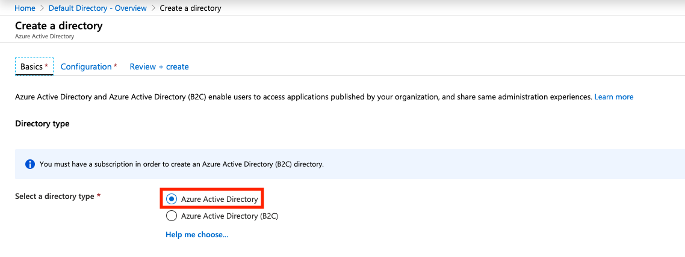

# Get an Azure Free Account

Before you start, you will need to sign up for a free Azure account: [https://azure.microsoft.com/en-au/free/](https://azure.microsoft.com/en-au/free/)

This gives you some Azure services, like Windows & Linux VMs, free for 12 months, while other Azure services (like Azure Active Directory) are free permanently up to certain usage limits.

With Azure AD free, you can freely create users and groups, but groups cannot be assigned and synchronized to enterprise applications. To do this you will need a premium account.

To see everything included in the free account, click [here](https://azure.microsoft.com/en-au/free/free-account-faq/).

# Get a Domain Name
You'll be integrating your own domain name into Azure AD in this guide, so you'll need one if you don't already. Domains are pretty cheap depending on the TLD. You can often find ones for $1-2/year.

[NameCheap](https://www.namecheap.com/), [Google Domains](https://domains.google/), [Porkbun](https://porkbun.com/) are all good sites to get a domain from.

# Create a new tenant

From the Azure Home screen, open the menu and go to **Azure Active Directory**.

You'll see the default directory. Ignore this and select **Create a directory** from the top.

Under the **Basics** tab, select **Azure Active Directory**. Click next to go to the **Configuration** tab.

Give your "Organization" a name. I went with my own name. You'll also need to select an Initial Domain Name. This will be a subdomain on the `onmicrosoft.com` domain. Eg: `nathanc.onmicrosoft.com`

You cannot delete this domain, but can optionally add your own domain name in a later step. The subdomain you pick here must be unique and connot have been used before by any other Azure user.

Finally, select your country so you can be allocated to the closest DC region.

When you are done, click next to go to the **Review + Create** tab. Review your selection and click **Create** when you are ready.

# Add a custom domain

While you could use the `*.onmicrosoft.com` domain for your lab, it's generally a better idea to use your own custom domain name. This allows you to have identities such as nathan@mydomain.com instead of nathan@nathanc.onmicrosoft.com.

Once your tenant has been created, on the side panel for your new directory, click **Custom domain names**. Then click **Add custom domain** at the top.

Enter in your full domain name, **including the top-level**, eg: `.com`, `.net`, `.cool` etc.

You'll be promoted to add a new TXT DNS record with your domain registrar using the infomation displayed. Once you've done so, you can click **Verify**. The record may fail to validate straight away: it can take up to 72 hours before the validation works, although for me it took roughly 5 minutes.

Once verified, elect to make your custom domain the primary domain for your new directory.

# Add some users

From the directory side menu under **Manage**, click **Users**, then **New User**.

Fill in the following fields for the user:

1. Username
2. Name
3. Password
4. Job Title & Department

Users will be provisioned with the basic **User** role by default. You can add additional roles & permissions if needed. We haven't setup any groups yet so leave that part alone.

When you're finished, you'll be returned to the **All users** page with your new user created.

For a homelab, might be helpful to create several dummy users.

# Create some groups

Groups are exactly that: Secure grouping of users to simplify access policies within certain applications.

From the directory side menu under **Manage**, click **Groups**, then **New Group**. You'll notice I already have some groups defined.

Leave the **Group type** as **Security**. Give you group a name and description.

Here you can assign an owner of the group, as well as members from a list of users you created earlier. You can also assign existing groups as a member making this new group the parent superset.

Click **Create** when you are done.

# Adding Enterprise Applications for SSO

From the directory side menu under **Manage**, click **Enterprise applications**, then **New application**.

Search for the application you want to provide SSO to.

When you have found your application, click **Create**.

# Finish

Azure AD should now be configured with some users and groups.

