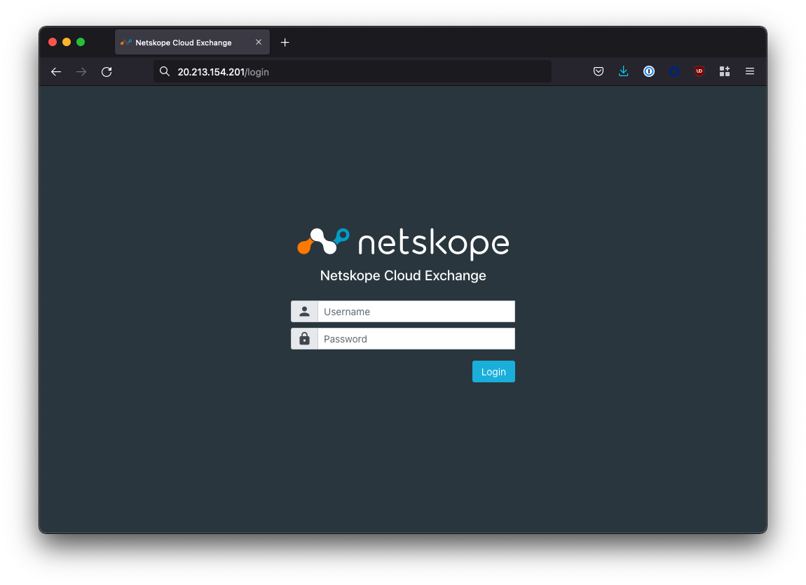
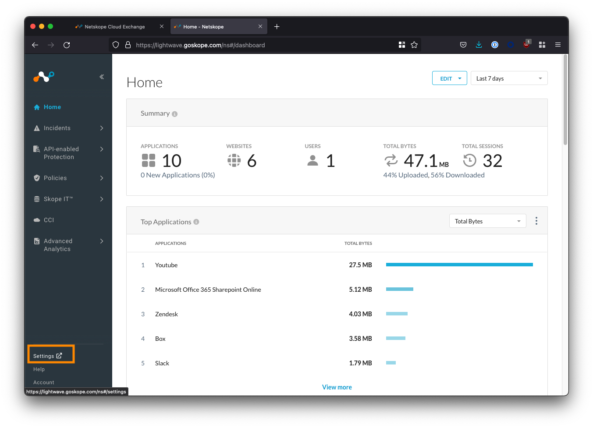
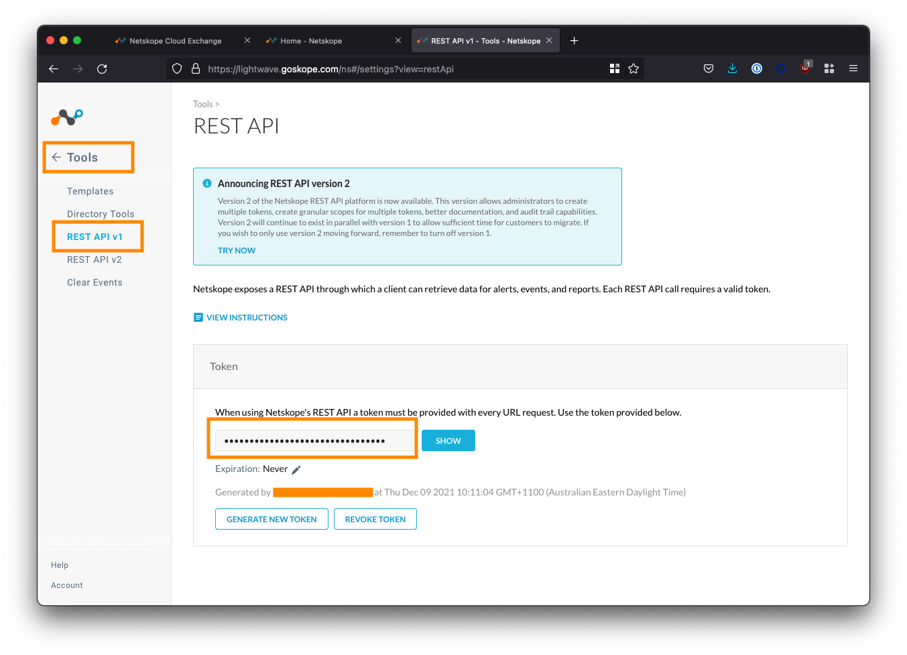
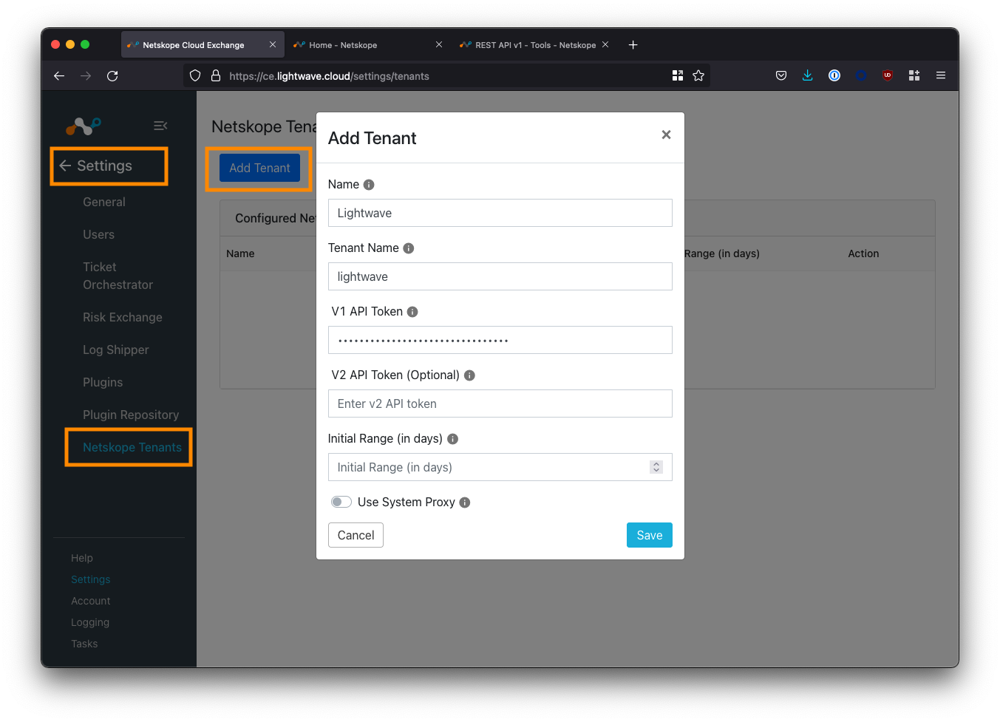

> The thoughts, and opinions in this post are my own and do not reflect those of Netskope. All content in this post is my own and is not endorsed by Netskope. Please follow this guide at your own risk.

Changelog:

* 1st Mar, 2022: Initial post
* 7th Dec, 2022: Updated guide for Cloud Exchange 4.0.

# What is Cloud Exchange?

Cloud Exchange (CE) is a platform (free for all Netskope customers) that facilitates the exchange of information between your various security and operations platforms.


# What can Cloud Exchange do?
4 modules make up the Cloud Exchange platform; each with a particular area of focus. You don't need to use every module: only the ones that make sense based on the vendors in your current environment.

## 1. Threat Exchange
The Cloud Threat Exchange (CTE) module is designed to streamline and automate the sharing of threat indicators and intelligence between security platforms in use in your environment; reducing the likelihood of a successful attack.

## 2. Ticket Orchestrator
For incidents and alerts generated in the Netskope platform, the Cloud Ticket Orchestrator (CTO) module will automatically create tickets and/or notifications in 3rd-party ITSM and collaboration systems (like ServiceNow, JIRA, Slack, etc) to streamline incident response.

## 3. Risk Exchange
The Cloud Risk Exchange (CRE) module facilitates the sharing and normalization of both **user** and **SaaS application** risk scores between security vendors. CRE is divided into two distinct sub-modules: User Risk Exchange (URE) and Application Risk Exchange (ARE).

### User Risk Exchange

The User & Entity Behavior Analytics (UEBA) feature in the Netskope platform tracks anomolous user behaviour and provides a dynamic risk score for each user in the organization. This score is known as the User Confidence Index (UCI) and it can be leveraged in policy to trigger restrictions or access controls based on hightened user risk.

Other platforms, like Crowdstrike and Mimecast, also offer user risk scoring features of their own. The URE sub-module takes the user risk scores generated by Netskope and your other security vendors, and normalizes and weights them into a single score that can be used to trigger actions across vendors (eg: place the user into a "high risk" Active Directory group).

### Application Risk Exchange

The ARE sub-module collects the risk information for all SaaS apps accessed by users in the organization, and facilitates the sharing of this data with other security vendors.

## 4. Log Shipper
The Cloud Log Shipper (CLS) module extracts the raw event, alert, and log data from your Netskope tenant, and pushes it to one or more receivers, such as a Data Lake or SIEM solution like Splunk, Azure Sentinel, Exabeam, and so on.

---

# Deploying Cloud Exchange
Cloud Exchange is deployed as a series of Docker containers within your environment - hence as long as your system can run Docker (or Podman), it can also run Cloud Exchange!

This guide will focus on using Ubuntu 20.04 LTS as the host OS, but you may also wish to use Red Hat Enterprise Linux (RHEL).


RHEL leverages Podman instead of Docker for container management. Netskope has specific instructions for RHEL/Podman [here](https://docs.netskope.com/en/system-requirements.html#idm45784491605296_body).


## Requirements
You will need the following to install Cloud Exchange:

### Operating System

* A Linux system capable of supporting the docker.io release of Docker (v19.0.0 or higher), and Docker Compose (v1.29.0 or higher).
  * Ubuntu 20.04 LTS and RHEL 7.9 & 8.0 are supported by Netskope.
  * This guide uses Ubuntu 20.04 LTS


### System Specification

The VM that Cloud Exchange is deployed to should meet the following minimum requirements:
* 4 vCPUs
* 4 GB of memory
* 40 GB of storage
* For example: Azure = `Standard B2ms`, AWS = `a1.xlarge`, GCP = `e2-highcpu-4`.

For large enterprise environments with a high rate of Events Per Minute (EPM), the system requirements are higher. Netskope provides scaling numbers [here](https://docs.netskope.com/en/system-requirements.html#UUID-92edc283-a3a0-2a63-1312-513929a52ed0_N1666326801974).

### Networking

* Cloud Exchange requires **outbound** connectivity to GitHub, Docker Hub, your Netskope tenant, and any other vendor platform you plan to integrate it with (eg: Crowdstrike, Splunk, Mimecast, etc).
  * [See here](https://docs.netskope.com/en/system-requirements.html#idm45784491624608) for a list of URLs that Cloud Exchange requires access to.
* Deploying CE behind a HTTP(S) proxy is supported (if required).
* Cloud Exchange requires inbound connectivity on 22 for installation/server management, and 443 for access to the admin UI (via HTTPS).
  * It is NOT recommended that you expose Cloud Exchange publicly on the internet.

---

## Install Docker & Docker Compose

If you're using a fresh VM, you'll need to install Docker and Docker Compose. The below will install Docker CE (Community Edition), which is free but does not come with support. For a production environment, Docker Enterprise is recommended.


The commands below cover the installation of Docker on an Ubuntu host. **For RHEL 8+, you will need to use Podman instead of Docker. Please see [here](https://docs.netskope.com/en/install-netskope-cloud-exchange-on-a-red-hat-enterprise-8-x-linux-host.html) for instructions on how to deploy CE on RHEL.**


1. Update the existing packages on the system:

```
sudo apt update -y && sudo apt upgrade -y
```

2. Install the pre-requisite packages. These allow `apt` to use a repository over HTTPS:

```
sudo apt install apt-transport-https ca-certificates curl gnupg lsb-release -y
```

3. Add the GPG key for the official Docker software repository:

```
sudo mkdir -p /etc/apt/keyrings && curl -fsSL https://download.docker.com/linux/ubuntu/gpg | sudo gpg --dearmor -o /etc/apt/keyrings/docker.gpg
```

4. Add the Docker software repository:

```shell
echo "deb [arch=$(dpkg --print-architecture) signed-by=/etc/apt/keyrings/docker.gpg] https://download.docker.com/linux/ubuntu $(lsb_release -cs) stable" | sudo tee /etc/apt/sources.list.d/docker.list > /dev/null
```

5. Update the package index:

```
sudo apt update -y
```


If you receive a GPG error, your default [umask](https://en.wikipedia.org/wiki/Umask) may be incorrectly configured. Grant read permissions to the Docker public key (`sudo chmod a+r /etc/apt/keyrings/docker.gpg`) and try again.


6. Install Docker:

```
sudo apt install docker-ce docker-ce-cli containerd.io docker-compose-plugin -y
```

7. Verify the installation:

```
sudo docker run hello-world
```

If successful, this will pull a Docker container, print a confirmation message, and exit.


8. Install Docker Compose:

Cloud Exchange currently uses the older `docker-compose` syntax instead of `docker compose` (note the missing `-`), so we need to install the standalone version of Docker Compose which uses the older syntax:

```
sudo curl -SL https://github.com/docker/compose/releases/download/v2.14.0/docker-compose-linux-x86_64 -o /usr/local/bin/docker-compose
```

9. Make the Docker Compose binary executable:

```
sudo chmod +x /usr/local/bin/docker-compose
```

10. Validate that Docker Compose is installed correctly:

```
docker-compose --version
...
>> Docker Compose version v2.14.0
```

11. Set the Docker process to start at boot:

```
sudo systemctl enable docker && sudo systemctl start docker
```

12. Check that the Docker service is running:

```
sudo systemctl status docker

● docker.service - Docker Application Container Engine
     Loaded: loaded (/lib/systemd/system/docker.service; enabled; vendor preset: enabled)
     Active: active (running) since Wed 2022-12-07 05:49:10 UTC; 1min 14s ago
TriggeredBy: ● docker.socket
       Docs: https://docs.docker.com
   Main PID: 838 (dockerd)
      Tasks: 8
     Memory: 91.6M
     CGroup: /system.slice/docker.service
             └─838 /usr/bin/dockerd -H fd:// --containerd=/run/containerd/containerd.sock
```

After the install, if you attempt to run the `docker` command without `sudo`, you will get the following error:
```
ERROR: Got permission denied while trying to connect to the Docker daemon socket at unix:///var/run/docker.sock:
```

If you don't mind this, you can jump ahead. Otherwise, you can add your username to the `docker` group that was created on install. This will allow you to use the `docker` command without `sudo`.
```
sudo usermod -aG docker ${USER}
```

You will then need to log out of the system, then log back in again for the updated membership to take effect.

---


## Clone the Netskope Cloud Exchange Repository
Clone the Cloud Exchange repository from [Netskope on GitHub](https://github.com/netskopeoss/ta_cloud_exchange).

```
mkdir netskope && cd netskope
git clone https://github.com/netskopeoss/ta_cloud_exchange
cd ta_cloud_exchange
```

The scripts in this repository will pull the containers from the Netskope repository on [Docker Hub](https://hub.docker.com/u/netskopetechnicalalliances), bring them up using Docker Compose, and perform the initial setup of Cloud Exchange. Before executing the setup command however, thought needs to be given as to how Cloud Exchange will be secured… read on!

---


## Installing Cloud Exchange

Install Cloud Exchange:
```
python3 ./setup
```


Special characters (including, but not limited to `#`, `$`, `/`, etc) **are not supported** when setting the maintenance password for CE. Using these characters may cause some internal processes to fail.


When prompted:

* Type `1` to install the latest version.
* Specify whether you are using a HTTP(S) proxy for outbound traffic. If you are not sure, type `N`
* Enter the **Tenant ID** of your Netskope tenant. **Do not enter the `.goskope.com` part**. For example:
  * If your tenant URL is: `https://mycompany.goskope.com`, enter `mycompany`
  * If your tenant URL is: `https://mycompany.au.goskope.com` (or similar), enter `mycompany.au`

* Type `HTTPS` to access Cloud Exchange securely (don't use HTTP… just don't.)
* Enter `443` when prompted for a port.
  * This is the port that the admin interface is accessible on. Make sure you have an appropriate firewall rule in place to allow access.

* Enter a secret password that will be used to sign any generated authentication tokens. You don't need to remember this - just make it long and complex.
* Enter a maintenance password for the RabbitMQ and MongoDB services.
  * **WARNING: This password can only be set once! Make sure you make it complex and note it down.**
  * **Remember: Don't use special characters like `#`, `$`, and `/`.**

* Press ENTER or type `No` when prompted to enable TLS 1.2. TLS 1.3 is used by default.


To see example usage of the setup script, see the GitHub Gist [here](https://gist.github.com/nathancatania/a08639b42b081dcd30c8af1693358320).

---

## Launching Cloud Exchange
To start Cloud Exchange:
```
./start
```

To stop Cloud Exchange:
```
./stop
```

On first run, the Cloud Exchange containers will be pulled from Docker Hub so it may take some time to come up.

```
nathan1@ce:~/netskope/ta_cloud_exchange$ ./start
Docker Compose version v2.14.0
[+] Running 5/5
 ⠿ watchtower Pulled
 ⠿ rabbitmq-stats Pulled
 ⠿ core Pulled
 ⠿ mongodb-primary Pulled
 ⠿ ui Pulled
[+] Running 5/5
 ⠿ Network ta_cloud_exchange_default              Created
 ⠿ Container ta_cloud_exchange_rabbitmq-stats_1   Started
 ⠿ Container ta_cloud_exchange_mongodb-primary_1  Started
 ⠿ Container ta_cloud_exchange_watchtower_1       Started
 ⠿ Container ta_cloud_exchange_core_1             Started
 ⠿ Container ta_cloud_exchange_ui_1               Started
```

When complete, you will be able to access the Cloud Exchange UI in your browser:
```
https://<host ip address>
```


At this point, you should receive an untrusted SSL warning in your browser. **This is normal**: The CE setup script automatically generated a self-signed SSL certificate to secure connectivity to the admin UI. Your connection is secure.

You can whitelist the CE URL in your browser to remove this error OR you can replace the self-signed SSL certificate with one that is trusted/signed by a trusted CA. The latter is covered in the next section.




If you can't access the UI, make sure that any host firewall (eg: `ufw`), network firewall, and/or Network Security Group (NSG) permits port 443 inbound towards the host IP address.


Inbound exposure should be local only: We do not recommend exposing Cloud Exchange to the internet. Ideally, you should site CE behind a ZTNA solution like Netskope Private Access (NPA).


If you want to be able to access Cloud Exchange from a nice domain name (eg: cloudexchange.company.com), you can create an A record in your DNS (or hosting provider) pointing towards the IP address of your Cloud Exchange host.

---

## (Optional) Changing the SSL Certificate

When you opted to use HTTPS to access the Cloud Exchange UI, the setup script automatically generated a self-signed SSL certificate to secure access to the admin UI. However, this results in untrusted SSL certificate warnings in your browser.

The self-signed certificate can be optionally swapped out for one that is signed by a trusted CA to prevent the SSL warning.

To do so, follow these steps:

1. Stop the Cloud Exchange service:

```
cd ~/netskope/ta_cloud_exchange
./stop
```

2. Remove the existing certificate and private key in the `ta_cloud_exchange/data/ssl_certs/` directory:

```
cd ~/netskope/ta_cloud_exchange/data/ssl_certs/
rm -rf cte_cert.crt
rm -rf cte_cert_key.key
```

3. Rename your certificate and private key to `cte_cert.crt` and `cte_cert_key.key` and copy them to `ta_cloud_exchange/data/ssl_certs/`:

```
cp your_certificate.crt ~/netskope/ta_cloud_exchange/data/ssl_certs/cte_cert.crt
...
cp your_private_key.key ~/netskope/ta_cloud_exchange/data/ssl_certs/cte_cert_key.key
```

4. Restart Cloud Exchange:

```
cd ~/netskope/ta_cloud_exchange
./start
```


Ensure that you rename your public and private key to `cte_cert.crt` and  `cte_cert_key.key` respectively, or your certificate will not be used!


### Troubleshooting

After changing the certificate, if the UI is no longer accessible, check the logs for the UI container (this will typically be called `ta_cloud_exchange_ui_1`):

```
docker logs ta_cloud_exchange_ui_1
```

The issue is likely due to the format of the certificate or private key. Cloud Exchange uses NGINX underneath, so that is what you are aiming for in terms of compatibility. There should be no need to use a CA Bundle: just the certificate on it's own will suffice.

```
nathan1@ce:~/$ docker logs ta_cloud_exchange_ui_1
[...]
2022/12/09 00:52:41 [emerg] 11#11: SSL_CTX_use_PrivateKey("/etc/nginx/nginx-privatekey.key") failed (SSL: error:0B080074:x509 certificate routines:X509_check_private_key:key values mismatch)
nginx: [emerg] SSL_CTX_use_PrivateKey("/etc/nginx/nginx-privatekey.key") failed (SSL: error:0B080074:x509 certificate routines:X509_check_private_key:key values mismatch)
```

---

# Configure Cloud Exchange
Now that you have deployed Cloud Exchange, we need to perform some initial configuration steps.

## Logging into Cloud Exchange
The default username/password for the Super Administrator for Cloud Exchange is `admin`/`admin`.

Once you accept the EULA, you will be prompted to change the default password. There can only be one Super Administrator and the username cannot be changed.

## Enabling Cloud Exchange Modules & Updates
Once you are logged in, Cloud Exchange will place you into the **Settings > General** menu.


You should enable all 5 of the Cloud Exchange modules under the **General** tab. Only the Super Administrator (the `admin` user) can turn these modules on/off: Regular admins are not able to see the settings to enable/disable these modules.

Under **System Updates**, toggle ON *`Periodically check for updates`*.

## (Optional) Setting a Proxy

If you require the Cloud Exchange modules themselves to communicate through a proxy, you can configure this under the *Proxy* tab under **Settings > General**.

## Adding Users & Configuring SSO
By default, Cloud Exchange uses a local login mechanism where users sign into CE directly.

User Management is located under **Settings > Users**

To create a user, click the plus button on the top right-hand side of the Users table.


There are two roles available for assignment: **Admin** and **Read-Only**. Currently, it is not possible to create additional roles in Cloud Exchange.

The Super Administrator role is only assigned to the default `admin` user. Only the default `admin` user can add/remove users, add/remove CE modules, and change CE module-specific config.

While local login may be acceptable for some smaller organizations, most will want to configure Single-Sign On (SSO) so that the login can utilize federated identity.

To configure SSO, click the *SSO* tab under **Settings > Users**, and enable the SSO checkbox.

I will post a separate guide linked below on how to configure SSO for Cloud Exchange with both Okta and Azure Active Directory (AAD).

* [Guide] [How-to setup SSO for Netskope Cloud Exchange (Okta & Azure AD)](/posts/sso-cloud-exchange)


## Add Your Netskope Tenant(s)

The last configuration step is to pair your Netskope tenant with your Cloud Exchange deployment in order for data to be synchronized. Multiple tenants are supported.

### Get an API Key
You will need to get an API key from within your Netskope tenant. For this guide, we will use API v1. API v2 will not be used (for now).

Log into your Netskope tenant, and navigate to **Settings (bottom-left corner) > Tools > REST API v1**.





Copy the API token displayed. If this is your first time using the API, you may need to generate a new one.

### Add your Netskope Tenant(s) in Cloud Exchange

Navigate to **Settings > Netskope Tenants** and click the **Add Tenant** button.



Fill in the fields according to the table below:

| Field            | Description                                                                                                                                                                                                                                  |
|------------------|----------------------------------------------------------------------------------------------------------------------------------------------------------------------------------------------------------------------------------------------|
| Name             | Enter an easy to remember name for the tenant. Can be whatever you like.                                                                                                                                                                     |
| Tenant Name      | Enter the subdomain of your Netskope tenant - this is everything **before** the `.goskope.com` in the URL of your Netskope tenant. Eg: For `lightwave.goskope.com`, enter `lightwave`. For `lightwave.eu.goskope.com`, enter `lightwave.eu`. |
| V1 API Token     | Enter the API token copied from your tenant in the step above.                                                                                                                                                                              |
| V2 API Token     | Optional. Leave this blank for now.                                                                                                                                                                                                          |
| Initial Range    | Number of days of historical data to sync with CE initially. Enter any value between 1-60. 7-14 is a good default number if you are unsure.                                                                                                  |
| Use System Proxy | Check this if you would like the connection between CE and Netskope to use the configured system proxy.                                                                                                                                      |

Click **Save** to complete your configuration.


### Verify the Netskope Tenant Configuration
Navigate to **Logging** in the bottom-left corner of the UI.

If your Netskope tenant was successfully added, you will start to see events synchronized (provided your tenant has alerts to sync).


# Configure Plugins
Cloud Exchange uses the concept of "plugins" to determine where to send and receive data from. 

You can have multiple inputs and multiple outputs: Naturally, you will want to sync data to and from your Netskope tenant(s) in addition to your other vendors.

Navigate to **Settings > Plugins**


Here you will see a list of supported plugins; tagged according to the CE module the plugin aligns to data-wise:

| CE Tag | Associated CE Module                                         |
| ------ | ------------------------------------------------------------ |
| CTO    | Cloud Threat Exchange. Synchronize threat intel, including IOCs, between vendors. |
| CRE    | Cloud Risk Exchange (User Risk Scoring): Normalize and aggregate user risk scoring between vendors. |
| CTO    | Cloud Ticket Orchestrator. Automatically raise tickets and alerts in apps like Jira, ServiceNow, and Slack. |
| CLS    | Cloud Log Shipper. Automatically pull and push logs to SIEM and data lake applications like Splunk and Sentinel. |
| ARE    | Application Risk Exchange. Send Netskope SaaS app risk information to other security vendors. |

To start, you will want to configure the Netskope plugins for the associated modules you wish to use. For example, if you wish to share IOCs between Netskope and Crowdstrike, ensure you configure the Netskope CTE plugin in addition to the Crowdstrike CTE plugin.

Vendors could potentially have multiple plugins depending on the CE modules supported. For example, Crowdstrike has both CTE and CRE plugins for sharing both threat and risk intel.


---

# Finish
Congratulations! You've just deployed Cloud Exchange! Where to from here? It's time to start exploring the different plugins across each of the Cloud Exchange modules.

* [Cloud Exchange Netskope documentation](https://docs.netskope.com/en/netskope-cloud-exchange.html)
* [List of 3rd party plugins](https://docs.netskope.com/en/supported-3rd-party-plugins.html) (see the Cloud Exchange UI for the most up-to-date list)

