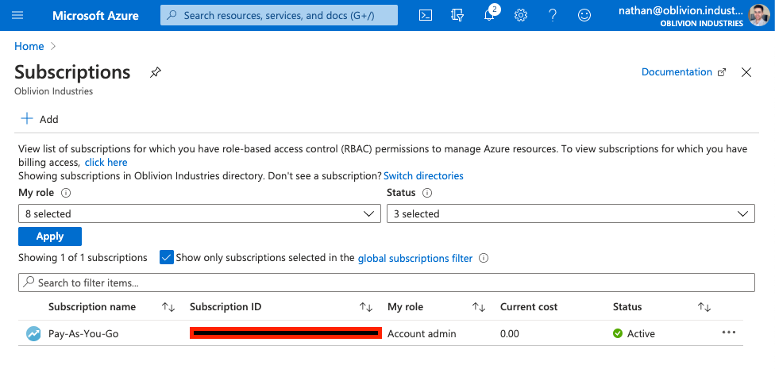
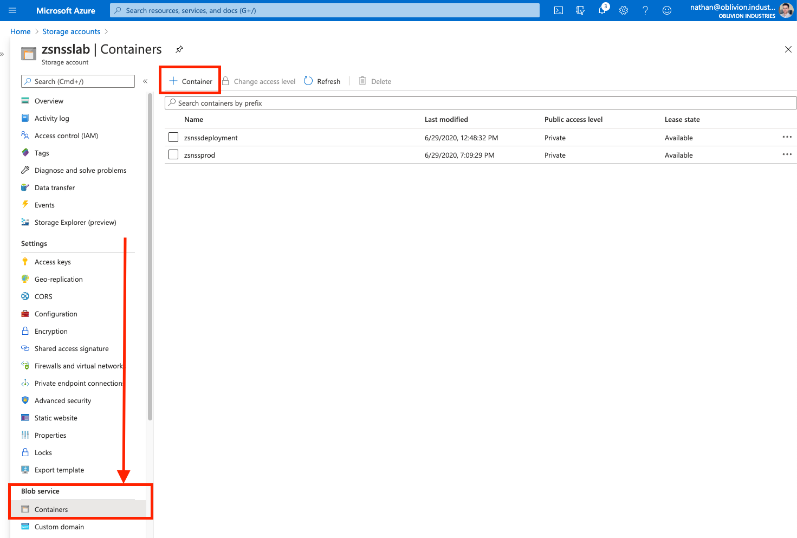
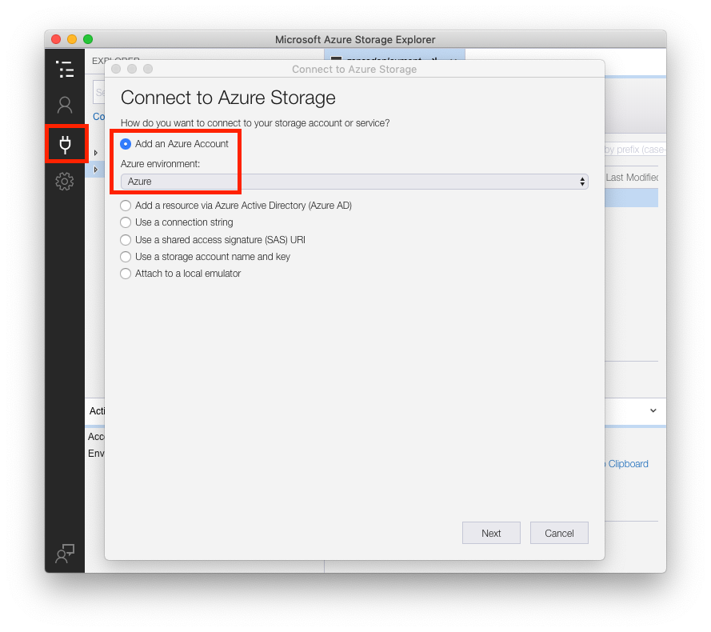
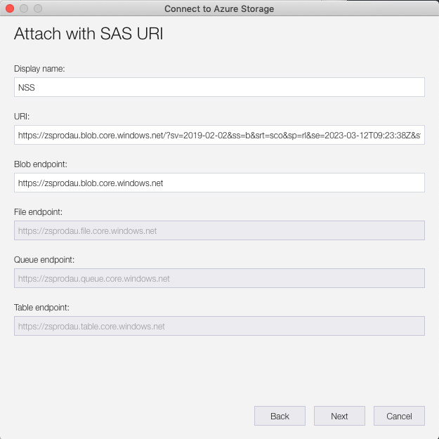
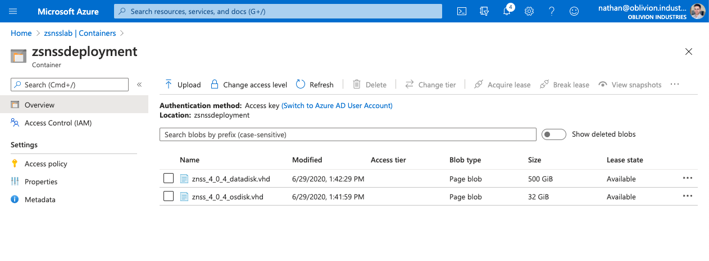
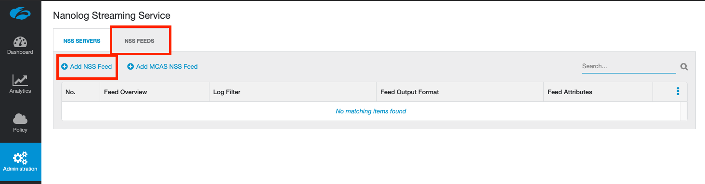

This guide will cover deployment of a Nanolog Streaming Service (NSS) VM within Azure. NSS can also be deployed on-premise using an OVA file, or in AWS.

If you're planning to integrate with Microsoft Cloud App Security (MCAS) or Azure Sentinel, you'll require a healthy NSS deployment, and it is highly recommended that you use Azure.

> Why do I need to deploy a VM to stream logs to a SIEM? Can't Zscaler just send logs to my SIEM directly?

Your logs are stored in Zscaler's Nanolog clusters in a highly compressed and encoded format. The NSS VM connects to both the Nanolog cluster and the Zscaler control plane, grabs the logs, decodes them, and forwards them to your SIEM over a TCP connection. Think of NSS as a log gateway!

# Before you begin

## Be aware of potential charges

You can't follow this guide without an Azure subscription. If you're deploying in as part of demo or lab environment, be careful: This guide WILL rack up some charges for VM and storage resources in Azure.

If you're using the Azure Free Account, you should have US$200 of credit to use as part of your free subscription and may be able to avoid charges.

Proceed at your own risk.

## You'll need a subscription to the NSS feature
Not all Zscaler subscriptions allow you to use NSS. In the ZIA Portal, navigate the **Administration** tab. If you don't see **Nanolog Streaming Service** listed as an option, then you are most likely not subscribed to the NSS feature and will need to chat to your account team.

---


# Part 1 - Create an NSS Virtual Appliance
1. Log into the ZIA admin portal and navigate to **Administration > Nanolog Streaming Service**.
2. Select **Add NSS Server**
3. Give the server a name, select **NSS for Web** (or firewall, depending on your use case), set it to **Enabled**, then click **Save**. Activate your changes.


## NSS VM System Requirements

### CPU
2 vCPUs (one for the control plane, one for the data plane)

### Memory
Depending upon whether this is a lab/demo or production deployment, memory requirements (and hence, the Azure instance type you deploy on) will be different. A production deployment depends on the number of users ZIA is/will be deployed to:

| Scenario       | Memory Required |
|----------------|-----------------|
| Lab/Demo       | 4GB             |
| <15,000 users  | 8GB             |
| <40,000 users  | 16GB            |
| <100,000 users | 32GB            |

Note: If you are planning on integrating with **Microsoft Cloud App Security (MCAS)**, you MUST deploy with at least 8GB of memory. Using 4GB for a Lab/Demo environment will not work.


---


# Part 2 - Resource Creation
You'll need the following information handy to deploy NSS in Azure:
* Azure subscription (this **can** be the free tier - you'll have access to US$200 credit with it which will help)
* Resource Group
* Virtual Network
* Storage Account with two containers/blobs

If you have some or all of these already, you can skip forward as needed.


## 1. Create an Azure Subscription
You need an Azure Subscription (even if it is part of the free tier) to continue. In the Azure Portal search bar (at the top of the page), search for "**Subscriptions**" and validate you have a valid subscription.



Ensure you have an existing subscription present, you click **Add** to create one if you need to.

**Warning!** You have the potential to rack up large charges if you aren't careful! Proceed at your own risk!


## 2. Create a Resource Group

A Resource Group houses related resources and services for something deployed in Azure.

If you don't have a usable Resource Group already, you'll need to create one. In the Azure Portal search bar (at the top of the page), search for "**Resource Groups**".


Click **Add** to create a new one. Associate it with your subscription, give it a name, and select your closest Azure region. 

In the screenshot above, the Resource Group I'll be using is called `AzureLab`, which is linked to the `Pay-As-You-Go` subscription in the `Australia East` region.


## 3. Create a Virtual Network

You'll need (ideally) two Virtual Network (vNet) subnets to deploy NSS. In the Azure Portal search bar (at the top of the page), search for "**Virtual networks**".

Click **Add** to create a new vNet (or select an existing one). If you're creating a new one:

* Under the **Basics** tab, associate the new vNet with your subscription and resource group from above. Give it a name and ensure it's created in the same region.
* Under the **IP Addresses** tab, the default 10.X.X.X/16 IPv4 address space should be fine. This will give you 65536 usable addresses in the entire vNet which is more than enough!
* There should already be a `default` subnet - a /24 range which will be a subset of the /16 address space above. Leave this as it is and create a new /24 subnet. One of these will be for the management interface of the NSS VM, the other for the service interface.
  * When creating a new subnet, NAT Gateway, Security Group, Route table, and Services can all be left as None or their default values for now.
* Under the **Security** tab, leave DDoS protection and Firewall **Disabled**.
* When you are finished, click **Review + create**.


In the image below, I have an vNet called `vNetLab` which has a global 10.0.0.0/16 address space; with two subnets:

* `default` = 10.0.0.0/24
* `mgmt` = 10.0.1.0/24


## 4. Create a Storage Account

The Storage Account will house the VHD files for our NSS VM. In the Azure Portal search bar (at the top of the page), search for "**Storage accounts**".

Click **Add** to create a new Storage Account.

Associate the Storage Account with your existing subscription and Resource Group. Provide it with a **globally unique name**. Ensure the location is the same as the one associated with your Resource Group.

For the cheapest option for a lab deployment, select the following:

* Performance = **Standard**
* Account kind = **StorageV2 (general purpose v2)**
* Replication = **Locally-redundant storage (LRS)**
* Access tier = **Hot**


Under the **Networking** tab, for a lab/demo deployment select **Public endpoint (all networks)**: This will ensure you can immediately connect to the storage account. For a more secure deployment (ie: production), you might want to select either of the other two options.

Under the **Data Protection** tab, for a lab deployment, everything should be set to **Disabled**.

Under the **Advanced** tab, for a lab deployment, set everything as **Disabled**.

Click **Review + create** when you are done.


## 5. Create two Blob Containers

Open the Storage Account you just created, and in the left-side-menu, select **Containers**. Create two containers here: one will be used to copy the VHD files from Zscaler's storage account, and the other will be used to deploy the NSS VM itself.




---

# Part 3 - Copy the OS and Data VHD images

These are 32GB and 500GB respectively. Zscaler makes these available on their Storage Account which you can use to copy them across to your own to avoid transfer charges (not to mention the time of downloading & re-uploading that amount of data).

In this section, we will copy the two VHD images to the Storage Account and blob containers we created earlier, and then use these to initialize the NSS VM.


## 1. Download Azure Storage Explorer
You can also do this [via PowerShell](https://help.zscaler.com/zia/nss-deployment-guide-microsoft-azure#step_4_PS), but that is outside the scope of this guide.

Download link (all platforms): [https://azure.microsoft.com/en-us/features/storage-explorer/](https://azure.microsoft.com/en-us/features/storage-explorer/)


## 2. Sign in to your Azure Account

Open Azure Storage Explorer, click the "plug" icon in the sidebar, then select **Add an Azure Account**. Click **Next** and you will be redirected to sign in to Azure via Microsoft SSO. Sign in using your Azure admin credentials.



Once you have logged in, you should see your Azure subscription in the side panel.


## 3. Connect to the Zscaler Storage Account

Next, we need to connect to the Zscaler Storage Account to access the NSS VHDs.

Click the plug icon again in the sidebar (as you did above), but this time select **Use a shared access signature (SAS) URI**.

> **Stop!** You will need a SAS URI token from Zscaler to proceed!

You need a SAS token to authenticate with the Zscaler Storage Account. To obtain one:

* If you are a Zscaler employee, [click here](https://community.zscaler.com/t/tokens-for-nss-on-azure-vhd/3255) to visit the Community forum and obtain a token directly.
* Otherwise, you will need to raise a support ticket requesting a SAS token for NSS deployment in Azure.

Once you have your SAS token, you can fill in the fields in Azure Storage Explorer as prompted:

* Display name = ZscalerNSS
* URI = This is region dependant (see the table below), and MUST contain the SAS token as a URL argument.

| Region    | URI                                                |
| --------- | -------------------------------------------------- |
| USA       | https://zsprod.blob.core.windows.net/?[SAStoken]   |
| Europe    | https://zsprodeu.blob.core.windows.net/?[SAStoken] |
| Australia | https://zsprodau.blob.core.windows.net/?[SAStoken] |

For example, for deploying in Australia, my full URI would look like:

```
https://zsprodau.blob.core.windows.net/?sv=2019-02-02&ss=b&srt=sco&sp=rl&se=2023-03-12T09:14:30Z&st=2020-03-12T00:14:30Z&spr=https&sig=XXXXXXXXXXXXXXXXXXXXXXXXX
```

Pay close attention to the format above as it is important. If you have an issue with Azure Storage Explorer not accepting the URI, check the formatting. **Do not use any of the URLs provided to you ending in** `.vhd`.




Click **Next** when done, followed by **Connect**.


## 4. Error: Unable to get local issuer certificate


If you receive this error, it is most likely because your connection is being SSL inspected, and Azure Storage Explorer does not like this. You will need to add an SSL inspection bypass for `.blob.core.windows.net` to resolve the issue.

For ZIA, navigate to **Policy > SSL Inspection** in the ZIA admin portal. Add `.blob.core.windows.net` to the list of URLs to bypass from SSL Inspection. Save and activate your changes.

Wait a moment, then **right-click on the storage account and click Refresh**. If you just try and load the storage account again, you'll continuously get the same error as it is cached.


The error should be resolved.


## 5. Copy the VHD files

In the side panel of Azure Storage Explorer, expand the **Zscaler NSS Storage (SAS)** storage account, and select the **nss** blob container.


Select both of the VHD images listed and click **Copy**.

Next, under the Azure subscription you connected to earlier, expand the storage account you created earlier and select the blob container you created to store a copy of the VHD files. Click **Paste** and the files will begin to transfer. This is a 532GB file transfer so it may take a minute or two.


Note: You're now consuming storage on Azure and there is a charge associated with this. Every region is different, but using the settings I selected above, my cost was estimated to be approx US$11 per month for a single blob container. This is just for storage. Using a 2nd blob container for the VM itself PLUS VM charges will get expensive quickly; particularly for a home lab deployment. You may wish to reconsider running this in a lab environment long-term.


## 6. Verify the Transfer & Copy URLs

In the Azure Portal, go to your storage account and look at the blob container you transferred the VHD files to. You'll see them listed there.



Click on each file and copy the URL listed - we'll need these later to deploy the NSS VM.


---

# Part 4 - Deploy the NSS VM

We need to use PowerShell to deploy the NSS VM via a script.

* If you're on a Windows device, you should have PowerShell already installed.
* If you are on Mac OS, you'll need to install PowerShell via Homebrew.


## 1. Install PowerShell on Mac OS

1. [Install Homebrew](https://brew.sh/) if you haven't already. Open Terminal:

```shell
/bin/bash -c "$(curl -fsSL https://raw.githubusercontent.com/Homebrew/install/master/install.sh)"
```

2. Install PowerShell:

```shell
brew cask install powershell
```

3. Invoke PowerShell:

```
pwsh
```

4. You should now be on the PowerShell prompt:

```
$ pwsh

PowerShell 7.0.2
Copyright (c) Microsoft Corporation. All rights reserved.

https://aka.ms/powershell
Type 'help' to get help.

PS /Users/nathan>
```


## 2. Install & Import the Azure Modules

These modules let us perform tasks on Azure via PowerShell:

```
PS /Users/nathan> Install-Module Az
PS /Users/nathan> Import-Module Az 
```


## 3. Connect to your Azure account

You'll need to sign-in and authenticate using your Azure admin credentials:

```
PS /Users/nathan> Connect-AzAccount

WARNING: To sign in, use a web browser to open the page https://microsoft.com/devicelogin and enter the code XXXXXXXXX to authenticate.
```

Go to [https://microsoft.com/devicelogin](https://microsoft.com/devicelogin) and enter the code provided.

Return to PowerShell and press Enter/Return. After a few moments your subscriptions will appear.


## 4. List all VM sizes for your Azure region

We need to grab the name of the Azure instance type we'll be deploying the NSS VM on.

You can use the [Azure Pricing Calculator](https://azure.microsoft.com/en-us/pricing/calculator/?service=virtual-machines) to determine which instance type is best (and how much it will cost you). Be sure to select your region for accurate availability and pricing. Not every instance type is available in every region.

You'll need an instance with 2 vCPUs and either:

* 4GB memory (lab deployment)
* 8GB memory (MCAS or typical production deployment)
* 16GB memory (15K-40K users - large enterprise)
* 32GB memory (40K-100K users - huge enterprise)

If you're not sure, just find something with 8GB of memory + 2 vCPUs.

Next, list all of the VM sizes for your selected region in PowerShell:

```
PS /Users/nathan> Get-AzVmSize -Location "Australia East"

Name                   NumberOfCores MemoryInMB
----                   ------------- ----------
Standard_B1ls                      1        512
Standard_B1ms                      1       2048
Standard_B1s                       1       1024
Standard_B2ms                      2       8192
Standard_B2s                       2       4096
Standard_B4ms                      4      16384
Standard_B8ms                      8      32768
Standard_B12ms                    12      49152
Standard_B16ms                    16      65536
Standard_B20ms                    20      81920
Standard_D1_v2                     1       3584
Standard_D2_v2                     2       7168
Standard_D3_v2                     4      14336
Standard_D4_v2                     8      28672 
[..snip..]
```

NB: The table above has been trimmed to fit.

Locate your desired instance, and copy down the name as it's printed in the terminal window. We'll need this for our PowerShell script which will deploy the NSS VM.

In my case, I'll be using `Standard_A4_v2` which has 2 vCPUs and 8GB memory.

**Be very careful! VM instances become expensive over a whole month!** If left on for 30 days, the `Standard_A4_v2` instance type would cost be  **~US$153!** Proceed at your own risk!


## 5. Enable Compatibility Mode for AzureRM

The current Zscaler deployment script uses the old AzureRM modules which have been depreciated. We need to enable compatibility for them:

```
PS /Users/nathan> Enable-AzureRmAlias -Scope CurrentUser
```


If you get an error similar to:

```
Enable-AzureRmAlias: Could not find a part of the path '/Users/nathan/.config/powershell/profile.ps1'
```

You'll need to create the `powershell` directly under `/Users/<YourUsername>/.config/`:

```
PS /Users/nathan> cd ~/.config
PS /Users/nathan/.config> mkdir powershell
```


## 6. (Windows) Enable Unsigned Scripts

Allow powershell to run unsigned scripts (not needed/supported on macOS):

```
PS /Users/nathan> Set-ExecutionPolicy -Scope Process -ExecutionPolicy Bypass
```


## 7. Create the Deployment Config File

Copy the following into a file called `conf_file.txt` and replace with your data:

```
name=AzureNSS
location=australiaeast
rgname=AzureLab
createrg=n
storename=zsnsslab
createstorage=n
vnetrg=AzureLab
vnetname=vNetLab
vnetprefix=10.0.0.0/16
mgmtsubnetname=mgmt
mgmtsubnetprefix=10.0.1.0/24
svcsubnetname=default
svcsubnetprefix=10.0.0.0/24
niccount=2
mgmtdyn=n
vmsize=Standard_A4_v2
dstStorageURI=https://zsnsslab.blob.core.windows.net
dstContainer=zsnssproduction
srcOsURI=https://zsnsslab.blob.core.windows.net/zsnssdeployment/znss_4_0_4_osdisk.vhd
srcDataURI=https://zsnsslab.blob.core.windows.net/zsnssdeployment/znss_4_0_4_datadisk.vhd
```


A description of each of these fields is below:

| Field              | Description                                                  |
| ------------------ | ------------------------------------------------------------ |
| `name`             | The name to be assigned to the NSS VM when deployed          |
| `location`         | The Azure region to deploy the VM to. This should be in lowercase with no spaces. |
| `rgname`           | The name of the Resource Group to be used for VM deployment. |
| `createrg`         | `y` or `n` depending if you want the above RG to be created or not. Set it to `n` as it should exist already. |
| `storename`        | The name of the Storage Account to use.                      |
| `createstorage`    | `y` or `n` depending if you want the above RG to be created or not. Set it to `n` as it should exist already. |
| `vnetrg`           | The resource group that the vNet for the VM exists in. Will probably be the same as `rgname` above. |
| `vnetname`         | The Azure vNet to which the VM should be attached.           |
| `vnetprefix`       | The IPv4 address space assigned to the vNet in CIDR form. This will probably be the 10.X.X.X/16 range. |
| `mgmtsubnetname`   | The name of the subnet you created within the vNet for the NSS management interface. |
| `mgmtsubnetprefix` | The subnet address prefix (in CIDR) of the subnet you created within the vNet for the NSS management interface. Could be 10.X.Y.X/24. |
| `svcsubnetname`    | The name of the subnet you created within the vNet for the NSS service interface. |
| `svcsubnetprefix`  | The subnet address prefix (in CIDR) of the subnet you created within the vNet for the NSS service interface. Could be 10.X.Z.X/24. |
| `niccount`         | The number of NICs to assign to the VM. This should be set to `2` for NSS. |
| `mgmtdyn`          | Set this to `n`                                              |
| `vmsize`           | The name of the Instance type/size to deploy the VM to (obtained above). Eg: Standard_A4_v2 |
| `dstStorageURI`    | The URI for your storage account. Remove the trailing `/`. This is typically in the format https://<name>.blob.core.windows.net |
| `dstContainer`     | Name of the destination blob container within your storage account to create the VM disks. You would have created this in Part 2, Step 4. |
| `srcOsURI`         | The URI of the OS Disk .vhd file from your storage account that you copied in Part 3, Step 6. |
| `srcDataURI`       | The URI of the Data Disk .vhd file from your storage account that you copied in Part 3, Step 6. |


## 8. Download the Deployment Script

Download the NSS deployment script here:

[https://help.zscaler.com/downloads/zia/documentation-knowledgebase/analytics/nss/nss-deployment-guides/nss-deployment-guide-microsoft-azure/deployment_script[1].ps1](https://help.zscaler.com/downloads/zia/documentation-knowledgebase/analytics/nss/nss-deployment-guides/nss-deployment-guide-microsoft-azure/deployment_script[1].ps1)

Save the file as `deployment_script.ps1` in the same folder as the `conf_file.txt` configuration file.


## 9. Run the Deployment Script

From the PowerShell prompt, run the deployment script. You may be prompted to sign in again:

```
PS /Users/nathan> .\deployment_script.ps1 conf_file.txt
```


When prompted, select the subscription to use, and (optionally) whether or not to use Public IP addresses for the two NICs. If this is a lab environment and you want to immediately be able to SSH to the NSS VM after deployment, you might want to select `y` for this part.


## 10. Verify the VM has been deployed

Check whether the NSS VM has been deployed in the Azure Portal. In the search bar at the top of the portal, search for "**Virtual Machines**". Validate that your new NSS VM is present and running.


## 11. (Optional) Update Security Groups

If you chose to assign public IP addresses to your NSS VM during deployment, you may wish to lock this down with some rules to prevent anyone from being able to hit your VM.

As a start, you should only allow outbound connections to Zscaler's required IP ranges. You can find these at the following URLs (depending on your Zscaler cloud):

* https://ips.zscaler.net/nss
* https://ips.zscalerone.net/nss
* https://ips.zscalertwo.net/nss
* https://ips.zscalerthree.net/nss
* https://ips.zscloud.net/nss

You may also want to restrict inbound connectors to those on port 22 from your source IP only.

Apart from SSH management, NSS only requires connections to both the Zscaler Cloud and your SIEM/destination in the outbound direction. Not inbound connectivity is mandatory.

To create a security group, search for "**Network security groups**" in the Azure Portal. Click **Add** to create a new one.

You'll need to then edit the security group, and apply it to the respective network interfaces created under the vNet in use by the VM.

For more information, [see the Microsoft documentation, here](https://docs.microsoft.com/en-us/azure/virtual-network/manage-network-security-group).

---

# Part 5 - Configure the NSS VM

Now that the NSS VM has been deployed, we need to configure it and associate it with our ZIA instance.


## 1. Connect to the VM

First, locate the IP address in use for the management interface. Under **Virtual Machines** in the Azure Portal, select the NSS VM, and on the **Overview** page, note either the Public or Private IP address assigned (under the Networking heading).


## 2. Review the initial NSS config

Review the NSS initial config to check whether the service interface has been configured correctly:

```
[zsroot@NSS ~]$ sudo nss dump-config

Detected an Azure VM!!
Configured Values:
	CloudName:Failed to read SSL Certificate
	nameserver:168.63.129.16	
	smnet_dev:
	Default gateway for Service IP:
	Routes for Siem N/w:
```


If the `smnet_dev` and `Default gateway for Service IP` fields are blank, check the Networking menu of the NSS VM you deployed in Azure:


Note down the private IP of the 2nd network interface `<VMname>_nic_1`, then run the `nss configure` command to set the service interface IPs:

```
[zsroot@NSS ~]$ sudo nss configure

Detected an Azure VM!!
nameserver:168.63.129.16 (Options <c:change, d:delete, n:no change>) [n]n
Do you wish to add a new nameserver? <n:no y:yes> [n]: n
smnet_dev (Service interface IP address with netmask) []: 10.0.0.4/24
smnet_dflt_gw (Service interface default gateway IP address) []: 10.0.0.1
Successfully Applied Changes
```


When prompted, enter the IP address in CIDR format for the service interface (see above for formatting), and the IP address of the gateway for the service interface (if you use a /24 subnet, this will be the .1 IP address)


## 3. Download the SSL Certificate Package

Download the SSL Certificate package for your NSS VM from the ZIA portal under **Administration > Nanolog Streaming Service**.


WARNING: This package is different for each NSS VM you have listed. Sharing the same certificate between NSS deployments will cause connection flapping.

Copy this package to the NSS VM:

```
scp NssCertificate.zip zsroot@<ip>:
```

Install the certificate package on the NSS VM:

```
[zsroot@NSS ~]$ sudo nss install-cert NssCertificate.zip
```

Check the configuration:

```
[zsroot@NSS ~]$ sudo nss dump-config
Detected an Azure VM!!
Configured Values:
	CloudName:zscaler.net
	nameserver:168.63.129.16	
	smnet_dev:10.0.0.4/24	
	Default gateway for Service IP:10.0.0.1	
	Routes for Siem N/w:
```

If the SSL package was installed correctly, you will see your cloud name referenced in the configuration (eg: zscaler.net).

## 4. Update the NSS Service

The NSS service on the fresh VM is probably out-of-date. To update it, run the `nss update-now` command:

```
[zsroot@NSS ~]$ sudo nss update-now
```

Updating may take some time...

You can check the current version with `nss checkversion`:

```
[zsroot@NSS ~]$ sudo nss checkversion
```


## 5. Start the NSS Service

To start the NSS service, run `nss start`:

```
[zsroot@NSS ~]$ sudo nss start
```

This will NOT start NSS on boot by default. You should enable autostart:

```
[zsroot@NSS ~]$ sudo nss enable-autostart
```


## 6. Verify Connectivity

To check active connections from NSS, run the following command:

```
[zsroot@NSS ~]$ sudo nss troubleshoot netstat | grep tcp
```

NSS only requires outbound connectivity to the Zscaler Cloud and your SIEM/destination. No inbound connectivity is necessary (unless you've enabled SSH).

A healthy NSS instance will have two TCP connections in the `ESTABLISHED` state:

```
[zsroot@NSS ~]$ sudo nss troubleshoot netstat | grep tcp
//+SHARED MEMORY KEY 17 (/sc/)
tcp          0(  0%)       69(  0%) 10.0.0.4.2942          104.129.193.102.443   ESTABLISHED
tcp          0(  0%)        0(  0%) 10.0.0.4.2110          104.129.193.102.443   TIME_WAIT
```

If you only see one connection, wait a few minutes and check again. If neither connection is in the `ESTABLISHED` state, or you are still missing a connection, check your firewall and ensure you have reachability to the Zscaler infrastructure. You can check the network requirements for NSS using the links below (select the link corresponding to the Zscaler cloud you have been provisioned on):

* [https://ips.zscaler.net/nss](https://ips.zscaler.net/nss)
* [https://ips.zscalerone.net/nss](https://ips.zscalerone.net/nss)
* [https://ips.zscalertwo.net/nss](https://ips.zscalertwo.net/nss)
* [https://ips.zscalerthree.net/nss](https://ips.zscalerthree.net/nss)
* [https://ips.zscloud.net/nss](https://ips.zscloud.net/nss)


Return to the ZIA portal, and under **Administration > Nanolog Streaming Service**, the NSS instance you just deployed *should* now read as **Healthy**:


---

# Part 6 - Add NSS Feeds to Stream Data

NSS Feeds configured in the ZIA portal explicitly tell your NSS VM instance what data to stream, where to stream it, and in what format it is required.

Each NSS VM can be configured with up to 8 data feeds.

## 1. Configure an NSS Feed

To configure an NSS Feed, go to Administration > Nanolog Streaming Service, then select the **NSS Feeds** tab. Click **Add NSS Feed**.



Fill in the following data when prompted:

| Field                 | Description                                                  |
| --------------------- | ------------------------------------------------------------ |
| Name                  | The name of the NSS Feed                                     |
| NSS Server            | Which NSS VM is responsible for streaming this feed.         |
| SIEM Destination Type | Select whether to use an IP or FQDN (domain) to specify the destination SIEM you would like to stream data to. |
| SIEM TCP Port         | The destination TCP port the SIEM expects to receive data on. |
| Log Type              | Typically you will want to select Web, but alerts can be streamed in RFC compliant Syslog as well. |
| Feed Output Type      | The format (as shown in the window) that the logs will be streamed to the SIEM in (see the note below) |
| Filters               | By default, the NSS feed will stream EVERYTHING. You can filter down the data stream to only specific data that you care about using the tabs at the bottom of the configuration window. |


Click **Save** when you are done and activate your changes.

Note that Zscaler has formal [partnerships](https://www.zscaler.com/partners/technology/siem-analytics) with several SIEM vendors, and in many cases has co-written deployment guides for them. If you don't see your SIEM listed in the Feed Output Type, check to see if they don't already have an article on Zscaler integration. Failing that, odds are they can probably ingest one of the existing formats; like QRadar LEEF, or Arcsight CEF.

Zscaler documentation covers how to configure feeds for a variety of features:

* [Adding an NSS Feed for Alerts](https://help.zscaler.com/zia/adding-nss-feeds-alerts)
* [Adding NSS Feeds for DNS Logs](https://help.zscaler.com/zia/adding-nss-feeds-dns-logs)
* [Adding NSS Feeds for Firewall Logs](https://help.zscaler.com/zia/adding-nss-feeds-firewall-logs)
* [Adding NSS Feeds for Tunnel Logs](https://help.zscaler.com/zia/adding-nss-feeds-tunnel-logs)
* [Adding NSS Feeds for Web Logs](https://help.zscaler.com/zia/adding-nss-feeds-web-logs)


## 2. Configuring MCAS

If you're looking to integrate with Microsoft Cloud App Security (MCAS), [I've written a detailed guide here](/posts/integrate-zia-and-mcas).

---

# Finish

You should now have a healthy NSS deployment in Azure.

If you deployed this for lab or demo purposes, **make sure you don't forget about the running NSS VM!** Ensure you stop and de-allocate resources after you're done so you don't continue to be charged.