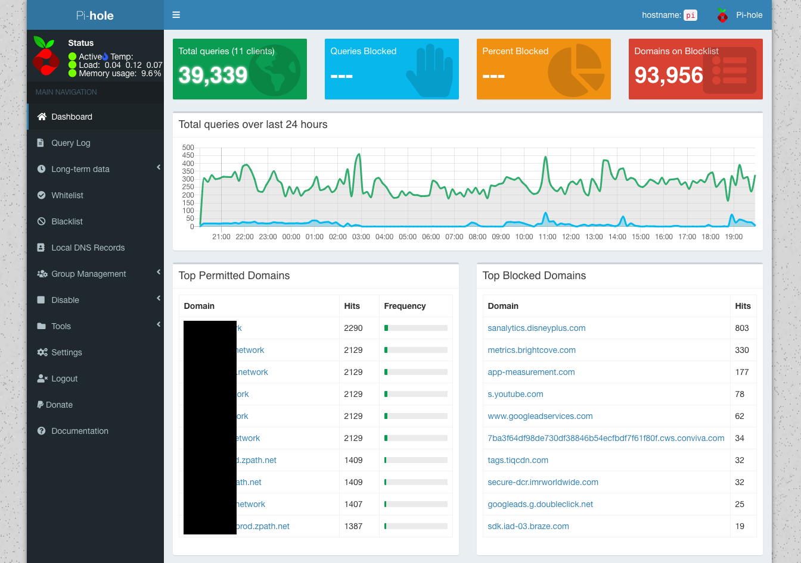

Block ads, trackers, and malware from any local device without having to use an ad-blocker; while securing your DNS traffic at the same time - sounds good!

First, what is Pi-Hole? According to [Jacob Salmela, the creator of Pi-Hole](https://www.raspberrypi.org/blog/pi-hole-raspberry-pi/):

> Pi-hole is a network-wide ad blocker. Instead of installing adblockers on every device and every browser, you can install Pi-hole once on your network, and it will protect all of your devices. Because it works differently than a browser-based ad-blocker, Pi-hole also blocks ads in non-traditional places, such as in games and on smart TVs.

That sounds pretty great!

This guide will cover the following deployment onto a Raspberry Pi (although any Linux-based device/OS can be used):

* Pi-Hole will be installed and used as DNS for all home devices to block ads, trackers, and malware domains.
* DNS over HTTPs (using Cloudflare) will be configured to secure our upstream DNS requests.

Let's get started!

---

# Configure Cloudflare DNS over HTTPS (DoH)

While Pi-Hole will be used as our local DNS server, it will need to query an upstream DNS provider (like Google, or Cloudflare) itself to return a result (provided the query has not already been cached by Pi-Hole). Typically you would set the upstream DNS provider in Pi-Hole to 1.1.1.1 (Cloudflare) or 8.8.8.8 (Google), however these requests are not secured in transit.

We're going to use DNS over HTTPS (DoH) to secure our DNS requests to Cloudflare across our ISP's network to provide us with more privacy.


## What is DoH and why should I bother?
### The problem with DNS and ISPs
DNS was not designed with security in mind. Queries are sent in plaintext across your ISP's network and are not encrypted or authenticated by default. This is true even if the site you are visiting uses HTTPS: the DNS query to resolve the domain is still sent unencrypted.

Why is this an issue? The same reason why you shouldn't do sensitive things like banking or online shopping on an insecure website: your data can be intercepted, read, and logged at any point in transit. For example, when you visited this webpage on my domain, nathancatania.com, anyone capturing network traffic would see your DNS query to resolve my domain and know that you were attempting to visit it. You can try this yourself, if you are so inclined, with Wireshark.

Many ISPs around the world will log your data, and in many cases are legally required to do so by local governments. Your DNS requests can paint a picture of your internet usage just like your browser history can, and having this logged at any point along can raise significant privacy concerns.

Unsecured DNS also raises the concern of Man-In-The-Middle attacks, where your DNS request could be intercepted and changed without your knowledge or consent. Instead of your requested domain resolving to 1.2.3.4, it might be changed to resolve to 5.6.7.8 instead - which could be a malicious domain or a copy of the original domain designed for phishing. 
DNSSEC is a mechanism to help prevent this by authenticating that a DNS record has not been altered in transit. However, [according to Cloudflare](https://developers.cloudflare.com/1.1.1.1/dns-over-https/), only a single-digit percentage of domains use DNSSEC today. Additionally, DNSSEC does not provide confidentiality and will not prevent entities from snooping on your DNS requests.

### What is DNS over HTTPS (DoH)?
DNS over HTTPS (DoH) is a method of securing your DNS requests, by sending the request to an HTTPS endpoint. This means that your DNS request appears as normal HTTPS (encrypted) web traffic instead of an actual DNS packet. All your ISP sees is secure HTTPS traffic coming from your network: no more DNS traffic that can be snooped on.

### The (subjective) issue with DoH
It is worth noting that DoH itself presents some privacy issues as well: There are only a handful of DNS providers that support DoH (Cloudflare, Google, etc) and by using DoH, you would be trusting your DNS traffic to one of these larger centralized entities (although the same would be true if you just set 1.1.1.1 or 8.8.8.8 as your DNS provider anyway): How do you know that these companies are safely and responsibly handling your data? You don't.

There is also the argument that using DoH centralizes DNS to a few larger providers, giving them too much power over the internet as a whole. DNS was designed to be highly distributed across the internet, and the concept of DoH goes against that principle.

### What should I do?
This boils down to: Who do you trust more? Your ISP, a company like Cloudflare or Google, or no-one but yourself?

* If you answered "My ISP", then DoH probably isn't for you and you can keep on doing what you've been doing for DNS up until now. You might consider using DoH if your ISP's DNS service offers it.
* If you answered "Cloudflare, Google, etc", then DoH is for you.
* If you answered "No-one but myself", then a solution like [Unbound](https://nlnetlabs.nl/projects/unbound/about/) (a recursive and caching DNS resolver) is probably a better solution for you. I don't cover Unbound in this post, but may in the future.
* If all you care about is the "bad guys" not being able to see your data, then DoH is also for you.


In this post, we'll be using Cloudflare DoH.


## Trying out Cloudflare DoH

DNS requests occur via an HTTPS endpoint. We can test this using cURL and JSON.

IPv4 (A record) request for `example.com`:

```shell
curl -H 'accept: application/dns-json' 'https://cloudflare-dns.com/dns-query?name=example.com&type=A'
```

Response for `example.com`:

```json
{
  "Status": 0,
  "TC": false,
  "RD": true,
  "RA": true,
  "AD": true,
  "CD": false,
  "Question": [
    {
      "name": "example.com.",
      "type": 1
    }
  ],
  "Answer": [
    {
      "name": "example.com.",
      "type": 1,
      "TTL": 1409,
      "data": "93.184.216.34"
    }
  ]
}
```

IPv6 (AAAA record) request for `example.com`:

```bash
curl -H 'accept: application/dns-json' 'https://cloudflare-dns.com/dns-query?name=example.com&type=AAAA'
```

Response for `example.com`:

```json
{
  "Status": 0,
  "TC": false,
  "RD": true,
  "RA": true,
  "AD": true,
  "CD": false,
  "Question": [
    {
      "name": "example.com.",
      "type": 28
    }
  ],
  "Answer": [
    {
      "name": "example.com.",
      "type": 28,
      "TTL": 10226,
      "data": "2606:2800:220:1:248:1893:25c8:1946"
    }
  ]
}
```


## Configuring Cloudflare DoH on a Raspberry Pi

The source for much of this was the [official Pi-Hole documentation on DoH](https://docs.pi-hole.net/guides/dns-over-https/).

The method detailed here should work for non-Raspberry Pi systems, but you may need to switch out the ARM binary.


### Install the cloudflared daemon

We're going to use `cloudflared` (or an 'Argo Tunnel' as Cloudflare call it) as our DoH proxy. This will listen for DNS queries on port 5353 (or any custom port you specify), and proxy the requests received to the Cloudflare DoH endpoint. The response received from Cloudflare is then returned via the proxy back to the host that sent the original DNS query.

Why port 5353 and not 53? You can specify any port that isn't in use, apart from port 53. 53 is the standard port for DNS, and Pi-Hole will already be using this port to listen for DNS queries from our local hosts/devices.

1. Create a new *service account* to run the `cloudflared` daemon:

```bash
sudo useradd -s /usr/sbin/nologin -r -M cloudflared
```

2. Download the binary tgz for `ARMv6` devices. The download link can be verified [here](https://developers.cloudflare.com/argo-tunnel/downloads/). If you're *not* using an RPi, then pick a non-ARM binary.

```bash
wget https://bin.equinox.io/c/VdrWdbjqyF/cloudflared-stable-linux-arm.tgz
```

3. Unpack the binary, and copy it to the `/usr/local/bin` directory, and make it executable:

```bash
tar -xzvf cloudflared-stable-linux-arm.tgz
sudo cp ./cloudflared /usr/local/bin
sudo chmod +x /usr/local/bin/cloudflared
```

4. Change permissions so the `cloudflared` service account can access it:

```shell
sudo chown cloudflared:cloudflared /usr/local/bin/cloudflared
```

5. Check the binary is working. This should show the version:

```bash
cloudflared -v
> cloudflared version 2019.9.0 (built 2019-09-06-0334 UTC)
```

If you get a segmentation fault, you may need to compile from [source](https://github.com/cloudflare/cloudflared) as per the issue reported [here](https://github.com/cloudflare/cloudflared/issues/38).


### Create the Configuration File

We need to create a configuration file for cloudflared  at `/etc/default/cloudflared` which specifies:

1. The local port to listen on for DNS requests. These will be proxied upstream to Cloudflare using DoH. As per the Pi-Hole documentation, I used `5053` (although this could be any valid port).
2. The upstream HTTPS endpoint(s). We'll use `https://1.1.1.1/dns-query` and `https://1.0.0.1/dns-query`.

The options specified in this file will be passed to the `cloudflared` daemon.

Create the configuration file (CTRL+X to save and quit):

```bash
sudo nano /etc/default/cloudflared
```

Add the following:

```shell
# Commandline args for cloudflared
CLOUDFLARED_OPTS=--port 5053 --upstream https://1.1.1.1/dns-query --upstream https://1.0.0.1/dns-query
```

Change the port as required. This will listen for DNS requests on port 5053 (DNS is normally port 53) and will proxy it to either of the 1.1.1.1 or 1.0.0.1 HTTPS endpoints.

Change the permissions for the configuration file so the `cloudflared` service account can access it:

```shell
sudo chown cloudflared:cloudflared /etc/default/cloudflared
```


### Run at Startup

The above is all well and good, but it requires the `cloudflared` daemon to be started manually after each restart and/or error.

Courtesy of Pi-Hole, we can use the below to create a `systemd` service that will automatically run on boot and restart on any error.

Create the service file:

```shell
sudo nano /lib/systemd/system/cloudflared.service
```

Add the following:

```shell
[Unit]
Description=cloudflared DNS over HTTPS proxy
After=syslog.target network-online.target

[Service]
Type=simple
User=cloudflared
EnvironmentFile=/etc/default/cloudflared
ExecStart=/usr/local/bin/cloudflared proxy-dns $CLOUDFLARED_OPTS
Restart=on-failure
RestartSec=10
KillMode=process

[Install]
WantedBy=multi-user.target
```

Load the service, set it to run at startup, and start the service:

```shell
sudo systemctl daemon-reload
sudo systemctl enable cloudflared
sudo systemctl start cloudflared
```

Check the status:

```shell
sudo systemctl status cloudflared
```

It should be running:

```shell
● cloudflared.service - cloudflared DNS over HTTPS proxy
   Loaded: loaded (/lib/systemd/system/cloudflared.service; enabled; vendor preset: enabled)
   Active: active (running) since Sun 2019-09-29 15:37:44 AEST; 3 weeks 1 days ago
 Main PID: 652 (cloudflared)
    Tasks: 14 (limit: 2200)
   Memory: 35.6M
   CGroup: /system.slice/cloudflared.service
           └─652 /usr/local/bin/cloudflared proxy-dns --port 5053 --upstream https://1.1.1.1/dns-query --upstream https://1.0.0.1/dns-query
```

If you encounter an issue, you can view the log output of the service using the following command:

```shell
sudo journalctl -u cloudflared
```


## Verify the DNS requests are proxied correctly

To verify, use `nslookup` specifying your custom port (5053 above) and `127.0.0.1` (localhost) as the DNS server.

```shell
nslookup -port=5053 example.com 127.0.0.1
```

If everything is working correctly, you should see a response as per the below:

```
Server:   127.0.0.1
Address:  127.0.0.1#5053

Non-authoritative answer:
Name: example.com
Address: 93.184.216.34
Name: example.com
Address: 2606:2800:220:1:248:1893:25c8:1946
```

Note that the server is the localhost/Raspberry Pi and the port is 5053 which we defined above. We successfully get a response using these parameters which means DoH has been configured correctly and is working. Testing with `example.com` we should see an identical result to our earlier test.


## Done!

You now have a DNS proxy running on your Raspberry Pi. If you were to tell clients to use your Raspberry Pi for DNS and to send requests on port 5053 (instead of port 53), they will get a response after the Raspberry Pi forwards the DNS request to Cloudflare over HTTPS.


## Troubleshooting

If `nslookup` doesn't return anything or looks like it hangs, then your request is not being proxied using DoH. This indicates either a config issue (check the port you specified and whether your HTTPS endpoints in your config file are correct), or you could have an issue with your networking (your specified port could already be in use or the request/response is being blocked by a firewall).

---

# Configure Pi-Hole

In the next step, we will install Pi-Hole and tell it to use 127.0.0.1 (localhost), Port 5053 as its upstream DNS. All DNS requests sent to this location will be proxied using DoH to Cloudflare.

When you're done with this section, you'll be able to set the IP address of your Pi-Hole system (eg: 10.0.0.5) as your DNS provider on your devices, or in your router/modem, and all ads on the web will magically disappear!

## Requirements
There are a couple of things you'll need to check and have in place before continuing.

### Check your Network Interfaces
Your Raspberry Pi (or similar instance) probably has multiple network interfaces. In the case of the RPi, you'll have at least 3: loopback/localhost (`lo0`), ethernet (`eth0`), and wireless (`wlan0`). You'll need to note down the interface that Pi-Hole will use and listen for incoming DNS requests on.

I would strongly advise you to NOT use wireless or Wi-Fi for Pi-Hole, and instead use a wired connection (`eth0` or similar).

```shell
nathan@pi:~ $ ip -c address

1: lo: <LOOPBACK,UP,LOWER_UP> mtu 65536 qdisc noqueue state UNKNOWN group default qlen 1000
    link/loopback 00:00:00:00:00:00 brd 00:00:00:00:00:00
    inet 127.0.0.1/8 scope host lo
       valid_lft forever preferred_lft forever
    inet6 ::1/128 scope host 
       valid_lft forever preferred_lft forever

2: eth0: <BROADCAST,MULTICAST,UP,LOWER_UP> mtu 1500 qdisc pfifo_fast state UP group default qlen 1000
    link/ether b8:27:eb:XX:XX:XX brd ff:ff:ff:ff:ff:ff
    inet 10.0.0.5/24 brd 10.0.0.255 scope global noprefixroute eth0
       valid_lft forever preferred_lft forever
    inet6 fe80::e0bc:::/64 scope link 
       valid_lft forever preferred_lft forever

3: wlan0: <NO-CARRIER,BROADCAST,MULTICAST,UP> mtu 1500 qdisc pfifo_fast state DOWN group default qlen 1000
    link/ether b8:27:eb:XX:XX:XX brd ff:ff:ff:ff:ff:ff
```

### Assign a Static IP Address
The system that Pi-Hole is installed on **must** have a static IP address, or it's current IP address reserved in your DHCP server or modem/router. You'll be pointing all of your devices to use Pi-Hole as their DNS, so if Pi-Hole's IP address changes, all of your devices will break.

To set a static IP on the Raspberry Pi, edit `/etc/dhcpcd.conf`:

```shell
nathan@pi:~ $ sudo nano /etc/dhcpcd.conf
```

Define a static IP, gateway, and DNS under "*Example static IP configuration*", and (optionally) define the hostname:

```
[..snip...]

# Inform the DHCP server of our hostname for DDNS.
pi.yourdomain.internal

[..snip..]

# Example static IP configuration:
interface eth0
static ip_address=10.0.0.5/24
#static ip6_address=fd51:42f8::::/64
static routers=10.0.0.1
static domain_name_servers=1.1.1.1 1.0.0.1
```

Use `CTRL+X` then `Y` to exit. Reboot when you have finished:

```shell
nathan@pi:~ $ sudo reboot
```


## Download the Pi-Hole installer
For reference, you may want to have a read of the [Pi-Hole documentation](https://github.com/pi-hole/pi-hole).

Download and run the Pi-Hole installer:
```shell
wget -O basic-install.sh https://install.pi-hole.net
...
sudo bash basic-install.sh
```

## Configure the Installer
Upon running the installer, you'll be taken to a colored screen. Follow the prompts and the instructions below to install Pi-Hole.

1. When prompted, select the network interface to use for Pi-Hole (recommended: `eth0` for an RPi):


2. For the **Upstream DNS Provider**, select anything for the time being (Google, Cloudflare, etc). We will change this later.


3. For the blocklists, leave the default selected and continue:


4. Select whether to enable IPv4 and/or IPv6. If you're not sure, leave this option as the default (both options selected).

5. The following step will ask you to confirm the Static IP address and Gateway. The IP and Gateway displayed on-screen *should* match the static IP you set earlier. If not, you can alter it here (most likely you selected the wrong interface at Step 1).

Most of the remaining configuration can be left as the default:

* Ensure the web interface is installed. In the following step, ensure you also install the webserver (Lighttpd).
* Ensure queries are logged. If you have tight or severe security concerns you might want to disable this.
* When prompted to select a [privacy mode](https://docs.pi-hole.net/ftldns/privacylevels/), the setting is up to you.
  * Everything is stored locally on the Pi-Hole device, so for some lovely analytics, you might want to select "Show everything".
  * Conversely, if you are concerned about the privacy of the logs, you might want to select settings 1, 2, or 3.


At this point, your configuration is done and Pi-Hole will finish installing. When the process is finished, you'll get one final screen with your default admin credentials.


Ignore the default password: You should change it to something more secure. You can change (or reset) the password from the command-line:

```
sudo pihole -a -p
```

Setting a blank password will disable the password requirement for the Admin UI (not recommended).


## Adding Firewall Rules

Depending on your device, you may need to permit inbound connections from TCP 80 and UDP 53. This will allow you to access the Web UI and for Pi-Hole to receive DNS queries from devices.

If you're using a Raspberry Pi, you can do this using `ufw`:

```
sudo ufw limit ssh
sudo ufw allow dns
sudo ufw allow 80/tcp
```

The first line will allow through SSH connections for management. You may or may not want to do this. As Pi-Hole is not exposed inbound from the internet and is local to your home network, this should be OK from a security standpoint.

Lastly, you need to enable `ufw` for the settings to take effect:

```
sudo ufw enable
```

You can check the status of `ufw` and it's associated rules using the below command:

```
nathan@pi:~ $ sudo ufw status
Status: active

To                         Action      From
--                         ------      ----
22/tcp                     LIMIT       Anywhere                  
80/tcp                     ALLOW       Anywhere                  
DNS                        ALLOW       Anywhere                  
22/tcp (v6)                LIMIT       Anywhere (v6)             
80/tcp (v6)                ALLOW       Anywhere (v6)             
DNS (v6)                   ALLOW       Anywhere (v6)             
```


## Access the Admin Web Interface

Open your web browser and navigate to:

```
http://<pi-hole-ip>/admin
```

Where `<pi-hole-ip>` is the static IP address you set for Pi-Hole. The admin UI should appear.

* If you get a blank screen with the Pi-Hole logo only, make sure you added the `/admin` at the end of the URL.

If you're getting a `CONNECTION_REFUSED` error or similar, check to see that you have configured your firewall rules correctly to allow inbound connections on port 80.

Alternatively, check the other IP addresses of any other network interfaces you have; `wlan0`, `lo0` etc. You may have selected the wrong interface when installing Pi-Hole. You can re-run the installer again to fix this.

Click **Login** in the side panel to log into the Dashboard using the admin password you set earlier.



Your Dashboard will start to populate data once your devices start using Pi-Hole for DNS.

If you notice that some sites stop working once you start using Pi-Hole, you can bypass the block under **Whitelist**.

### Managing Blocks (Adlists)

To manage/add/remove Adlists (lists of domains that should be blocked), go to **Group Management > Adlists**. The two default adlists should be listed. Here are some other common lists:

```
http://sysctl.org/cameleon/hosts
https://s3.amazonaws.com/lists.disconnect.me/simple_tracking.txt
https://s3.amazonaws.com/lists.disconnect.me/simple_ad.txt
https://hosts-file.net/ad_servers.txt
```

Anything listed as an entry in any of your Adlists will be blocked.


## Set Cloudflare DoH as the Upstream DNS provider

We now need to tell Pi-Hole to use our DoH configuration for DNS queries.

Under **Settings**, click the **DNS** tab. De-select everything under **Upstream DNS Servers** and then add the following as a custom server:

```
127.0.0.1#5053
```

Replace `5053` with whatever port you set the `cloudflared` daemon to listen on for requests.

Under **Interface listening behavior** select the option to **Listen only on interface eth0** (or whatever interface you configured Pi-Hole on).

Lastly under **Advanced DNS settings**, check the box to **enable** the first 3 options:

* Never forward non-FQDNs
* Never forward reverse lookups for private IP ranges
* Use DNSSEC


## Verify DNS resolution is functioning correctly

On another device, manually set the DNS to point to the IP address of your Pi-Hole system, eg: 10.0.0.5. Alternatively, alter the `dhcpcd.conf` file on your RPi to point to its IP address.

You should start to see DNS query traffic within the Pi-Hole Dashboard. Try querying `example.com`:

```
nathan@pi:~ $ nslookup example.com
Server:   10.0.0.5
Address:  10.0.0.5#53

Non-authoritative answer:
Name: example.com
Address: 93.184.216.34
Name: example.com
Address: 2606:2800:220:1:248:1893:25c8:1946
```


You can also review the **Query Log** in the admin UI:


## Troubleshooting

If `nslookup` doesn't return anything or looks like it hangs, then your request is not being proxied through Cloudflare DoH. Check that `cloudflared` is running and that you can query it directly from the Pi-Hole host:

```
nslookup -port=5053 example.com 127.0.0.1
```

If this fails, there could be a `cloudflared` config issue. Check the port you specified and whether the DoH endpoints/URLs are correct in the config file.

If the above command returns a result, then your issue is localized to Pi-Hole itself. Make sure any firewall in use (including `ufw`) is permitting DNS traffic inbound to the Pi-Hole host. DNS is port 53 (typically UDP, but TCP can be used as a fallback).

```
nathan@pi:~ $ sudo ufw status
Status: active

To                         Action      From
--                         ------      ----               
DNS                        ALLOW       Anywhere                  
...
```
Check to see if TCP/UDP 53 is open on the Pi-Hole device (UDP entries will not have "LISTEN" next to them. This is OK: unlike TCP, UDP is connectionless):
```
nathan@pi:~ $ netstat -ln | grep 53
tcp        0      0 0.0.0.0:53              0.0.0.0:*               LISTEN     
tcp        0      0 127.0.0.1:5053          0.0.0.0:*               LISTEN     
udp        0      0 0.0.0.0:53              0.0.0.0:*                          
udp        0      0 0.0.0.0:5353            0.0.0.0:*                          
udp        0      0 0.0.0.0:53149           0.0.0.0:*                          
udp        0      0 127.0.0.1:5053          0.0.0.0:*                          
```

You can also use the `pihole` command to manage Pi-Hole from the command-line.

Check the status of Pi-Hole:

```
nathan@pi:~ $ pihole status
  [✓] DNS service is running
  [✓] Pi-hole blocking is Enabled
```

Debug Pi-Hole (this produces a LOT of information for you to parse):

```
nathan@pi:~ $ pihole debug
[..snip..]
********************************************
********************************************
[✓] ** FINISHED DEBUGGING! **

[?] Would you like to upload the log? [y/N] n
    * Log will NOT be uploaded to tricorder.
    * A local copy of the debug log can be found at: /var/log/pihole_debug.log
    
    
nathan@pi:~ $ cat /var/log/pihole_debug.log
...
...
```

You can also try restarting the DNS service and subsystems:

```
nathan@pi:~ $ pihole restartdns
```


---

# Finish

You should now have a working Pi-Hole deployment that forwards requests upstream to Cloudflare using DoH.

The last thing you need to do is get all of your devices to use your Pi-Hole DNS.

You could do this manually by setting the DNS on each device, or you could go the easy route and set your DHCP server (eg: your ISP modem/router) to use the Pi-Hole IP instead. This way, when a device obtains it's network settings via DHCP, it will automatically get the Pi-Hole IP address for it's DNS settings without you having to reconfigure every device manually.


