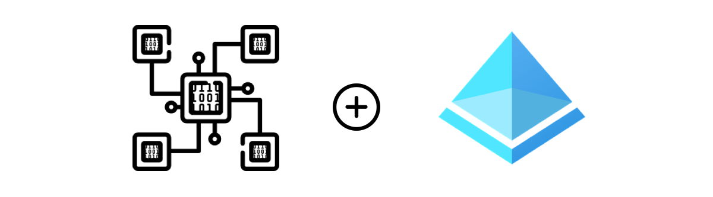
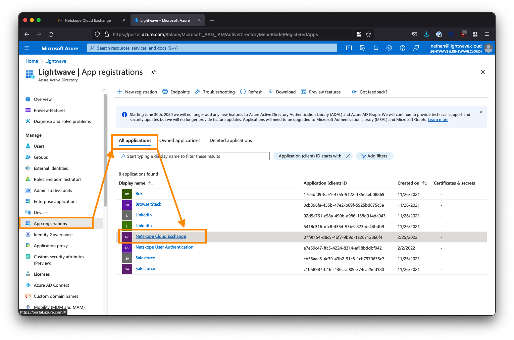
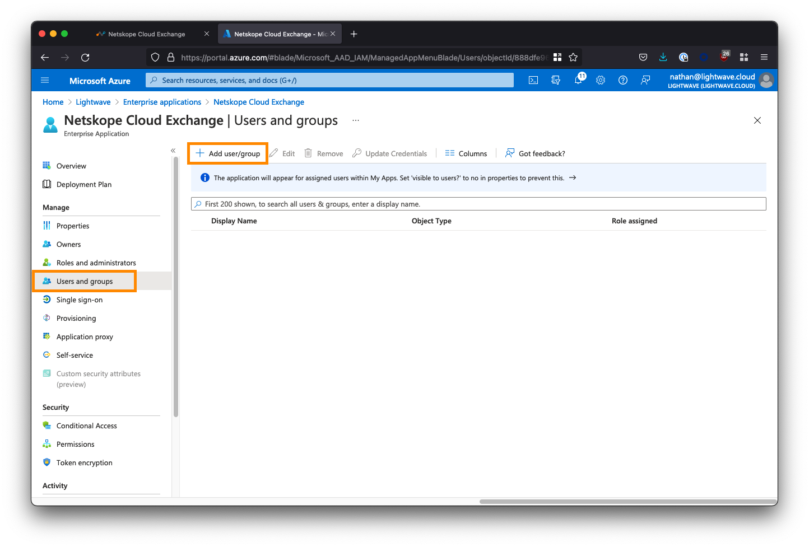
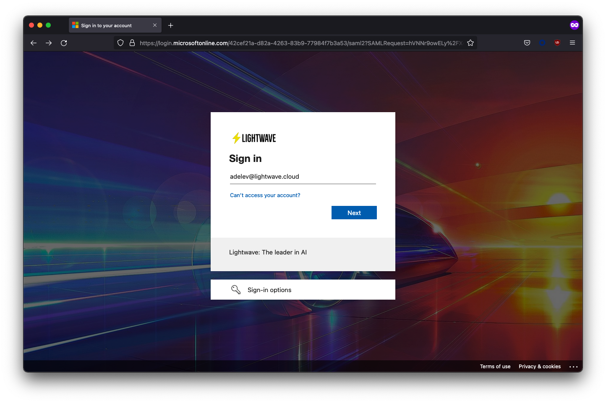
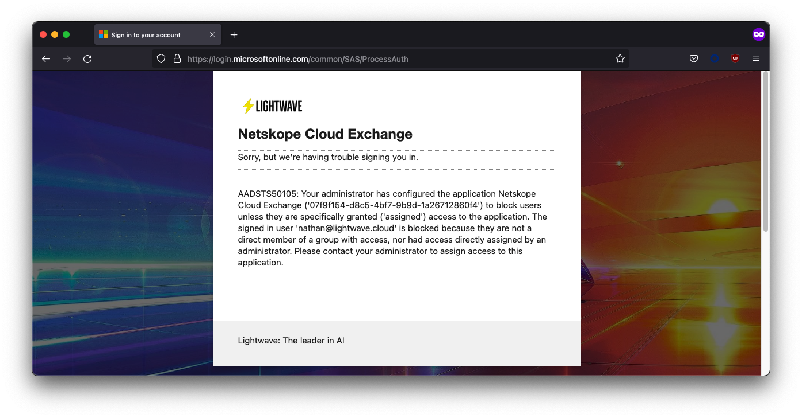
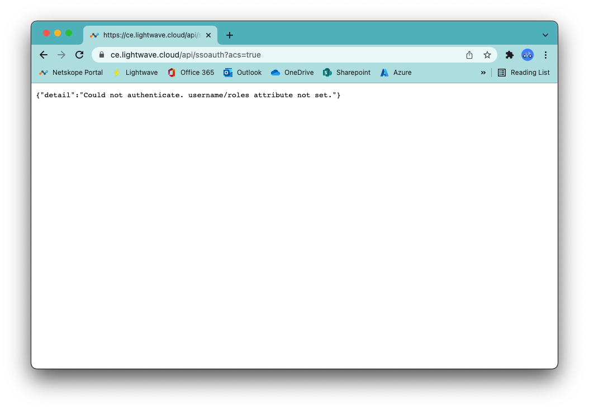
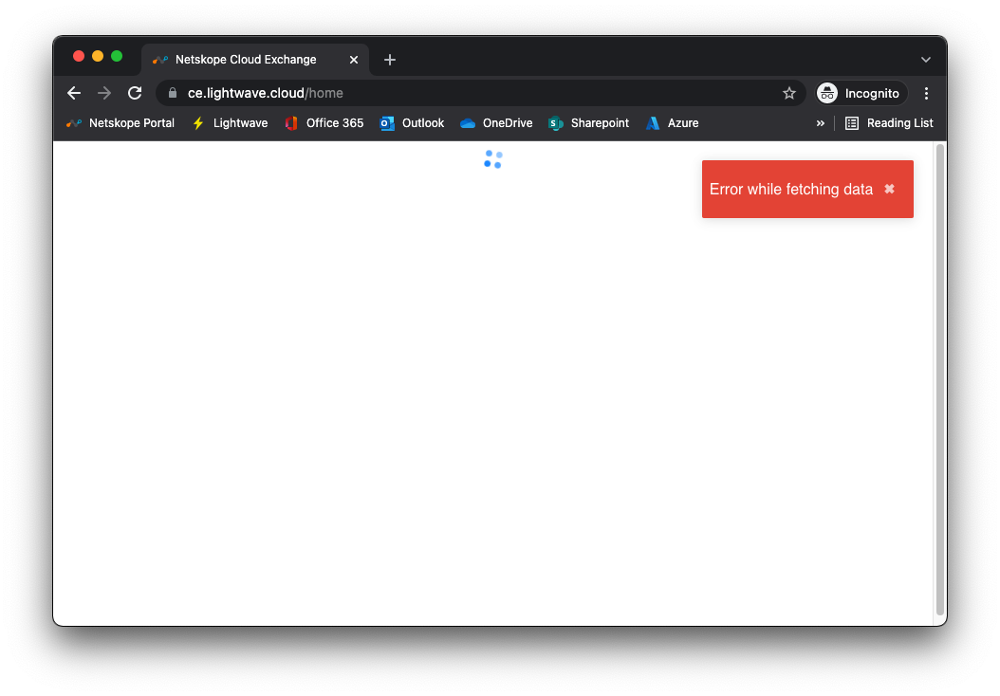
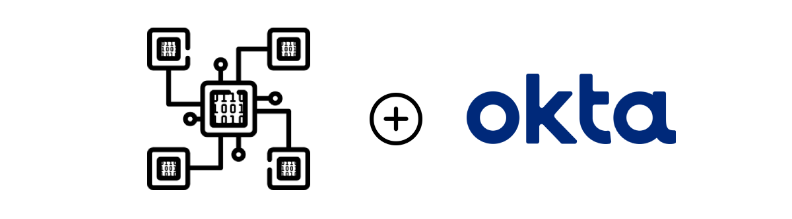
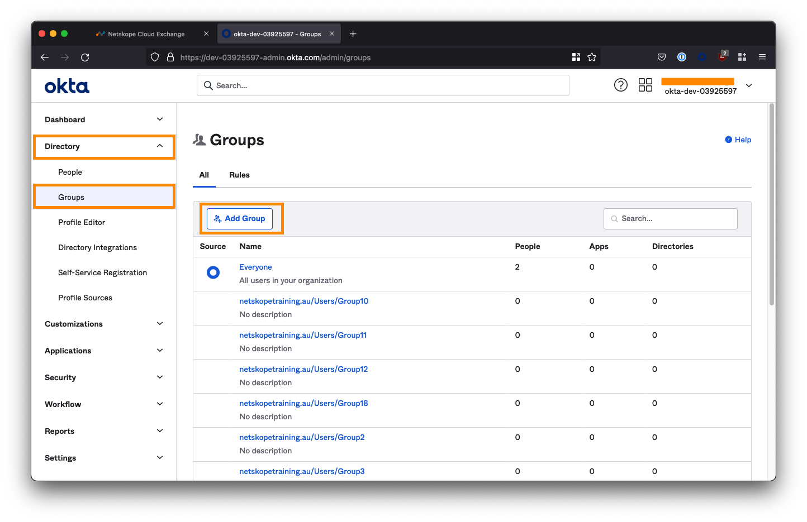
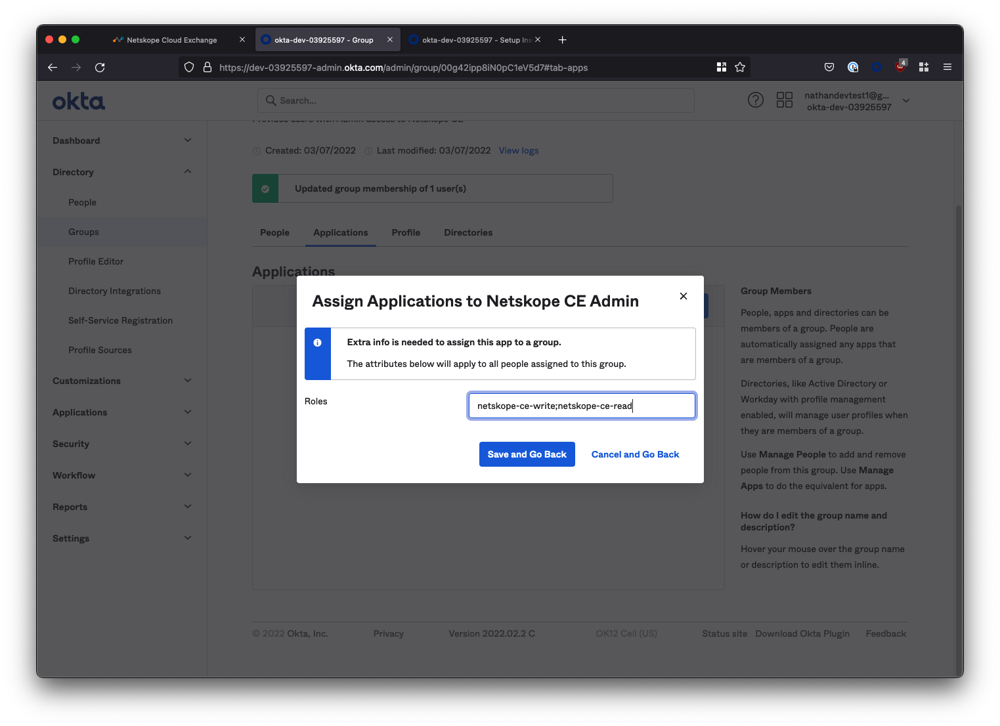

> The thoughts and opinions in this post are my own and do not reflect those of Netskope. Please follow this guide at your own risk.

This post will cover how to configure Single-Sign-On (SSO) for the Netskope Cloud Exchange (CE) platform; specifically for Azure AD and Okta. This will allow you to manage administrator access to CE from within your existing Identity Provider (IdP), rather than configuring administrators within the platform manually.

Cloud Exchange is different from the standard Netskope tenant you would have access to as a customer and facilitates the exchange of information between your various security and operations platforms. For information on what Cloud Exchange is (including how to deploy it), please [see here](/posts/deploy-netskope-cloud-exchange).

# Azure Active Directory (Azure AD)

## Create a new Enterprise Application
Log into the Azure AD [portal](https://portal.azure.com), and go to "Enterprise Applications". You may need to search for this at the top of the portal.

Click **New application**.

Click **Create your own application** and name the application `Netskope Cloud Exchange`.

Select the 3rd option to create a non-gallery app: **Integrate any other application you don't find in the gallery**.

Click **Create** when you are done.

Note, that Azure can sometimes have a quirk where it returns a 404 error when you click the **Create** button. Your application has should have been created, even if you get this error. If you encounter this issue, return to the **Enterprise Applications** view and click the refresh button. You should see your *Netskope Cloud Exchange* app appear in the list, despite getting a 404.

## Copy the Cloud Exchange SSO information

Log in to Cloud Exchange using the `admin` (super administrator) user, and navigate to **Settings > Users** (this settings area will only be visible to the `admin` user).

Select the **SSO Configuration** tab, and toggle the **SSO** toggle **ON** (make sure you save this configuration).

Note down the 3x "Service Provider" fields at the bottom of the screen. The image below maps which URL should be used for which SAML config field in Azure AD.

## Create Roles in Azure AD
Users can be assigned Read/Write or just Read access to the CE UI based on one of two roles assigned to them: `Admin` (read/write access) and `Read Only`. We need to create these roles in Azure AD so that they can be assigned to users who use the CE application.

**Note: If you don't create and map these roles then SSO will fail!**

Return to the **main** Azure Active Directory menu (ensure you are NOT within the *Enterprise Applications* sub-menu). Select **App registrations** from the left-side menu, click the ***All applications*** tab, then select the **Netskope Cloud Exchange** app from the list.

Next, click **App Roles** from the left-side menu, followed by **Create app role**. You will be creating two roles: One for the Admin user role and one for the Read-Only user role.

Create the **Admin** role as follows:
* For ***Display name***, enter `CE-Admin` (this can be whatever you like)
* For ***Allowed member types***, select the first option: `Users/Groups`
* For ***Value***, enter `netskope-ce-write;netskope-ce-read` <- Ensure you copy/paste this exactly!
* For ***Description***, enter `Provide the user with read/write access to Cloud Exchange.`
* Ensure the ***Do you want to enable this app role?*** option is **checked**.

Create the **Read-Only** role as follows:
* For ***Display name***, enter `CE-ReadOnly` (this can be whatever you like)
* For ***Allowed member types***, select the first option: `Users/Groups`
* For ***Value***, enter `netskope-ce-read` <- Ensure you copy/paste this exactly!
* For ***Description***, enter `Provide the user with read-only access to Cloud Exchange.`
* Ensure the ***Do you want to enable this app role?*** option is **checked**.

You're now finished configuring the App Roles. Return to the main Azure AD menu to proceed.

## Configure the Cloud Exchange Enterprise App in Azure AD
From the Azure AD main menu, return to the *Enterprise Applications* list and select **Netskope Cloud Exchange** to configure it.

From the left-side menu, click **Single sign-on**, and select **SAML** when prompted.

### Provide the SAML Configuration

Under **Basic SAML Configuration**, click the *Edit* button.

Copy the "Service Provider" URLs from the Cloud Exchange SSO Configuration page to the appropriate Azure AD SAML config field. See the table below for mapping.

| Azure AD SAML Field                        | Cloud Exchange Field       |
|--------------------------------------------|----------------------------|
| Identifier (Entity ID)                     | Service Provider Entity ID |
| Reply URL (Assertion Consumer Service URL) | Service Provider ACS URL   |
| Sign on URL                                | Service Provider ACS URL   |
| Relay State                                | N/A - Leave Blank          |
| Logout URL                                 | Service Provider SLS URL   |

The *Reply URL* and *Sign-on URL* in Azure AD both use the Service Provider ACS URL from the Cloud Exchange portal. The *Relay State* field in Azure AD should be left blank.

Save your configuration when done.

### Add Claims for Username & Roles

Click **Edit** next the **Attributes & Claims** section (section #2)

Click the button to **Add new claim**. Add a new claim as follows:

* For the *Name* field, enter `roles` <-- Enter this exactly!
* Leave ***Namespace*** blank.
* For ***Source***, ensure `Attribute` is selected (default).
* For ***Source attribute***, select `user.assignedroles` from the dropdown.

Click **Save** to add the claim.

Repeat the process to add a recond role:

* For the *Name* field, enter `username` <-- Enter this exactly!
* Leave ***Namespace*** blank.
* For ***Source***, ensure `Attribute` is selected (default).
* For ***Source attribute***, select `user.mail` from the dropdown.

Click **Save** to add the claim.

Once you've added the two new claims, your Attributes & Roles should look as follows:

### Download the SAML Signing Certificate

Back on the SAML configuration page, scroll down to Section 3 - **SAML Signing Certificate**, and click to download the **Base64** certificate (see the image below).

### Copy the Azure AD Application URLs

Next, under Section 4 - **Set up Netskope Cloud Exchange**, copy the **Login URL**, **Logout URL**, and **Azure AD Identifier** URL. You will need to paste these into the Cloud Exchange UI in the next section.

## Add Users & Groups to the Enterprise Application
The last step we need to perform in Azure AD is to assign users and/or groups to the Cloud Exchange app to provide them with access. We will also assign either the **Read-Only** or **Admin** roles we created earlier to these users/groups to grant them the appropriate permissions within CE.

From the left-side menu within the Cloud Exchange Enterprise Application, select **Users and groups**, then click **Add user/group**.

Select the users and/or groups that are permitted to use the Cloud Exchange application. You **MUST** also assign a role to the selected users/groups; ie: `CE-Admin` (read/write), or `CE-ReadOnly` (read-only).

**WARNING: If you do not assign a role, SSO will fail when the user attempts to sign in. Also, DO NOT assign the default `User` role you see in the list: this will also cause SSO to fail. You must only use the roles that you explicitly created in Azure AD yourself.**

After assigning users/groups and applicable roles, your user/group list should look similar to the below:

## Finish the SSO Configuration in Cloud Exchange

Return to the **SSO Configuration** section of the Cloud Exchange UI (**Settings > Users > SSO Configuration**).

### Copy the Azure app URLs
For the 3 Identity Provider URL fields in the Cloud Exchange SSO configuration, paste the corresponding Azure AD Application URLs you copied when configuring SAML on the Azure AD side. See the table below for mapping:

| Cloud Exchange Field         | Azure AD SAML Config Field |
|------------------------------|----------------------------|
| Identity Provider Issuer URL | Azure AD Identifier URL    |
| Identity provider SSO URL    | Login URL                  |
| Identity provider SLO URL    | Logout URL                 |

### Copy the SAML Signing Certificate

Open the Base64 SAML Signing Certificate you downloaded from Azure AD earlier in a text editor such as Notepad or TextEdit. Don't use MS Word. The certificate will have a `.cer` extension.

Copy the contents of the certificate file into the `Public x509 Certificate` field in the Cloud Exchange SSO config (see the image above).

Save your SSO Configuration when done.

## Testing the SSO Configuration

Open a new Incognito window (to avoid any potential issues with caching) and point your browser to the URL of your Cloud Exchange deployment.

If you enabled the "SSO" checkbox as instructed at the beginning of this guide, you will two options when reaching Cloud Exchange:
1. Login with SSO
2. Login with Username/Password

Option #2 is used for local login (ie: the default `admin` user, or any user manually added to the user list in CE).

Select **Login with SSO**. You should be redirected to Azure AD to sign in.

Upon entering your user credentials, you should be authenticated and redirected to the Cloud Exchange interface. In the example below, the Adele user was assigned the **CE-ReadOnly** role, so almost all of the **Settings** menu is hidden.

## Troubleshooting
If you are having issues signing in, first, look at which platform is giving you an error: Azure AD, or Cloud Exchange?
If the error you are presented with is from Azure AD, then there is likely an issue with your config on the Azure AD side. Double-check your URLs and/or whether the user you are attempting to sign in as is assigned to the application (or present in the group assigned to the app).

In the image below, my `nathan@lightwave.cloud` user was unable to sign in, as they were not assigned to the application in Azure AD.

If you are getting an error from Cloud Exchange, then you have likely stuffed up the URLs entered into either CE or Azure AD, not added the custom `username` and `roles` claims in Azure AD, or not assigned any roles to the user you are signing in as.

If you get the error `{"detail":"Method Not Allowed"}`, check that the URLs copied into both Azure AD and Cloud Exchange are correct and in the right place.

If you get the error `{"detail":"Could not authenticate. username/roles attribute not set."}`, then check that you added the `username` and `roles` claims in the SAML config, AND assigned roles correctly to users when you added them to the Enterprise Application in Azure AD.

If you pass SSO fine but receive a red `Error while fetching data` message in CE, then there is a problem with the role you have assigned to the user. Ensure you entered `netskope-ce-write;netskope-ce-read` as the attribute for the Admin role (CE-Admin) and `netskope-ce-read` as the attribute for the Read-Only role (CE-ReadOnly). Additionally, check that you have assigned one of these roles to your impacted user: You may also get this error if the default `User` role is assigned.

---

# Okta

## Create a new App Integration

Log in to your Okta administrator console and from the left-side menubar, navigate to **Applications > Applications**.

Select **Create App Integration**.

Select **SAML 2.0** as the sign-in method and click **Next**.

On the next screen, set the App name to be Netskope Cloud Exchange and provide an app logo if required. Click Next to proceed to the Configure SAML section.

## Copy the Cloud Exchange SSO information

Log in to Cloud Exchange using the `admin` (super administrator) user, and navigate to **Settings > Users** (this settings area will only be visible to the `admin` user).

Select the **SSO Configuration** tab, and toggle the **SSO** toggle **ON** (make sure you save this configuration).

Note down the first two "Service Provider" fields at the bottom of the screen (`Service Provider Entity ID` and `Service Provider ACS URL`). The image below maps which URL should be used for which config field in Okta.

## Configure Okta SAML Integration
Switch back to your Okta configuration and configure the settings as follows:

### Copy the Cloud Exchange Service Provider URLs
For the first two Service Provider URL fields in the Cloud Exchange SSO configuration, paste the corresponding URL into the appropriate field in Okta. See the table below for mapping:

| Cloud Exchange Field         | Okta SAML Config Field      |
|------------------------------|-----------------------------|
| Service Provider Entity ID   | Audience URL (SP Entity ID) |
| Service Provider ACS URL     | Single sign on URL          |
| Service Provider SLS URL     | N/A - Not used              |

### Set the Name ID format
Ensure you change the **Name ID format** in Okta, from *Unspecified* to ***EmailAddress***.

### Add additional attributes
You need to add two additional attribute statements to the Okta configuration: One called `username` and another called `roles`.

* The `username` attribute should have the value of `user.email`.
* The `roles` attribute should have the value of `appuser.roles` (you will need to type this - it won't appear in the dropdown).

### Finish the SAML configuration
When you are done, scroll to the bottom of the page and click **Next**.

Check the box "*I'm an Okta customer adding an internal app*" and click **Finish**.

### Open the Okta SAML 2.0 Steup Instructions
On the next page, click the **View Setup Instructions** button inside the yellow box under the **Sign On** tab app.

This will open a new tab containing the details we will need to copy back into the Cloud Exchange console.

Leave this tab open for now as we still have some configuration left to do on the Okta side.

## Create the `roles` attribute in Okta
Users can be assigned Read/Write or just Read access to the CE UI based on one of two roles assigned to them: `Admin` (read/write access) and `Read Only`. We need to create the `roles` attribute in Okta so that it can be used and assigned to the groups of IT admins who will use the CE application.

Navigate to **Directory > Profile Editor** from the left-side menu, and select the **Netskope Cloud Exchange User** profile.

Here you'll see the `username` attribute we added when we completed the SAML configuration, but the `roles` attribute is nowhere to be found! We need to create it manually.

Click the **Add Attribute** button.

* For **Display name**, enter `Roles`
* For **Variable name**, enter `roles` <-- Case sensitive!
* For **Description**, enter `Netskope Cloud Exchange Admin Roles`

Click **Save** at the bottom when you're done.

## Configure User Groups for CE Access
Next, we need to create two groups: One for the users that will have read/write access to CE, and another for users that will have read-only access.

Navigate to **Directory > Groups** from the left-side menu, and select the **Add Group** button.

### Create the `Read-Only` and `Admin` groups

Create two groups called `Netskope CE Read-Only` and `Netskope CE Admin` respectively.

### Assign people to the Read-Only role

Click the **Netskope CE Read-Only** group you created from the group list to edit the group.

Under the **People** tab, click **Assign People** and assign the users who will have read-only access to the CE platform. Don't forget to click **Save**.

Next, select the **Applications** tab and click **Assign applications**.

Assign the **Netskope Cloud Exchange** application.

You will then be prompted to specify a role. Enter `netskope-ce-read`

**WARNING: You must enter this exactly, or SSO will fail! It is case sensitive.**

Select **Save and Go Back** to complete the configuration of the read-only group.

### Assign people to the Admin role

Click the **Netskope CE Admin** group you created from the group list to edit the group.

Repeat the steps above, except this time select the people who will have read/write access to the CE platform. Don't forget to click **Save**.

When prompted to specify a role, enter `netskope-ce-write;netskope-ce-read`

**WARNING: You must enter this exactly, or SSO will fail! It is case sensitive.**

Select **Save and Go Back** to complete the configuration of the Admin group.

## Finish the SSO Configuration in Cloud Exchange

Return to the **SSO Configuration** section of the Cloud Exchange UI (**Settings > Users > SSO Configuration**). Here we will use the details within the Setup Instructions that we opened (in a separate tab) earlier.

For the below fields in the Cloud Exchange SSO configuration, paste the corresponding information from the Okta Setup Instructions. See the table below for mapping:

| Cloud Exchange Field         | Okta Setup Instructions Field        |
|------------------------------|--------------------------------------|
| Identity Provider Issuer URL | Identity Provider Issuer             |
| Identity provider SSO URL    | Identity Provider Single Sign-On URL |
| Identity provider SLO URL    | Identity Provider Single Sign-On URL |
| Public x509 Certificate      | X.509 Certificate                    |

The SLO URL field is not needed, but cannot be blank. Copy the same URL used for the Identity provider SSO URL for this field.

Save your SSO Configuration when done.

## Testing the SSO Configuration

Open a new Incognito window (to avoid any potential issues with caching) and point your browser to the URL of your Cloud Exchange deployment.

If you enabled the "SSO" checkbox as instructed at the beginning of this guide, you will two options when reaching Cloud Exchange:
1. Login with SSO
2. Login with Username/Password

Option #2 is used for local login (ie: the default `admin` user, or any user manually added to the user list in CE).

Select **Login with SSO**. You should be redirected to Okta to sign in.

Upon entering your user credentials, you should be authenticated and redirected to the Cloud Exchange interface. In the example below, the Ben user was assigned to the **Netskope CE Read-Only** group, so almost all of the **Settings** menu is hidden.

## Troubleshooting

If you are having issues signing in, first, look at which platform is giving you an error: Okta, or Cloud Exchange?
If the error you are presented with is from Okta, then the issue is likely with your config on the Okta side. Double-check your URLs and/or whether the user you are attempting to sign in as is assigned to either the *Netskope CE Read-Only* or *Netskope CE Admin* groups.

If you are getting an error from Cloud Exchange, then you have likely stuffed up the URLs entered into either CE or Azure AD, not added the custom `username` and `roles` attributes, or not typed the name of the role correctly (ie: `netskope-ce-read` and `netskope-ce-write;netskope-ce-read`).

If you get the error `{"detail":"Method Not Allowed"}`, check that the URLs copied into both Okta and Cloud Exchange are correct and in the right place.

If you get the error `{"detail":"Could not authenticate. username/roles attribute not set."}`, then check that you have added the `username` and `roles` claims in the SAML config.

If you pass SSO fine but receive a red `Error while fetching data` message in CE, then there is a problem with the role you have assigned to the user. Ensure you entered `netskope-ce-write;netskope-ce-read` as the attribute for the Admin group (Netskope CE Admin) and `netskope-ce-read` as the attribute for the Read-Only role (Netskope CE Read-Only). Additionally, check that you have assigned one of these groups to your impacted user: You may also get this error if anything else has been entered into the role field apart from the above two accepted strings.

